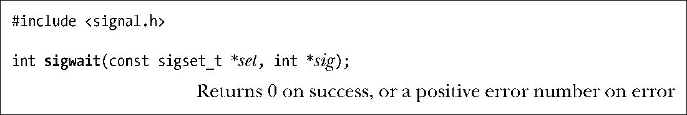

### 33.2.4　妥善处理异步信号

第20章至第22章所探讨的各种因素（诸如，可重入问题、重启遭中断的系统调用，以及避免竞争条件），当使用信号处理函数对异步产生的信号加以处理时，这些都将导致情况变得复杂。另外，没有任何Pthreads API属于异步信号安全（async-signal-safe）函数，均无法在信号处理函数（21.1.2节）中安全加以调用。因为这些原因，所以当多线程应用程序必须处理异步产生的信号时，通常不应该将信号处理函数作为接收信号到达的通知机制。相反，推荐的方法如下。

+ 所有线程都阻塞进程可能接收的所有异步信号。最简单的方法是，在创建任何其他线程之前，由主线程阻塞这些信号。后续创建的每个线程都会继承主线程信号掩码的一份拷贝。
+ 再创建一个专用线程，调用函数 sigwaitinfo()、sigtimedwait()或sigwait()来接收收到的信号。22.10节对sigwaitinfo()和sigtimedwait()做了说明。下面则对sigwait()有所描述。

这一方法的优势在于，同步接收异步产生的信号。当接收到信号时，专有线程可以安全地修改共享变量（在互斥量的保护之下），并可调用并非异步信号安全（non-async-signal-safe）的函数。也可以就条件变量发出信号，并采用其他线程或进程的通讯及同步机制。

函数sigwait()会等待set所指信号集合中任一信号的到达，接收该信号，且在参数sig中将其返回。

除了以下不同以外，sigwait()的操作与sigwaitinfo()相同。

+ 函数sigwait()只返回信号编号，而非返回一个描述信号信息的siginfo_t类型结构。
+ 并且返回值与其他线程相关函数保持一致（而非传统UNIX系统调用返回的0或−1）。

如有多个线程在调用sigwait()等待同一信号，那么当信号到达时只有一个线程会实际接收到，也无法确定收到信号的会是哪条线程。

