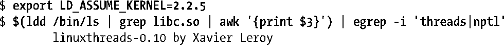

### 33.5.3　哪一种线程实现

一些Linux发布版本附带包换LinuxThreads和NPTL的GNU C库，依据系统运行在何种内核上动态地确定链接哪一种 GNUC 库。（这些发布版本有其历史原因，自版本2.4后glibc不再提供LinuxThreads。）所以有时候可能需要回答以下的问题。

+ 特定的Linux发布版本中，哪一种线程实现是有效的？
+ 在既提供LinuxThreads也提供NPTL的Linux发布版本中，缺省使用哪一种？如何明确地选择一个应用程序所使用的线程库？

#### 找出线程实现

可以通过一些技术去找出某个特定系统使用的线程实现，也可以发现在提供两种线程实现的系统上运行的程序默认使用的实现版本。

在提供glibc 2.3.2或后续版本的系统上，可以使用如下命令找出系统提供的线程实现，如果提供两种实现的，则显示默认的那个：

在只有NPTL或者将其作为默认实现的系统上，将会显示类似下面的信息：

##### NPTL 2.3.4

自glibc 2.3.2以来，程序可以通过confstr(3)获得类似的信息，并取得 glibc特定的配置变量_CS_GNU_LIBPTHREAD_VERSION的值。

使用老版本GNUC库的系统上，需要做一些额外的动作。首现，下面的命令可以被用来显示程序运行时使用的GNUC库的路径（这里使用标准程序ls作为例子，其位置为/bin/ls）：

GNU C库的路径显示在=>之后。如果作为命令执行这个路径的程序，那么glibc将会显示关于自身的一系列信息。可以通过grep选取与线程实现相关的信息。

在egrep正则表达式（regular expression）中包含nptl，是因为某些包含NPTL的glibc发布显示如下的字符串信息：

因为glibc路径会随着不同的Linux发布而改变，可以使用shell的替换功能来产生一个显示Linux系统上使用的线程实现信息的命令行：

#### 选择程序使用的线程实现

在即提供NPTL也提供LinuxThreads的Linux系统上，能够明确地控制具体使用的线程实现有时候非常地有用。最常见的例子是，当遇到一个旧有的依赖于某些LinuxThreads行为（可能非标准）的程序时，要能够强制程序使用指定的线程实现，而不是默认的NPTL。

出于这个目的，可以使用一个动态链接器（dynamic linker）能够理解的特定的环境变量LD_ASSUME_KERNEL。顾名思义，这个环境变量告诉动态链接器就好像运行在特定的Linux内核版本上一样。通过指定并不提供NPTL支持的内核版本（例如2.2.5）可以确保LinuxThreads被使用到。所以可以使用如下命令运行一个基于LinuxThreads的多线程应用程序：

当环境变量设置与之前提及的显示使用的线程实现信息的命令行一起使用时，可以看到如下的一些信息：

> 可以通过LD_ASSUME_KERNEL设置的内核版本号的范围受一些限制因素的制约。在一些提供NPTL和LinuxThreads的一般发布版本中，将版本号指定为2.2.5已经足够保证会使用LinuxThreads。此环境变量更完整的描述请参考http://people.redhat.com/drepper/assumkernel.html。

