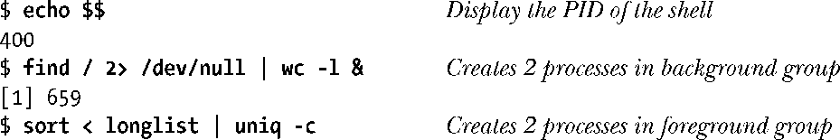
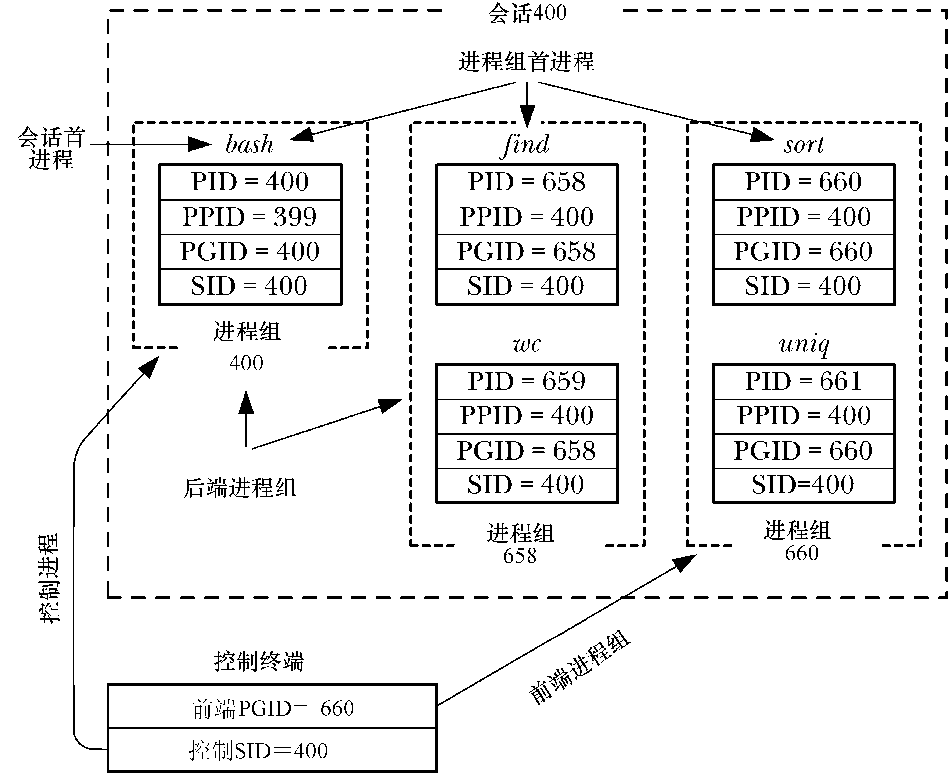

### 34.1　概述

进程组由一个或多个共享同一进程组标识符（PGID）的进程组成。进程组ID是一个数字，其类型与进程ID一样（pid_t）。一个进程组拥有一个进程组首进程，该进程是创建该组的进程，其进程ID为该进程组的ID，新进程会继承其父进程所属的进程组ID。

进程组拥有一个生命周期，其开始时间为首进程创建组的时刻，结束时间为最后一个成员进程退出组的时刻。一个进程可能会因为终止而退出进程组，也可能会因为加入了另外一个进程组而退出进程组。进程组首进程无需是最后一个离开进程组的成员。

会话是一组进程组的集合。进程的会话成员关系是由其会话标识符（SID）确定的，会话标识符与进程组ID一样，是一个类型为pid_t的数字。会话首进程是创建该新会话的进程，其进程ID会成为会话 ID。新进程会继承其父进程的会话ID。

一个会话中的所有进程共享单个控制终端。控制终端会在会话首进程首次打开一个终端设备时被建立。一个终端最多可能会成为一个会话的控制终端。

在任一时刻，会话中的其中一个进程组会成为终端的前台进程组，其他进程组会成为后台进程组。只有前台进程组中的进程才能从控制终端中读取输入。当用户在控制终端中输入其中一个信号生成终端字符之后，该信号会被发送到前台进程组中的所有成员。这些字符包括生成SIGINT的中断字符（通常是Control-C）、生成SIGQUIT的退出字符（通常是Control-\）、生成SIGSTP的挂起字符（通常是Control-Z）。

当到控制终端的连接建立起来（即打开）之后，会话首进程会成为该终端的控制进程。成为控制进程的主要标志是当断开与终端之间的连接时内核会向该进程发送一个SIGHUP信号。

> 通过检查Linux特有的/proc/PID/stat文件，就能确定任意进程的进程组ID和会话ID。此外，还能确定进程的控制终端的设备ID（一个十进制数字，包含主ID和辅ID）和控制该终端的控制进程的进程ID。更多细节信息请参考proc(5)手册。

会话和进程组的主要用途是用于shell作业控制。读者通过一个具体的例子就能够弄清楚这些概念了。如对于交互式登录来讲，控制终端是用户登录的途径。登录shell是会话首进程和终端的控制进程，也是其自身进程组的唯一成员。从shell中发出的每个命令或通过管道连接的一组命令都会导致一个或多个进程的创建，并且shell会把所有这些进程都放在一个新进程组中。（这些进程在一开始是其进程组中的唯一成员，它们创建的所有子进程会成为该组中的成员。）当命令或以管道连接的一组命令以&符号结束时会在后台进程组中运行这些命令，否则就会在前台进程组中运行这些命令。在登录会话中创建的所有进程都会成为该会话的一部分。

> 在窗口环境中，控制终端是一个伪终端。每个终端窗口都有一个独立的会话，窗口的启动shell是会话首进程和终端的控制进程。
> 在除任务控制之外的其他场景中也有可能用到进程组，因为进程组具备两个有用的属性：在特定的进程组中父进程能够等待任意子进程（参见26.1.2节）和信号能够被发送给进程组中的所有成员（参见20.5节）。

图34-1给出了执行下面的命令之后各个进程之间的进程组和会话关系。

<b class="my_markdown">图34-1　进程组、会话和控制终端之间的关系</b>

