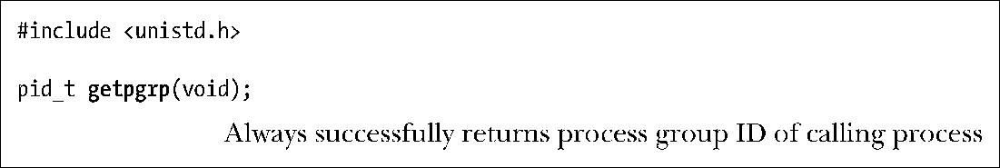
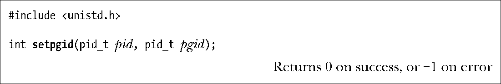
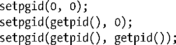
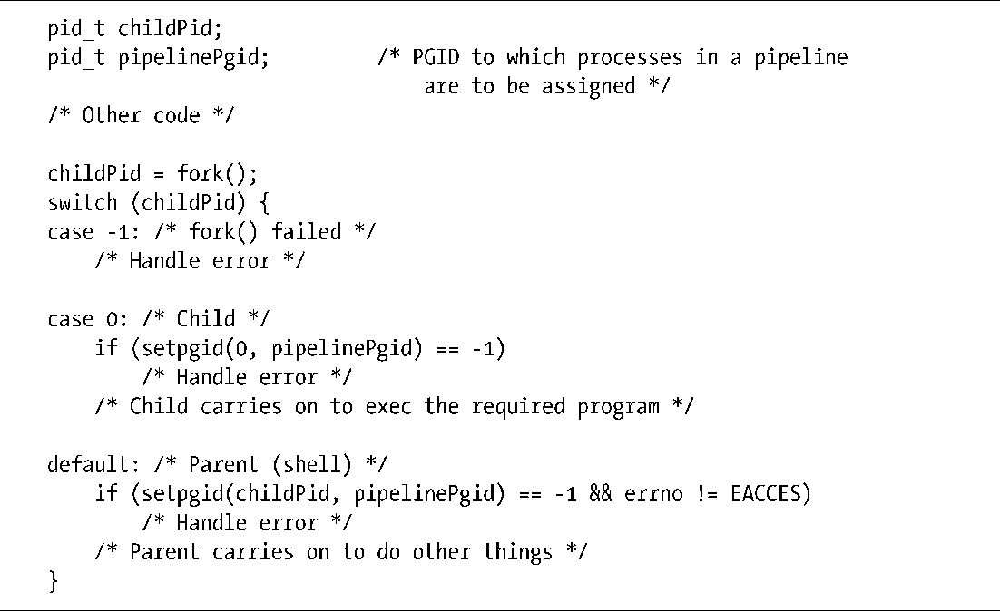

### 34.2　进程组

每个进程都拥有一个以数字表示的进程组ID，表示该进程所属的进程组。新进程会继承其父进程的进程组ID，使用getpgrp()能够获取一个进程的进程组ID。

如果getpgrp()的返回值与调用进程的进程 ID 匹配的话就说明该调用进程是其进程组的首进程。

setpgid()系统调用将进程ID为pid的进程的进程组 ID 修改为pgid。

如果将pid的值设置为0，那么调用进程的进程组ID就会被改变。如果将pgid的值设置为0，那么 ID 为pid的进程的进程组 ID 会被设置成pid的值。因此，下面的setpgid()调用是等价的。

如果pid和pgid参数指定了同一个进程（即pgid是0或者与 ID 为pid的进程的进程ID匹配），那么就会创建一个新进程组，并且指定的进程会成为这个新组的首进程（即进程的进程组 ID 与进程 ID 是一样的）。如果两个参数的值不同（即pgid不是0或者与 ID 为pid的进程的进程 ID 不匹配），那么setpgid()调用会将一个进程从一个进程组中移到另一个进程组中。

通常调用setpgid()（以及34.3节中介绍的setsid()）函数的是shell和login(1)。在37.2节中将会看到一个程序在使自己变成daemon的过程中也会调用setsid()。

在调用setpgid()时存在以下限制。

+ pid参数可以仅指定调用进程或其中一个子进程。违反这条规则会导致ESRCH错误。
+ 在组之间移动进程时，调用进程、由pid指定的进程（可能是另外一个进程，也可能就是调用进程）以及目标进程组必须要属于同一个会话。违反这条规则会导致EPERM错误。
+ pid参数所指定的进程不能是会话首进程。违反这条规则会导致EPERM错误。
+ 一个进程在其子进程已经执行exec()后就无法修改该子进程的进程组 ID 了。违反这条规则会导致EACCES错误。之所以会有这条约束条件的原因是在一个进程开始执行之后再修改其进程组 ID 的话会使程序变得混乱。

#### 在作业控制shell中使用setpgid()

一个进程在其子进程已经执行exec()之后就无法修改该子进程的进程组ID的约束条件会影响到基于shell的作业控制程序设计，即需要满足下列条件。

+ 一个任务（即一个命令或一组以管道符连接的命令）中的所有进程必须被放置在一个进程组中。（通过图34-1中bash创建的两个进程组就能看出。）这一步允许shell使用killpg()（或使用负的pid值来调用kill()）来同时向进程组中的所有成员发送作业控制信号。一般来讲，这一步需要在发送任意作业控制信号前完成。
+ 每个子进程在执行程序之前必须要被分配到进程组中，因为程序本身是不清楚如何操作进程组ID的。

对于任务中的各个进程来讲，父进程和子进程都可以使用setpgid()来修改子进程的进程组ID。但是，由于在父进程执行fork()（参见24.4节）之后父进程与子进程之间的调度顺序是无法确定的，因此无法依靠父进程在子进程执行exec()之前来改变子进程的进程组ID，同样也无法依靠子进程在父进程向其发送任意作业控制信号之前修改其进程组ID。（依赖这些行为中的任意一个行为都会导致竞争条件。）因此，在编写作业控制shell程序时需要让父进程和子进程在fork()调用之后立即调用setpgid()来将子进程的进程组ID设置为同样的值，并且父进程需要忽略在setpgid()调用中出现的所有EACCES错误。换句话说，在一个作业控制shell程序中可能会出现像程序清单34-1中给出的代码。

程序清单34-1：作业控制shell程序如何设置子进程的进程组ID

在处理由管道符连接起来的命令时事情会变得比程序清单34-1更加复杂一点，父shell需要记录管道中第一个进程的进程 ID 并使用这个值作为该组中所有进程的进程组 ID（pipelinePgid）。

#### 获取和修改进程组ID的其他（过时的）接口

这里需要解释一下为何getpgrp()和setpgid()两个系统调用名称中的后缀不同。

在一开始，4.2BSD提供了一个getprgp(pid)系统调用来返回进程ID为pid的进程的进程组ID。在实践中，pid几乎总是用来表示调用进程。结果，POSIX委员会认为这个系统调用过于复杂了，因此他们采纳了System V getpgrp()系统调用，这个系统调用不接收任何参数并返回调用进程的进程组ID。

为了修改进程组ID，4.2BSD提供了setpgrp(pid,pgid)系统调用，它与setpgid()的行为是相似的。这两个系统调用之间最主要的差别在于BSD setpgrp()能够用来将进程组ID设置为任意值。（前面曾经提及过不能使用setpgid()将一个进程迁移至其他会话中的进程组。）这会引起一些安全问题，但在实现任务控制程序时也更加灵活。结果，POSIX委员会决定给这个函数增加额外的限制条件并将其命名为setpgid()。

更复杂的事情是SUSv3指定了一个getpgid(pid)系统调用，它与老式的BSD getpgrp()的功能是一样的。此外，它还定义了一个从System V演化而来的setpgrp()，它不接受任何参数，与setpgid(0, 0)调用几乎是等价的。

尽管对于实现shell作业控制来讲，利用前面介绍的setpgid()和getpgrp()系统调用已经足够了。但与其他大多数UNIX实现一样，Linux也提供了getpgid(pid)和setpgrp(void)。为了向后兼容，很多从BSD演化而来的实现仍然提供了setprgp(pid, pgid)，它与setpgid(pid, pgid)是一样的。

在编译程序时如果显式地定义_BSD_SOURCE特性测试宏的话，glibc会使用从BSD演化而来的setpgrp()和getpgrp()来取代默认版本。

