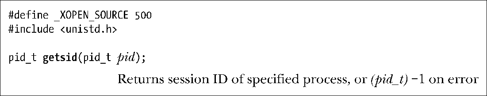
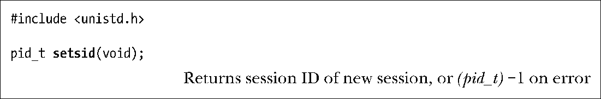
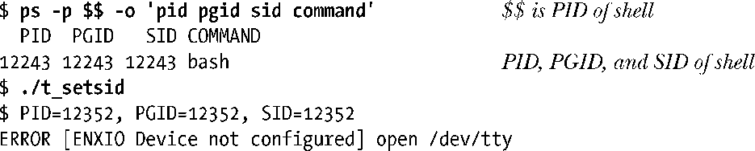
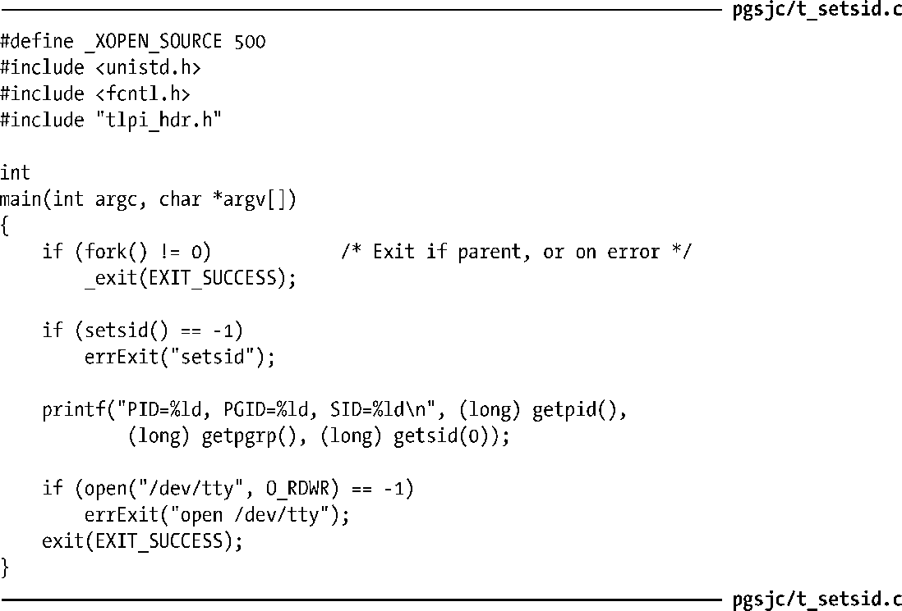

### 34.3　会话

会话是一组进程组集合。一个进程的会话成员关系是由其会话ID来定义的，会话ID是一个数字。新进程会继承其父进程的会话ID。getsid()系统调用会返回pid指定的进程的会话ID。

如果pid参数的值为0，那么getsid()会返回调用进程的会话ID。

> 在一些UNIX实现中（如HP-UX 11），只有当调用进程与pid指定的进程属于同一个会话时才能使用getsid()来获取进程的会话ID。（SUSv3无此限制。）换句话说，只能通过这个调用的结果，即成功或失败（EPERM），来弄清楚指定进程与调用进程是否属于同一个会话。而在Linux和大多数其他实现中并不存在这一限制。

如果调用进程不是进程组首进程，那么setsid()会创建一个新会话。

setsid()系统调用会按照下列步骤创建一个新会话。

+ 调用进程成为新会话的首进程和该会话中新进程组的首进程。调用进程的进程组ID和会话ID会被设置成该进程的进程ID。
+ 调用进程没有控制终端。所有之前到控制终端的连接都会被断开。

如果调用进程是一个进程组首进程，那么setsid()调用会报出EPERM错误。避免这个错误发生的最简单的方式是执行一个fork()并让父进程终止以及让子进程调用setsid()。由于子进程会继承其父进程的进程组 ID 并接收属于自己的唯一的进程 ID，因此它无法成为进程组首进程。

约束进程组首进程对setsid()的调用是有必要的。因为如果没有这个约束的话，进程组组长就能够将其自身迁移至另一个（新的）会话中了，而该进程组的其他成员则仍然位于原来的会话中。（不会创建一个新进程组，因为根据定义，进程组首进程的进程组ID已经与其进程ID一样了。）这会破坏会话和进程组之间严格的两级层次，因此一个进程组的所有成员必须属于同一个会话。

> 当使用fork()创建一个新进程时，内核会确保它拥有一个唯一的进程ID，并且该进程ID不会与任意已有进程的进程组ID和会话ID相同。这样，即使进程组或会话首进程退出之后，新进程也无法复用首进程的进程ID，从而也无法成为既有会话和进程组的首进程。

程序清单34-2演示了使用setsid()来创建一个新会话。为了检查该进程已经不再拥有控制终端了，这个程序尝试打开一个特殊文件/dev/tty（下一节将予以介绍）。当运行这个程序时会看到下面的结果：

从输出中可以看出，进程成功地将其自身迁移至了新会话中的一个新进程组中。由于这个会话没有控制终端，因此open()调用会失败。（从上面程序输出的倒数第二行中可以看出，hell提示符与程序输出混杂在一起了，因为shell注意到父进程在fork()调用之后就退出了，因此在子进程结束之前就输出了下一个提示符。）

程序清单34-2　创建一个新会话

