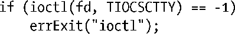
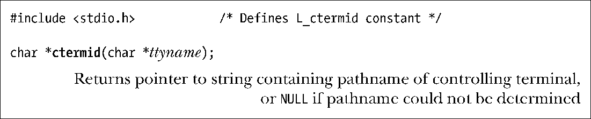

### 34.4　控制终端和控制进程

一个会话中的所有进程可能会拥有一个（单个）控制终端。会话在被创建出来的时候是没有控制终端的，当会话首进程首次打开一个还没有成为某个会话的控制终端的终端时会建立控制终端，除非在调用open()时指定O_NOCTTY标记。一个终端至多只能成为一个会话的控制终端。

> SUSv3定义了函数tcgetsid(int fd)（在<termios.h>头文件中进行定义），它返回与由fd指定的控制终端相关联的会话的ID。glibc提供了这个函数（它是使用ioctl() TIOCGSID操作实现的）。

控制终端会被由fork()创建的子进程继承并且在exec()调用中得到保持。

当会话首进程打开了一个控制终端之后它同时也成为了该终端的控制进程。在发生终端断开之后，内核会向控制进程发送一个SIGHUP信号来通知这一事件的发生。在34.6.2节中将会介绍更多有关这一方面的细节信息。

如果一个进程拥有一个控制终端，那么打开特殊文件/dev/tty就能够获取该终端的文件描述符。这对于一个程序在标准输入和输出被重定向之后需要确保自己确实在与控制终端进行通信是很有用的。如在8.5节中介绍的getpass()函数会因此而打开/dev/tty。如果进程没有控制终端，那么在打开/dev/tty时会报出ENXIO的错误。

#### 删除进程与控制终端之间的关联关系

使用ioctl(fd, TIOCNOTTY)操作能够删除进程与文件描述符fd指定的控制终端之间的关联关系。在调用这个函数之后再试图打开/dev/tty文件的话就会失败。（尽管SUSv3没有指定这个操作，但大多数UNIX实现都支持TIOCNOTTY操作。）

如果调用进程是终端的控制进程，那么在控制进程终止时（参见34.6.2）会发生下列事情。

**1．** 会话中的所有进程将会失去与控制终端之间的关联关系。

**2．** 控制终端失去了与该会话之间的关联关系，因此另一个会话首进程就能够获取该终端以成为控制进程。

**3．** 内核会向前台进程组的所有成员发送一个SIGHUP信号（和一个SIGCONT信号）来通知它们控制终端的丢失。

#### 在BSD上建立一个控制终端

SUSv3并不支持一个会话获取未指定的控制终端，在打开终端时仅指定O_NOCTTY标记的话只能确保该终端不会成为会话的控制终端。上面描述的Linux语义源自System V系统。

在BSD系统上，在会话首进程中打开一个终端不会导致该终端成为控制终端，不管是否指定了O_NOCTTY标记。相反，会话首进程需要使用ioctl() TIOCSCTTY操作来显式地将文件描述符fd指定的终端建立为控制终端。

只有在会话没有控制终端时才能执行这个操作。

Linux系统上也有TIOCSCTTY操作，但在其他（非BSD）实现中用得并不多。

#### 获取表示控制终端的路径名：ctermid()

ctermid()函数返回表示控制终端的路径名。

ctermid()函数以两种不同的方式返回控制终端的路径名：通过函数结果和通过ttyname指向的缓冲区。

如果ttyname不为NULL，那么它是一个大小至少为L_ctermid字节的缓冲区，并且路径名会被复制进这个数组中。这里函数的返回值也是一个指向该缓冲区的指针。如果ttyname为NULL，那么ctermid()返回一个指向静态分配的缓冲区的指针，缓冲区中包含了路径名。当ttyname为NULL时，ctermid()是不可重入的。

在Linux和其他UNIX实现中，ctermid()通常会生成字符串/dev/tty。引入这个函数的目的是为了能更加容易地将程序移植到非UNIX系统上。

