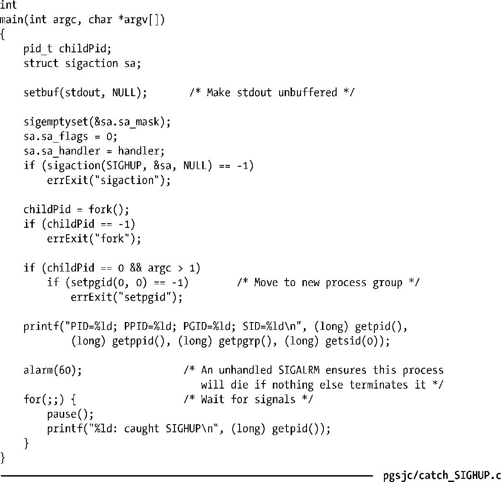
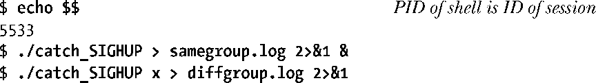
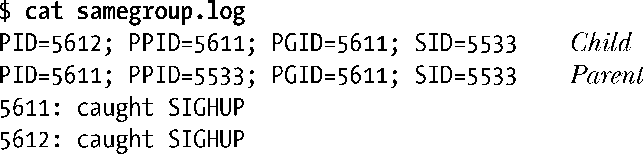
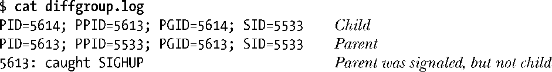

### 34.6.1　在shell中处理SIGHUP信号

在登录会话中，shell通常是终端的控制进程。大多数shell程序在交互式运行时会为SIGHUP信号建立一个处理器。这个处理器会终止shell，但在终止之前会向由shell创建的各个进程组（包括前台和后台进程组）发送一个SIGHUP信号。（在SIGHUP信号之后可能会发送一个SIGCONT信号，这依赖于shell本身以及任务当前是否处于停止状态。）至于这些组中的进程如何响应SIGHUP信号则需要根据应用程序的具体需求，如果不采取特殊的动作，那么默认情况下将会终止进程。

> 一些任务控制shell在正常退出（如登出或在shell窗口中接下Control-D）时也会发送SIGHUP信号来停止后台任务。bash和Korn shell都采取了这种处理方式（在首次登出尝试时打印出一条消息之后）。
> nohup(1)命令可以用来使一个命令对SIGHUP信号免疫——即执行命令时将SIGHUP信号的处理设置为SIG_IGN。bash内置的命令disown提供了类似的功能，它从shell的任务列表中删除一个任务，这样在shell终止时就不会向该任务发送SIGHUP信号了。

程序清单34-3演示了shell接收SIGHUP信号并向其创建的任务发送SIGHUP信号的过程。这个程序的主要任务是创建一个子进程，然后让父进程和子进程暂停执行以捕获SIGHUP信号并在收到该信号时打印一条消息。如果在执行程序时使用了一个可选的命令行参数（它可以是任意字符串），那么子进程会将其自身放置在一个不同的进程组中（在同一个会话中）。这个功能对于说明shell不会向不是由它创建的进程组发送SIGHUP信号，即使该进程组与shell位于同一个会话中来讲是非常有用的。（由于程序中最后一个for循环是一个无限循环，因此这个程序使用了alarm()设置一个定时器来发送SIGALRM信号。如果一个进程没有终止的话，那么当它接收到SIGALRM信号而不做处理时会导致进程终止。）

程序清单34-3：捕获SIGHUP信号

假设在一个终端窗口中输入了下面的命令来运行程序清单34-3中的程序的两个实例，接着关闭终端窗口。

第一个命令会导致创建两个进程，这两个进程属于由shell创建的进程组。第二个命令创建了一个子进程，子进程将自身放置在了一个不同的进程组中。

当查看samegroup.log时会发现其中包含了下面的输出，表明两个进程组的成员都收到了shell发送的信号。

当查看diffgroup.log时会发现下面的输出，表明shell在收到SIGHUP时不会向不是由它创建的进程组发送信号。

