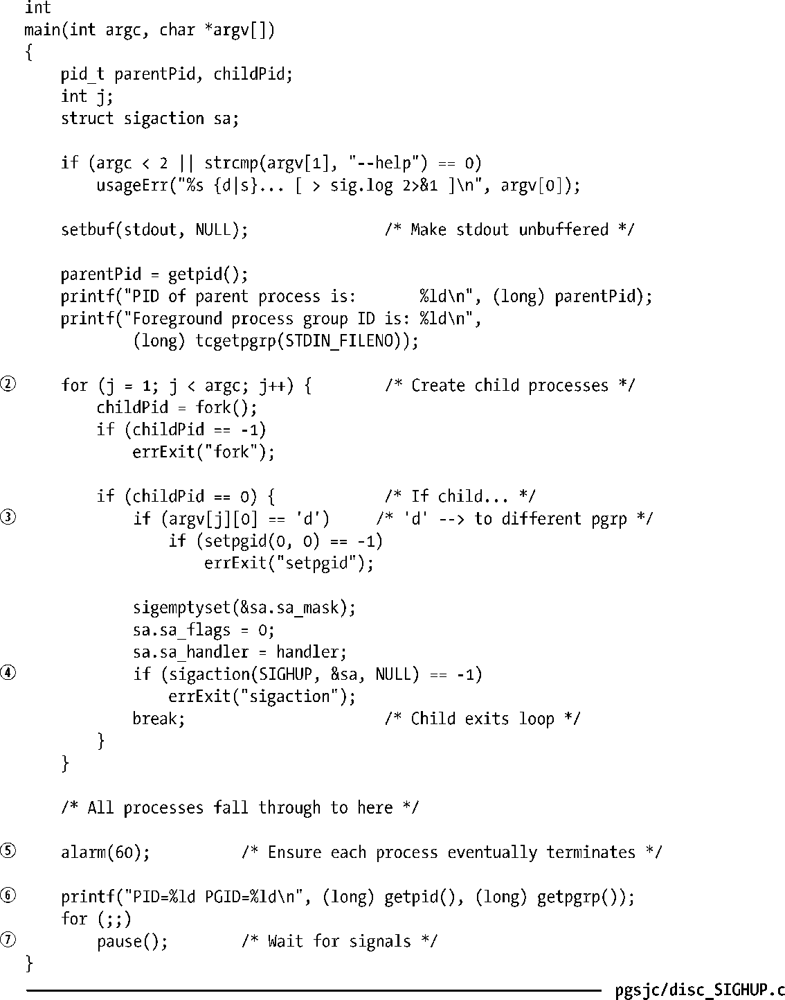
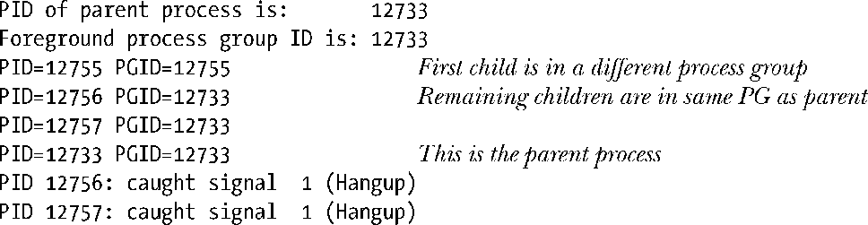

### 34.6.2　SIGHUP和控制进程的终止

如果因为终端断开引起的向控制进程发送的SIGHUP信号会导致控制进程终止，那么SIGHUP信号会被发送给终端的前台进程组中的所有成员（见25.2节）。这个行为是控制进程终止的结果，而不是专门与SIGHUP信号关联的行为。如果控制进程出于任何原因终止，那么前台进程组就会收到SIGHUP信号。

> 在Linux上，SIGHUP信号后面会跟着一个SIGCONT信号以确保在进程组之前被一个信号停止的情况下恢复该进程组。但SUSv3并没有指定这种行为，并且在这种情况下大多数其他UNIX实现不会发送SIGCONT信号。

程序清单34-4演示了控制进程的终止导致向终端的前台进程组的所有成员发送SIGHUP信号。这个程序为每个命令行参数都创建了一个子进程②。如果相应的命令行参数是d，那么子进程会将自身放置在自己的（不同的）进程组中③；否则的话子进程加入到父进程所在的进程组中。（这里使用了字母 s 来指定后面这种处理方式，尽管可以使用除d之外的任意字母。）接着各个子进程设置了SIGHUP信号处理器④。为确保它们能够在进程终止事件不发生的情况下正常终止，父进程和子进程都调用了alarm()设置一个定时器以在60秒之后发送一个SIGALRM信号⑤。最后所有进程（包括父进程）打印出了它们的进程ID和进程组ID⑥，接着循环等待信号的到达⑦。当发出信号之后，处理器会打印出进程的进程ID和信号数值①。

程序清单34-4　在终端断开发生时捕获SIGHUP信号

假设使用下面的命令在一个终端窗口中运行了程序清单34-4中的程序。

exec命令时一个shell内置命令，它会导致shell执行一个exec()来使用指定的程序取代自己。由于 shell 是终端的控制进程，因此现在这个程序已经成为了控制进程并且在终端窗口被关闭时会收到SIGHUP信号。在关闭终端窗口之后，在sig.log文件中会看到下面的输出。

关闭终端窗口会导致SIGHUP信号被发送给控制进程（父进程），进而导致该进程的终止。从上面可以看出，两个子进程与父进程位于同一个进程组中（终端的前台进程组），它们都收到了SIGHUP信号，但位于另一个进程组（后台）中的子进程并没有收到这个信号。

