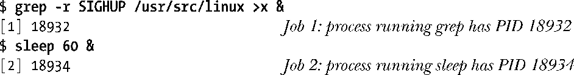
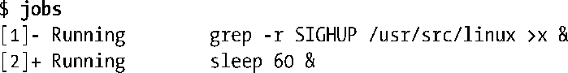
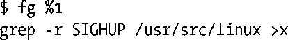
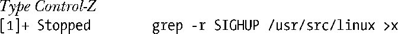
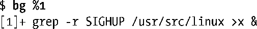
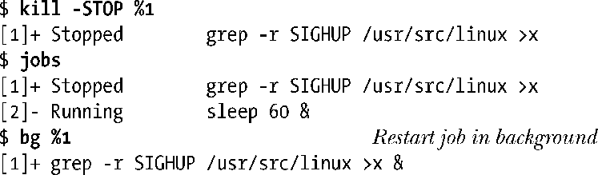
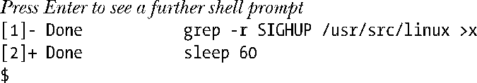
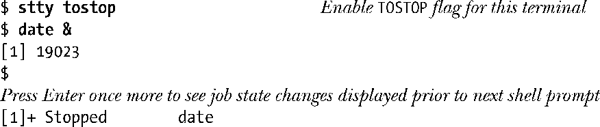
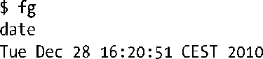

### 34.7.1　在shell中使用作业控制

当输入的命令以&符号结束时，该命令会作为后台任务运行，如下面的示例所示。

shell会为后台的每个进程赋一个唯一的作业号。当作业在后台运行之后以及在使用各种作业控制命令操作或监控作业时作业号会显示在方括号中。作业号后面的数字是执行这个命令的进程的进程ID或管道中最后一个进程的进程ID。在后面几个段落中介绍的命令中会使用%num来引用作业，其中num是shell赋给作业的作业号。

> 在很多情况下是可以省略%num的，当省略%num时默认指当前作业。当前作业是在前台最新被停止的作业（使用下面介绍的挂起字符）或者如果没有这样的作业的话，最新作业是在后台启动的任务。（不同shell确定哪个后台作业为当前作业的细节方面稍微有些不同。）另外，%%和%+符号指的是当前作业，%−符号指的是上一个当前作业。在jobs命令的输出中，当前的和上一个当前作业分别用加号（+）和减号（−）标记，稍后就会对此予以介绍。

jobs是shell内置的一个命令，它会列出所有后台作业。

在这个时刻，shell是终端的前台进程。由于仅有一个前台进程能够从控制终端读取输入和接收终端生成的信号，因此有时候需要将后台作业移动到前台。这是通过fg这个shell内置命令来完成的。

从上面的示例中可以看出，当在前后台之间移动作业时shell会重新打印出该作业的命令行。读者通过阅读下面的内容就会发现，当作业在后台的状态发生变化时，shell也会重新打印该作业的命令行。

当作业在前台运行时可以使用终端挂起字符（通常是Control-Z）来挂起作业，它会向终端的前台进程组发送一个SIGTSTP信号。

在按下Control-Z之后，shell会打印出在后台被停止的命令。如果需要的话，可以使用fg命令在前台恢复这个作业或使用bg命令在后台恢复这个命令。不管使用哪个命令恢复作业，shell都会通过向任务发送一个SIGCONT信号来恢复被停止的作业。

通过向后台作业发送一个SIGSTOP信号能够停止该后台作业。

> Korn和C shell提供了一个命令stop作为kill-stop快捷方式。

当后台作业最后执行结束之后，shell会在打印下一个shell提示符之前先打印一条消息。

只有前台作业中的进程才能够从控制终端中读取输入。这个限制条件避免了多个作业竞争读取终端输入。如果后台作业尝试从终端中读取输入，就会接收到一个SIGTTIN信号。SIGTTIN信号的默认处理动作是停止作业。

> 在上一个例子以及后面的几个例子中可能不需要按下回车键就能看到作业状态变更信息。根据内核的调度决策，shell可能会在打印下一个shell提示符之前接收到有关后台作业状态变更的通知。

现在必须要将作业移到前台来（fg）并向其提供所需的输入了。如果需要的话，可以通过先挂起该作业后在后台恢复该作业（bg）的方式继续该作业的执行。（当然，在这个特定的例子中，cat将会再次立即被停止，因为它会再次尝试从终端中读取输入。）

在默认情况下，后台作业是被允许向控制终端输入内容的。但如果终端设置了TOSTOP标记（终端输出停止，参见62.5节），那么当后台作业尝试在终端上输出时会导致SIGTTOU信号的产生。（使用stty命令能够设置TOSTOP标志，62.3节将会对此予以介绍。）与SIGTTIN信号一样，SIGTTOU信号会停止作业。

可以通过将作业移到前台来查看作业的输出。

作业具备多种状态，作业控制以及shell命令和终端字符（以及相应的信号）可以使作业在不同状态之间迁移，图34-2对作业的状态进行了总结。这些作业可以通过向作业发送各种信号来到达，如SIGINT和SIGQUIT信号，而这些信号可以通过键盘来生成。

<b class="my_markdown">图34-2　作业控制状态</b>

