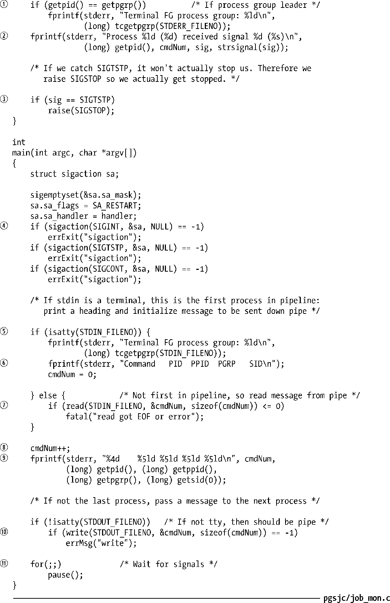
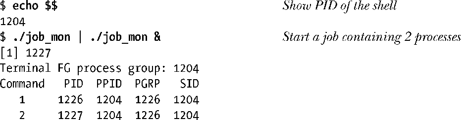
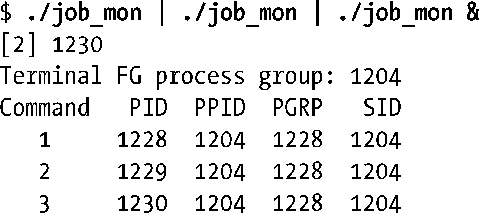
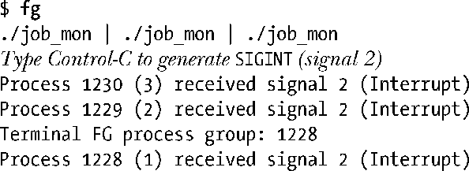
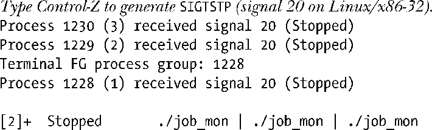
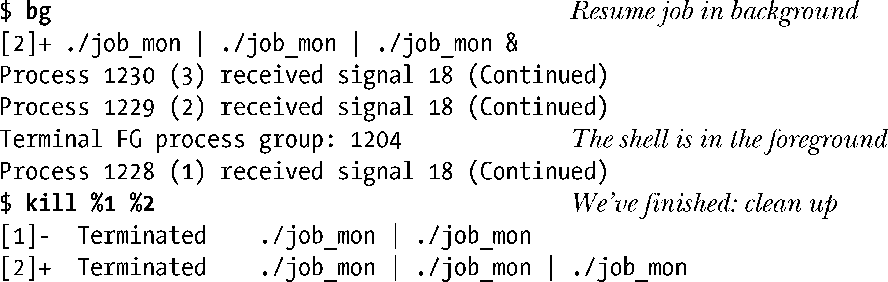

### 34.7.2　实现作业控制

本节将先介绍与实现作业控制有关的各个方面，最后介绍一个能使作业控制操作更加透明的示例程序。

尽管作业控制一开始在POSIX.1标准中是可选的，但在后面的标准中，包括SUSv3，则要求实现必须要支持作业控制。这种支持所需的条件如下。

+ 实现必须要提供特定的作业控制信号：SIGTSTP、SIGSTOP、SIGCONT、SIGTTOU以及SIGTTIN。此外，SIGCHLD信号（参见26.3节）也是必需的，因为它允许shell（所有任务的父进程）找出其子进程何时执行终止或被停止了。
+ 终端驱动器必须要支持作业控制信号的生成，这样当输入特定的字符或进行终端I/O以及在后台作业中执行特定的其他终端操作（下面将会予以介绍）时需要将恰当的信号（如图34-2所示）发送到相关的进程组。为了能够完成这些动作，终端驱动器必须要记录与终端相关联的会话ID（控制进程）和前台进程组ID（图34-1）。
+ shell必须要支持作业控制（大多数现代shell都具备这个功能）。这种支持是通过前面介绍的将作业在前台和后台之间迁移以及监控作业的状态的命令的形式来完成的。其中某些命令会向作业发送信号（如图34-2所示）。此外，在执行将作业从前台运行的状态迁移至其他状态的操作中，shell使用tcsetpgrp()调用来调整终端驱动器中与前台进程组有关的记录信息。

> 在20.5节中曾经讲过，信号一般只有在发送进程的真实或有效用户ID与接收进程的真实用户ID或保存的set-user-ID匹配时才会被发送给进程，但SIGCONT是这个规则的一个例外。内核允许一个进程（如shell）向同一会话中的任意进程发送SIGCONT信号，不管进程的验证信息是什么。在SIGCONT信号上放宽这个规则是有必要的，这样当用户开始一个会修改自身的验证信息（特别是真实的用户ID）的set-user-ID程序时，仍然能够在程序被停止时通过SIGCONT信号来恢复这个程序的运行。

#### SIGTTIN和SIGTTOU信号

SUSv3对后台进程的SIGTTIN和SIGTTOU信号的产生规定了一些特殊情况（Linux实现了这些规定）。

+ 当进程当前处于阻塞状态或忽视SIGTTIN信号的状态时则不发送SIGTTIN信号，这时试图从控制终端发起read()调用会失败，errno会被设置成EIO。这种行为的逻辑是没有这种行为的话进程就无法知道不允许进行read()操作。
+ 即使终端被设置了TOSTOP标记，当进程当前处于阻塞状态或忽视SIGTTIN信号的状态时也不发送SIGTTOU信号。这时从控制终端发起write()调用是允许的（即TOSTOP标记被忽视了）。
+ 不管是否设置了TOSTOP标记，当后台进程试图在控制终端上调用会修改终端驱动器数据结构的特定函数时会生成SIGTTOU信号。这些函数包括tcsetpgrp()、tcsetattr()、tcflush()、tcflow()、tcsendbreak()以及tcdrain()。（第62章将会介绍这些函数。）如果SIGTTOU信号被阻塞或被忽视了，那么这些调用就会成功。

#### 示例程序：演示作业控制的操作

通过程序清单34-5给出的程序能够看出shell是如何将命令以管道连接的形式组织进一个作业的（进程组）。此外，通过这个程序还能监控发送的特定信号以及在作业控制中对终端的前台进程组设置所做的变更。读者可以以管道的形式运行这个程序的多个实例，如下面的例子所示。

程序清单34-5中的程序执行了下面的操作。

+ 在启动的时候，程序为SIGINT、SIGTSTP和SIGTSTP信号④安装了一个处理器，该处理器执行下面的动作。
      + 显示终端的前台进程组①。为避免在输出中出现多行相同的内容，只有进程组首进程才能执行这个动作。
    + 显示进程的ID、进程在管道中的位置以及接收到的信号②。
    + 当处理器捕获到SIGTSTP信号时必须要做一些额外的处理工作，因为捕获到这个信号不会停止进程。这样要停止进程的话处理器就需要发出一个SIGSTOP信号③，因为这个信号总是会停止进程的执行。（在34.7.3节中将会优化SIGTSTP信号的处理方式。）  
+ 如果程序是管道中的第一个进程，那么它就会打印出所有进程的输出的标题⑥。为了检测进程本身是否是管道中的第一个进程（或最后一个进程），程序使用了isatty()函数（62.10节中将会予以介绍）来检查其标准输入（或输出）是否是一个终端⑤。如果指定的文件描述符是一个管道，那么isatty()返回false（0）。
+ 程序构建了一个消息并将消息传递给了管道中的下一个命令。这个消息是一个表明进程在管道中的位置的整数。因此，对于第一个进程来讲，消息中包含数字1。如果程序是管道中的第一个进程，那么消息被初始化为0。如果程序不是管道中的第一个进程，那么程序首先会从其前面的进程中读取这个消息⑦。程序在将控制权传递给下一个进程之前会递增消息值⑧。
+ 不管程序在管道中所处的位置如何，它都会输出一行包含其在管道中的位置、进程ID、父进程ID、进程组ID以及会话ID的文本⑨。
+ 除非程序是管道中的最后一个命令，否则就会写入一个整数消息以将其传递给管道中的下一个命令。
+ 最后，程序会无限循环并使用pause()等待信号⑪。

程序清单34-5：观察作业控制中的进程处理

下面的shell会话演示了程序清单34-5中的程序的用法。它首先打印出了shell的进程ID（它是会话首进程和进程组首进程，尽管它是进程组中的唯一成员），接着创建了一个包含两个进程的后台作业。

从上面的输出可以看出，shell仍然是终端的前台进程，并且新作业与shell位于同一个会话中，所有进程都位于同一个进程组中。从进程ID可以看出，作业中进程的创建顺序与命令在命令行中出现的顺序是一致的。（大多数shell是这样处理的，但有些shell实现创建进程的顺序与命令在命令行中出现的顺序不一致。）

下面继续创建第二个包含三个进程的后台作业。

从上面可以看出，shell仍然是终端的前台进程组，新任务中的进程与shell位于同一个会话中，但所处的进程组则与第一个任务中的进程所处的进程组不同。下面将第二个任务迁移至前台并向其发送一个SIGINT信号。

从上面的输出可以看出，SIGINT信号被发送给了前台进程组中的所有进程，并且这个作业现在已经成为了终端的前台进程组。接着向这个作业发送一个SIGTSTP信号。

现在进程组中的所有成员都被停止了。从输出中可以看出进程组1228是前台作业，但当这个作业被停止之后，shell变成了前台进程组，虽然这一点无法从输出中看出。

接着使用bg命令重新开始这个作业，该命令会向作业中的进程发送一个SIGCONT信号。

