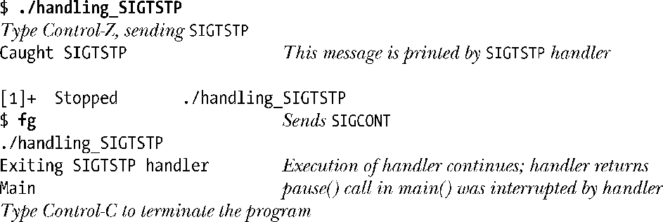
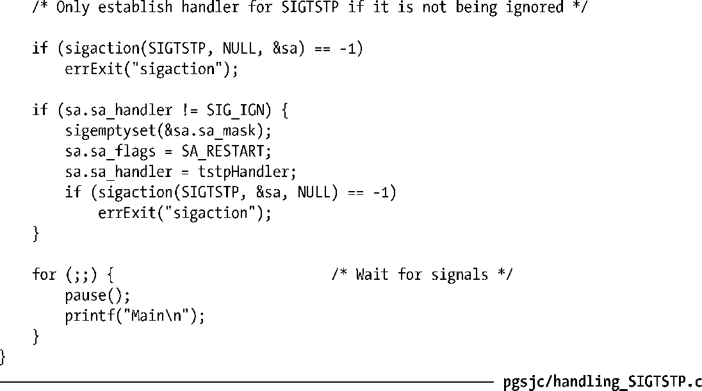

### 34.7.3　处理作业控制信号

由于对于大多数应用程序来讲作业控制的操作是透明的，因此它们无需对作业控制信号采取特殊的动作，但像vi和less之类的进行屏幕处理的程序则是例外，因为它们需要控制文本在终端上的布局和修改各种终端设置，包括允许在某一时刻从终端输入中读取一个字符（不是一行）的设置。（第62章将会介绍各种终端设置。）

屏幕处理程序需要处理终端停止信号（SIGTSTP）。信号处理器应该将终端重置为规范（每次一行）输入模式并将光标放在终端的左下角。当进程恢复之后，程序会将终端设置回所需的模式，检查终端窗口大小（窗口大小同时可能会被用户改掉）以及使用所需的内容重新绘制屏幕。

> 当挂起或退出诸如vi、xterm或其他终端处理程序时通常会看到程序使用启动之前的可见文本来绘制终端。这些终端处理程序是通过捕获两个字符序列来取得这种效果的，所有使用terminfo或termcap包的程序在取得和释放终端布局的控制时都需要输出这两个字符序列。第一个字符序列称为smcup（通常是Escape后面跟着[?1049h），它会导致终端处理程序切换至其“预备”屏幕。第二个序列称为rmcup（通常是Escape后面跟着[?1049l），它会导致终端处理程序恢复到默认屏幕，从而导致在显示器上重现屏幕处理程序在获取终端的控制权之前的初始文本。

在处理SIGTSTP信号时需要清楚一些细节问题。第一个问题是在34.7.2节中提及过的：如果SIGTSTP信号被捕获了，那么就不会执行默认的停止进程的动作。在程序清单34-5中是通过让SIGTSTP信号的处理器生成一个SIGSTOP信号来解决这个问题的。由于SIGSTOP信号是无法被捕获、阻塞和忽略的，因此能确保立即停止进程，但这种方式不是非常准确。在26.1.3节中曾经介绍过父进程可以使用wait()或waitpid()返回的等待状态值来确定哪个信号导致了其子进程的停止。如果在SIGTSTP信号处理器中生成了SIGSTOP信号，那么对于父进程来讲，其子进程是被SIGSTOP信号停止的，这就会产生误导。

在这种情况下，恰当的处理方式是让SIGTSTP信号处理器再生成一个SIGTSTP信号来停止进程，如下所示。

**1．** 处理器将SIGTSTP信号的处理重置为默认值（SIG_DFL）。

**2．** 处理器生成SIGTSTP信号。

**3．** 由于SIGTSTP信号会被阻塞进入处理器（除非指定了SA_NODEFER标记），因此处理器会接触该信号的阻塞。这时，在上一个步骤中生成的SIGTSTP信号会导致默认动作的执行：进程会立即被挂起。

**4．** 在后面的某个时刻，当进程接收到SIGCONT信号时会恢复。这时，处理器的执行就会继续。

**5．** 在返回之前，处理器会重新阻塞SIGTSTP信号并重新注册本身来处理下一个SIGTSTP信号。

执行重新阻塞SIGTSTP信号这一步是因为防止在处理器重新注册本身之后和返回之前接收到另一个SIGTSTP信号而导致处理器被递归调用的情况。在22.7节中曾经提及过在快速发送信号时递归调用一个信号处理器会导致栈溢出。阻塞信号还避免了信号处理器在重新注册本身和返回之前需要执行其他动作（如保存和还原全局变量）时存在的问题。

#### 示例程序

程序清单34-6中的处理器实现了上面描述的步骤，从而能够正确地处理SIGTSTP。（在程序清单62-4中给出了另一个处理SIGTSTP信号的例子）。在注册了SIGTSTP信号处理器之后，这个程序的main()函数开始循环等待信号。下面是运行这个程序之后的输出。

在诸如vi之类的屏幕处理程序中，程序清单34-6中的信号处理器中的printf()调用将会被前面概括过的能修改终端模式并重新绘制终端显示的程序所取代。（由于需要避免调用非同步信号安全函数，参见21.1.2节，处理器应该通过设置一个标记通知主程序重新绘制屏幕。）

注意SIGTSTP处理器可能会中断特定的阻塞式系统调用（如21.5节中描述的那样）。从上面执行程序的输出中也可以看出这一点，在pause()调用被中断之后，主程序打印出了消息Main。

程序清单34-6：处理SIGTSTP

#### 处理被忽略的任务控制和终端生成的信号

程序清单34-6中给出的程序只有在SIGTSTP信号不被忽略的情况下才会为该信号建立一个信号处理器。这里其实是遵循了一个常规规则，即应用程序应该在作业控制和终端生成信号不被忽略的时候才处理这些信号。对于作业控制信号（SIGTSTP、SIGTTIN以及SIGTTOU）来讲，这个规则防止应用程序试图处理那些从非作业控制shell（如传统的Bourne shell）发出的信号。在非作业控制shell中，这些信号的处理被设置成了SIG_IGN，只有作业控制shell将这些信号的处理设置成了SIG_DFL。

一个类似的规则同样适用于其他由终端生成的信号：SIGINT、SIGQUIT以及SIGHUP。对于SIGINT和SIGQUIT来讲，其原因是当一个命令在非作业控制shell的后台执行时，结果进程不会被放置在一个单独的进程组中，而是与shell位于同一个进程组中，而shell会在执行命令之前将SIGINT和SIGQUIT的处理设置为忽略。这样就能确保当用户输入终端中断或退出字符（它们应该只会影响到在前台运行的作业）时进程不会被杀死。如果进程在后面取消了shell对这些信号的处理动作，那么会更容易受到这些信号的影响。

当命令通过nohup(1)被执行时会忽略SIGHUP信号，这样就防止了当终端被挂断时命令被杀死的情况的发生，因此应用程序不应该在该信号被忽略时试图改变这个信号的处理动作。

