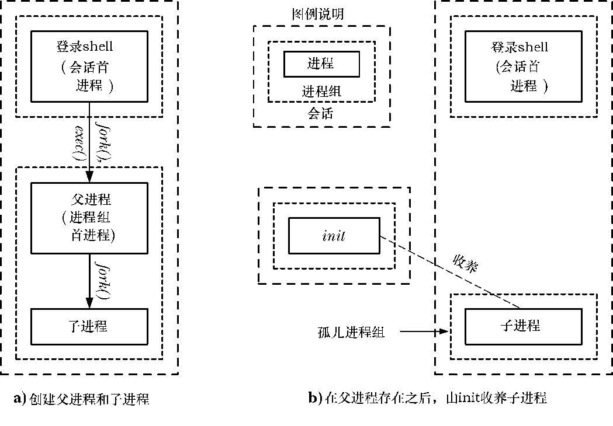
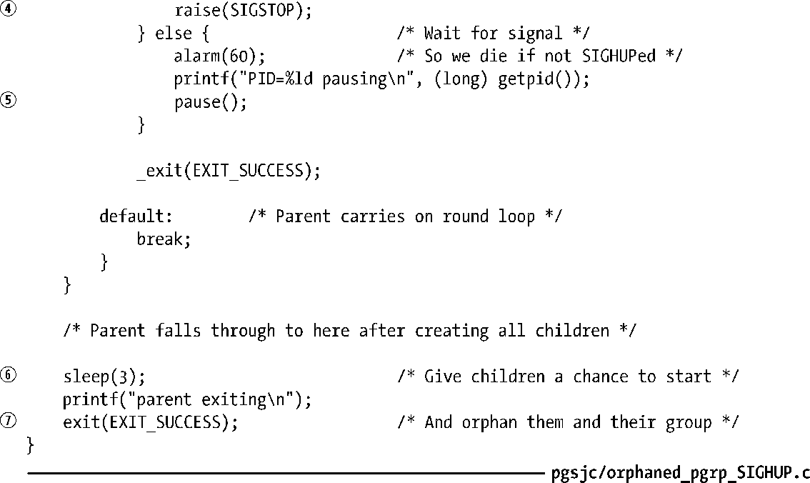
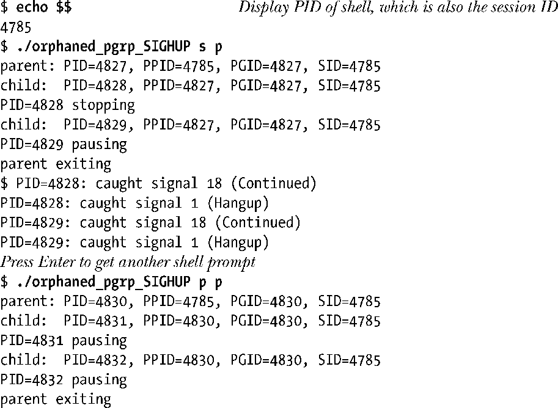

### 34.7.4　孤儿进程组（SIGHUP回顾）

在26.2节中曾经讲过孤儿进程是那些在父进程终止之后被init进程（进程ID为1）收养的进程。在程序中可以使用下面的代码创建一个孤儿进程。

假设在shell中执行一个包含上面这段代码的程序，图34-3给出了父进程终止前后该进程的状态。

<b class="my_markdown">图34-3　创建孤儿进程组的步骤</b>

从图34-3中可以看出，在父进程终止之后，子进程不仅是一个孤儿进程，同时也是孤儿进程组的一个成员。SUSv3认为当一个进程组满足“每个成员的父进程本身是组的一个成员或不是组会话的一个成员”时就变成了一个孤儿进程组。换句话说，如果一个进程组中至少有一个成员拥有一个位于同一会话但不同进程组中的父进程，就不是孤儿进程组。图34-3中包含子进程的进程组是孤儿进程组，因为进程组中的子进程是唯一进程，其父进程（init）位于不同的会话中。

> 根据定义，会话首进程位于孤儿进程组中。这是因为setsid()在新会话中创建了一个新进程组，而会话首进程的父进程则位于不同的会话中。

从shell作业控制的角度来讲，孤儿进程组是非常重要的。根据图34-3考虑下面的场景。

**1．** 在父进程退出之前，子进程被停止了（可能是由于父进程向子进程发送了一个停止信号）。

**2．** 当父进程退出时shell从作业列表中删除了父进程的进程组。子进程由init收养并变成了终端的一个后台进程，包含该子进程的进程组变成了孤儿进程组。

**3．** 这时没有进程会通过wait()监控被停止的子进程的状态。

由于shell并没有创建子进程，因此它不清楚子进程是否存在以及子进程与已经退出的父进程位于同一个进程组中。此外，init进程只会检查被终止的子进程并清理该僵尸进程，从而导致被停止的子进程可能会永远残留在系统中，因为没有进程知道要向其发送一个SIGCONT信号来恢复它的执行。

即使孤儿进程组中一个被停止的进程拥有一个仍然存活但位于不同会话中的父进程，也无法保证父进程能够向这个被停止的子进程发送SIGCONT信号。一个进程可以向同一会话中的任意其他进程发送SIGCONT信号，但如果子进程位于不同的会话中，发送信号的标准规则就开始起作用了（参见20.5节），因此如果子进程是一个修改了自身的验证信息的特权进程，父进程可能就无法向子进程发送信号。

为防止上面所描述的情况的发生，SUSv3规定，如果一个进程组变成了孤儿进程组并且拥有很多已停止执行的成员，那么系统会向进程组中的所有成员发送一个SIGHUP信号通知它们已经与会话断开连接了，之后再发送一个SIGCONT信号确保它们恢复执行。如果孤儿进程组不包含被停止的成员，那么就不会发送任何信号。

一个进程组变成孤儿进程组的原因可能是因为最后一个位于不同进程组但属于同一会话的父进程终止了，也可能是因为父进程位于另一个进程组中的进程组中最后一个进程终止了。（图34-3展示了后一种情况。）不管是何种原因引起的，对包含被停止的子进程的新孤儿进程组的处理是一样的。

> 向包含被停止的成员的新孤儿进程组发送SIGHUP和SIGCONT信号是为了消除任务控制框架中的特定漏洞，因为没有任何措施能够防止一个进程（拥有合适的权限）向孤儿进程组中的成员发送停止信号来停止它们。这样，进程就会保持在停止的状态，直到一些进程（同样需要拥有合适的权限）向它们发送一个SIGCONT信号。
> 孤儿进程组中的成员在调用tcsetpgrp()函数（参见34.5节）时会得到ENOTTY的错误，在调用tcsetattr()、tcflush()、tcflow()、tcsendbreak()和tcdrain()函数时（参见第62章）会得到EIO的错误。

#### 示例程序

程序清单34-7演示了前面描述的对孤儿进程的处理。在为SIGHUP和SIGCONT信号建立了处理器之后②，程序为每个命令行参数创建了一个子进程③。接着每个子进程停止了自己（通过发出SIGSTOP信号）④或等待信号（使用pause()）⑤。至于子进程到底选择何种动作则取决于相应的命令行参数是否以字母s（表示stop）打头。（这里使用了以字母p打头的命令行参数来表示相反的动作，即调用pause()，尽管可以使用除字母s之外的任何字母。）

在创建完所有子进程之后，父进程会睡眠一段时间以允许设置子进程时间⑥。（在24.2节中曾经提及过以这种方式使用sleep()不是一个完美的方案，但有时候确实是达成这一目标的可行方法。）接着父进程会退出⑦，这时包含子进程的进程组就会变成孤儿进程组。如果有子进程因为进程组变成孤儿进程组而收到信号，就会调用信号处理器，信号处理器会显示出子进程的进程ID和信号编号①。

程序清单34-7　SIGHUP和孤儿进程组

下面的shell会话日志给出了两次运行程序清单34-7中的程序的结果。

第一次运行时在即将变为孤儿进程组的进程组中创建了两个子进程：一个进程停止了自己，另一个则暂停了。（在这次运行中，shell提示符出现在子进程的输出的中间，这是因为shell注意到父进程已经退出了。）从输出中可以看出，两个子进程在父进程退出之后都收到了SIGCONT和SIGHUP信号。在第二次运行中创建了两个子进程，但它们都没有停止自身，因此当父进程退出之后不会发送任何信号。

#### 孤儿进程组和SIGTSTP、SIGTTIN、以及SIGTTOU信号

孤儿进程组还对SIGTSTP、SIGTTIN以及SIGTTOU信号的传输有影响。

在34.7.1节中讲过，当后台进程试图从控制终端中调用read()时将会收到SIGTTIN信号，当后台进程试图向设置了TOSTOP标记的控制终端调用write()时会收到SIGTTOU信号。但向一个孤儿进程组发送这些信号毫无意义，因为一旦被停止之后，它将再也无法恢复了。基于此，在进行read()和write()调用时内核会返回EIO的错误，而不是发送SIGTTIN或SIGTTOU信号。

基于类似的原因，如果SIGTSTP、SIGTTIN以及SIGTTOU信号的分送会导致停止孤儿进程组中的成员，那么这个信号会被毫无征兆地丢弃。（如果信号正在被处理，那么信号已经被分送给了进程。）这种行为不会因为信号发送方式（如信号可能是由终端驱动器产生的或由显式地调用kill()而发送）的改变而改变。

