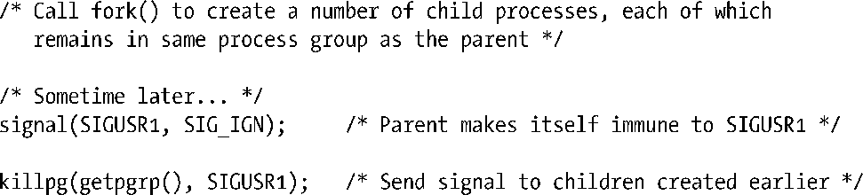

### 34.9　习题

**34-1.　** 假设一个父进程执行了下面的步骤。

这个应用程序设计可能会碰到什么问题？（考虑shell管道。）如何避免此类问题的发生？

**34-2.** 　编写一个程序来验证父进程能够在子进程执行exec()之前修改子进程的进程组ID，但无法在执行exec()之后修改子进程的进程组ID。

**34-3.** 　编写一个程序来验证在进程组首进程中调用setsid()会失败。

**34-4.** 　修改程序清单34-4（disc_SIGHUP.c）来验证当控制进程在收到SIGHUP信号而不终止时，内核不会向前台进程组中的成员发送SIGHUP信号。

**34-5.** 　假设将程序清单34-6中的信号处理器中解除阻塞SIGTSTP信号的代码移动到处理器的开头部分。这样做会导致何种竞争条件？

**34-6.** 　编写一个程序来验证当位于孤儿进程组中的一个进程试图从控制终端调用read()时会得到EIO的错误。

**34-7.** 　编写一个程序来验证当SIGTTIN、SIGTTOU或SIGTSTP三个信号中的一个信号被发送给孤儿进程组中的一个成员时，如果这个信号会停止该进程（即处理方式为SIG_DFL），那么这个信号就会被丢弃（即不产生任何效果），但如果该信号存在处理器，就会发送该信号。

