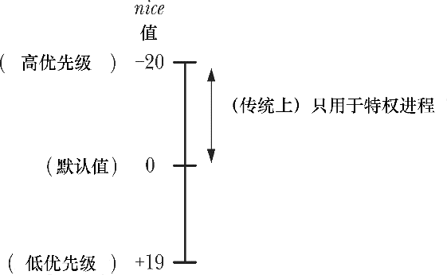
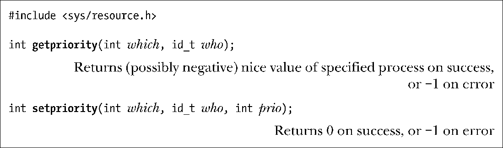
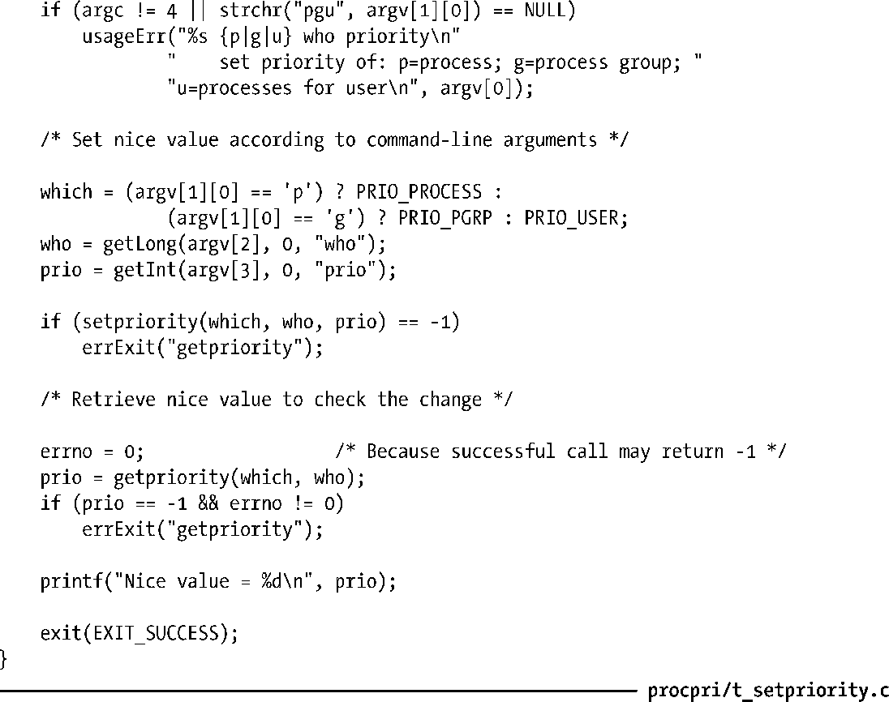

### 35.1　进程优先级（nice值）

Linux与大多数其他UNIX实现一样，调度进程使用CPU的默认模型是循环时间共享。在这种模型中，每个进程轮流使用CPU一段时间，这段时间被称为时间片或量子。循环时间共享满足了交互式多任务系统的两个重要需求。

+ 公平性：每个进程都有机会用到CPU。
+ 响应度：一个进程在使用CPU之前无需等待太长的时间。

在循环时间共享算法中，进程无法直接控制何时使用CPU以及使用CPU的时间。在默认情况下，每个进程轮流使用CPU直至时间片被用光或自己自动放弃CPU（如进行睡眠或执行一个磁盘读取操作）。如果所有进程都试图尽可能多地使用CPU（即没有进程会睡眠或被I/O操作阻塞），那么它们使用CPU的时间差不多是相等的。

进程特性nice值允许进程间接地影响内核的调度算法。每个进程都拥有一个nice值，其取值范围为−20（高优先级）～19（低优先级），默认值为0（参见图35-1）。在传统的UNIX实现中，只有特权进程才能够赋给自己（或其他进程）一个负（高）优先级。（在35.3.2节中将会解释一些Linux上的差别。）非特权进程只能降低自己的优先级，即赋一个大于默认值0的nice值。这样做之后它们就对其他进程“友好（nice）”了，这个特性的名称也由此而来。

<b class="my_markdown">图35-1　进程nice值的范围和解释</b>

使用fork()创建子进程时会继承nice值并且该值会在exec()调用中得到保持。

> getpriority()系统调用服务例程不会返回实际的nice值，相反，它会返回一个范围在1（低优先级）～40（高优先级）之间的数字，这个数字是通过公式unice=20-knice计算得来的。这样做是为了避免让系统调用服务例程返回一个负值，因为负值一般都表示错误。（参见3.1节中系统调用服务例程的描述。）应用程序是不清楚系统调用服务例程对返回值所做的处理的，因为C库函数getpriority()做了相反的计算操作，它将20-unice值返回给了调用程序。

#### nice值的影响

进程的调度不是严格按照nice值的层次进行的，相反，nice值是一个权重因素，它导致内核调度器倾向于调度拥有高优先级的进程。给一个进程赋一个低优先级（即高nice值）并不会导致它完全无法用到CPU，但会导致它使用CPU的时间变少。nice值对进程调度的影响程度则依据Linux内核版本的不同而不同，同时在不同UNIX系统之间也是不同的。

> 从版本号为2.6.23的内核开始，nice值之间的差别对新内核调度算法的影响比对之前的内核中的调度算法的影响要强。因此，低nice值的进程使用CPU的时间将比以前少，高nice值的进程占用CPU的时间将大大提高。

#### 获取和修改优先级

getpriority()和setpriority()系统调用允许一个进程获取和修改自身或其他进程的nice值。

两个系统调用都接收参数which和who，这两个参数用于标识需读取或修改优先级的进程。which参数确定who参数如何被解释。这个参数的取值为下面这些值中的一个。

##### PRIO_PROCESS

操作进程ID为who的进程。如果who为0，那么使用调用者的进程ID。

##### PRIO_PGRP

操作进程组ID为who的进程组中的所有成员。如果who为0，那么使用调用者的进程组。

##### PRIO_USER

操作所有真实用户ID为who的进程。如果who为0，那么使用调用者的真实用户ID。

who参数的类型id_t是一个大小能容纳进程ID或用户ID的整型。

getpriority()系统调用返回由which和who指定的进程的nice值。如果有多个进程符合指定的标准（当which为PRIO_PGRP或PRIO_USER时会出现这种情况），那么将会返回优先级最高的进程的nice值（即最小的数值）。由于getpriority()可能会在成功时返回−1，因此在调用这个函数之前必须要将errno设置为0，接着在调用之后检查返回值为−1以及errno不为0才能确认调用成功。

setpriority()系统调用会将由which和who指定的进程的nice值设置为prio。试图将nice值设置为一个超出允许范围的值（-20～+19）时会直接将nice值设置为边界值。

> 以前nice值是通过调用nice(incr)来完成的，这个函数会将调用进程的nice值加上incr。现在这个函数仍然是可用的，但已经被更通用的setpriority()系统调用所取代了。
> 在命令行中与setpriority()系统调用实现类似功能的命令是nice(1)，非特权用户可以使用这个命令来运行一个优先级更低的命令，特权用户则可以运行一个优先级更高的命令，超级用户则可以使用renice(8)来修改既有进程的nice值。

特权进程（CAP_SYS_NICE）能够修改任意进程的优先级。非特权进程可以修改自己的优先级（将which设为PRIO_PROCESS，who设为0）和其他（目标）进程的优先级，前提是自己的有效用户ID与目标进程的真实或有效用户ID匹配。Linux中setpriority()的权限规则与SUSv3中的规则不同，它规定当非特权进程的真实或有效用户ID与目标进程的有效用户ID匹配时，该进程就能修改目标进程的优先级。UNIX实现在这一点上与Linux有些不同。一些实现遵循的SUSv3的规则，而另一些——特别是BSD系列——与Linux的行为方式一样。

> 版本号小于2.6.12的Linux内核与之后的内核对非特权进程调用setpriority()时使用的权限规则不同（也与SUSv3不同）。当非特权进程的真实或有效用户ID与目标进程的真实用户ID匹配时，该进程就能修改目标进程的优先级。从Linux 2.6.12开始，权限检查变得与Linux中类似的API一致了，如sched_setscheduler()和sched_setaffinity()。

在版本号小于2.6.12的Linux内核中，非特权进程只能使用setpriority()来降低（不可逆的）自己或其他进程的nice值。特权进程（CAP_SYS_NICE）可以使用setpriority()来提高nice值。

从版本号为2.6.12的内核开始，Linux提供了RLIMIT_NICE资源限制，即允许非特权进程提升nice值。非特权进程能够将自己的nice值最高提高到公式20−rlim_cur指定的值，其中rlim_cur是当前的RLIMIT_NICE软资源限制。如假设一个进程的RLIMIT_NICE软限制是25，那么其nice值可以被提高到−5。根据这个公式以及nice值的取值范围为+19（低）～−20（高）的事实可以得出RLIMIT_NICE的有效范围为1（低）～40（高）的结论。（RLIMIT_NICE没有使用范围为+19～−20之间的值，因为一些负的资源限制值具有特殊含义——如RLIM_INFINITY可以为−1。）

非特权进程能够通过setpriority()调用来修改其他（目标）进程的nice值，前提是调用setpriority()的进程的有效用户ID与目标进程的真实或有效用户ID匹配并且对nice值的修改符合目标进程的RLIMIT_NIC限制。

程序清单35-1中的程序使用setpriority()来修改通过命令行参数（对应于setpriority()函数的参数）指定的进程的nice值，接着调用getpriority()来验证变更是否生效。

程序清单35-1：修改和获取进程的nice值

