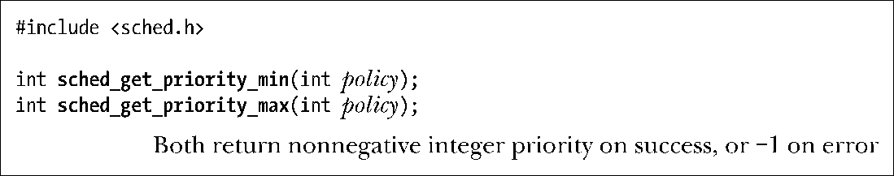

### 35.3.1　实时优先级范围

sched_get_priority_min()和sched_get_priority_max()系统调用返回一个调度策略的优先级取值范围。

在两个系统调用中，policy指定了需获取哪种调度策略的信息。这个参数的取值一般是SCHED_RR或SCHED_FIFO。sched_get_priority_min()系统调用返回指定策略的最小优先级，sched_get_priority_max()返回最大优先级。在Linux上，这些系统调用为SCHED_RR和SCHED_FIFO策略分别返回范围为1到99的数字。换句话说，两个实时策略的优先级取值范围是完全一样的，并且优先级相同的SCHED_RR和SCHED_FIFO进程都具备被调度的资格。（至于哪个进程先被调度则取决于它们在优先级级别队列中的顺序。）

不同UNIX实现中的实时策略的取值范围是不同的。因此不能在应用程序中硬编码优先级值，相反，需要根据两个函数的返回值来指定优先级。因此，SCHED_RR策略中最低的优先级应该是sched_get_priority_min(SCHED_FIFO)，比它高一级的优先级是sched_get_priority_min（SCHED_FIFO）+1，依此类推。

> SUSv3并不要求SCHED_RR和SCHED_FIFO策略使用同样的优先级范围，但在大多数UNIX实现中都是这样做的。如在Solaris 8中两种策略的优先级范围是0～59，而在FreeBSD 6.1中的优先级范围是0～31。

