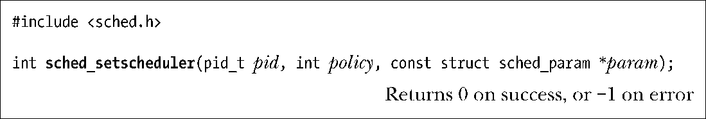
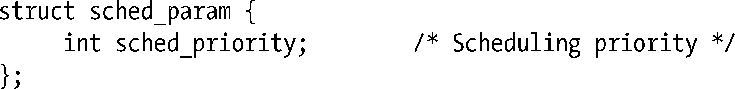
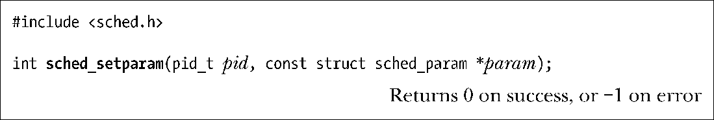
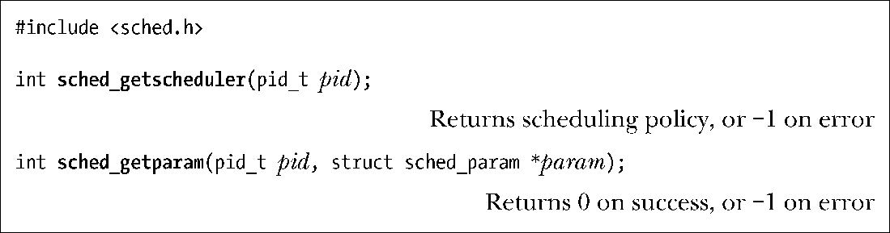
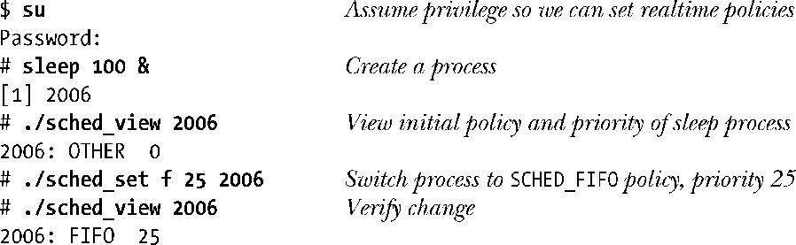
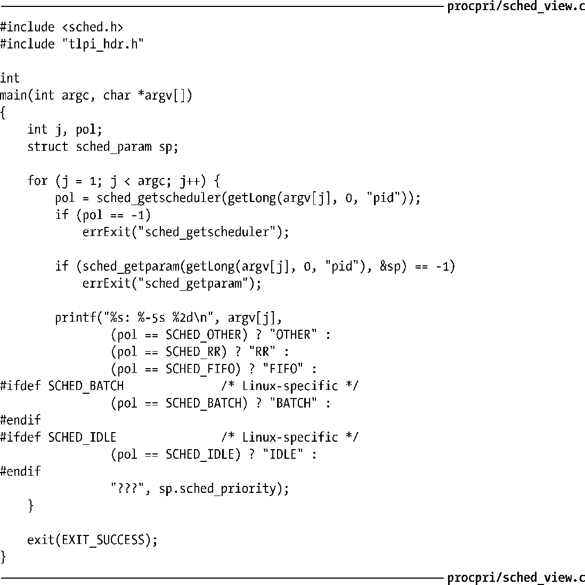

### 35.3.2　修改和获取策略和优先级

本节将介绍修改和获取调度策略和优先级的系统调用。

#### 修改调度策略和优先级

sched_setscheduler()系统调用修改进程ID为pid的进程的调度策略和优先级。如果pid为0，那么将会修改调用进程的特性。

param参数是一个指向下面这种结构的指针。

SUSv3将param参数定义成一个结构以允许实现包含额外的特定于实现的字段，当实现提供了额外的调度策略时这些字段可能会变得有用。但与大多数UNIX实现一样，Linux提供了sched_priority字段，该字段指定了调度策略。对于 SCHED_RR和SCHED_FIFO来讲，这个字段的取值必须位于 sched_get_priority_min()和 sched_get_priority_max()规定的范围内；对于其他策略来讲，优先级必须是0。

policy参数确定了进程的调度策略，它的取值为表35-1中的一个。

<b class="my_markdown">表35-1　Linux实时和非实时调度策略</b>

| 策　　略 | 描　　述 | SUSv3 |
| :-----  | :-----  | :-----  | :-----  | :-----  |
| SCHED_FIFO | SCHED_RR | 实时先入先出 实时循环 | ● | ● |
| SCHED_OTHER | SCHED_BATCH | SCHED_IDLE | 标准的循环时间分享 | 与SCHED_OTHER类似，但用于批量执行（自Linux 2.6.16起） | 与SCHED_OTHER类似，但优先级比最大的nice值（+19）还要低（自Linux 2.6.23起） | ● |

成功调用sched_setscheduler()会将pid指定的进程移到与其优先级级别对应的队列的队尾。

SUSv3规定成功调用sched_setscheduler()时其返回值应该是上一种调度策略。但Linux并没有遵循这个规则，在成功调用时该函数会返回0。一个可移植的应用程序应该通过检查返回值是否不为−1来判断调用是否成功。

通过fork()创建的子进程会继承父进程的调度策略和优先级，并且在exec()调用中会保持这些信息。

sched_setparam()系统调用提供了 sched_setscheduler()函数的一个功能子集。它修改一个进程的调度策略，但不会修改其优先级。

pid和param参数与sched_setscheduler()中相应的参数是一样的。

成功调用sched_setparam()会将pid指定的进程移到与其优先级级别对应的队列的队尾。

程序清单35-2使用sched_setscheduler()来设置由命令行参数指定的进程的策略和优先级。第一个参数是一个指定调度策略的字母，第二个参数是一个整数优先级，剩下的参数是需修改调度特性的进程的进程ID。

程序清单35-2　修改进程的调度策略和优先级

#### 权限和资源限制会影响对调度参数的变更

在2.6.12之前的内核中，进程必须要先变成特权进程（CAP_SYS_NICE）才能够修改调度策略和优先级。这个规则的一个例外情况是非特权进程在调用者的有效用户ID与目标进程的真实或有效用户 ID 匹配时就能将该进程的调度策略修改为SCHED_OTHER。

从2.6.12的内核开始，设置实时调度策略和优先级的规则发生了变动，即引入了一个全新的非标准的资源限制RLIMIT_RTPRIO。在老式内核中，特权（CAP_SYS_NICE）进程能够随意修改任意进程的调度策略和优先级。同时，非特权进程也能够根据下列规则修改调度策略和优先级。

+ 如果进程拥有非零的RLIMIT_RTPRIO软限制，那么它就能随意修改自己的调度策略和优先级，只要符合实时优先级的上限为其当前实时优先级（如果该进程当前运行于一个实时策略下）的最大值及其RLIMIT_RTPRIO软限制值的约束即可。
+ 如果进程的RLIMIT_RTPRIO软限制值为0，那么进程只能降低自己的实时调度优先级或从实时策略切换非实时策略。
+ SCHED_IDLE策略是一种特殊的策略。运行在这个策略下的进程无法修改自己的策略，不管RLIMIT_RTPRIO资源限制的值是什么。
+ 在其他非特权进程中也能执行策略和优先级的修改工作，只要该进程的有效用户ID与目标进程的真实或有效用户ID匹配即可。
+ 进程的软RLIMIT_RTPRIO限制值只能确定可以对自己的调度策略和优先级做出哪些变更，这些变更可以由进程自己发起，也可以由其他非特权进程发起。拥有非零限制值的非特权进程无法修改其他进程的调度策略和优先级。

> 从2.6.25的内核开始，Linux增加了实时调度组的概念。它通过CONFIG_RT_GROUP_SCHED内核参数进行配置，会影响到在设置实时调度策略时能够做出哪些变更，具体可参见内核源文件Documentation/scheduler/sched-rt-group.txt。

#### 获取调度策略和优先级

sched_getscheduler()和sched_getparam()系统调用获取进程的调度策略和优先级。

在这两个系统调用中，pid指定了需查询信息的进程ID。如果pid为0，那么就会查询调用进程的信息。两个系统调用都可被非特权进程用来获取任意进程的信息，而不管进程的验证信息是什么。

sched_getparam()系统调用返回由param指向的sched_param结构中sched_priority字段指定的进程的实时优先级。

如果执行成功，sched_getscheduler()将会返回前面表35-1中列出的一个策略。

程序清单35-3使用了sched_getscheduler()和sched_getparam()来获取进程ID为命令行参数指定的数值的进程的策略和优先级。下面的shell会话演示了这个程序的使用以及程序清单35-2的使用。

程序清单35-3　获取进程的调度策略和优先级

#### 防止实时进程锁住系统

由于SCHED_RR和SCHED_FIFO进程会抢占所有低优先级的进程（如运行这个程序的shell），因此在开发使用这些策略的应用程序时需要小心可能会发生失控的实时进程因一直占住CPU而导致锁住系统的情况。在程序中可以通过一些方法来避免这种情况的发生。

+ 使用setrlimit()设置一个合理的低软 CPU 时间组员限制（在36.3节中描述了RLIMIT_CPU）。如果进程消耗了太多的 CPU 时间，那么它将会收到一个SIGXCPU信号，该信号在默认情况下会杀死该进程。
+ 使用alarm()设置一个警报定时器。如果进程的运行时间超出了由alarm()调用指定的秒数，那么该进程会被SIGALRM信号杀死。
+ 创建一个拥有高实时优先级的看门狗进程。这个进程可以进行无限循环，每次循环都睡眠指定的时间间隔，然后醒来并监控其他进程的状态。这种监控可以包含对每个进程消耗的CPU时间的度量（参见23.5.3节中对clock_getcpuclockid()函数的讨论）并使用sched_getscheduler()和sched_getparam()来检查进程的调度策略和优先级。如果一个进程看起来行为异常，那么看门狗线线程可以降低该进程的优先级或向其发送合适的信号来停止或终止该进程。
+ 从2.6.25的内核开始，Linux提供了一个非标准的资源限制RLIMIT_RTTIME用于控制一个运行在实时调度策略下的进程在单次运行中能够消耗的CPU时间。RLIMIT_RTTIME的单位是毫秒，它限制了一个进程在不执行阻塞式系统调用时能够消耗的CPU时间。当进程执行了这样的系统调用时，累积消耗的CPU时间将会被重置为0。当这个进程被一个优先级更高的进程抢占时，累积消耗的CPU时间不会被重置。当进程的时间片被耗完或调用sched_yield()（参见35.3.3节）时进程会放弃CPU。当进程达到了CPU时间限制RLIMIT_CPU之后，系统会向其发送一个SIGXCPU信号，该信号在默认情况下会杀死这个进程。

> 版本号为2.6.25的内核中做出的这个变更还有助于避免失控的实时进程锁住系统，详细信息可参考内核源文件Documentation/scheduler/sched-rt-group.txt。

#### 避免子进程进程特权调度策略

Linux 2.6.32增加了一个SCHED_RESET_ON_FORK，在调用sched_setscheduler()时可以将policy参数的值设置为该常量。系统会将这个标记值与表35-1中列出的其中一个策略取OR。如果设置了这个标记，那么由这个进程使用fork()创建的子进程就不会继承特权调度策略和优先级了。其规则如下。

+ 如果调用进程拥有一个实时调度策略（SCHED_RR或SCHED_FIFO），那么子进程的策略会被重置为标准的循环时间分享策略SCHED_OTHER。
+ 如果进程的nice值为负值（即高优先级），那么子进程的nice值会被重置为0。

SCHED_RESET_ON_FORK标记用于媒体回放应用程序，它允许创建单个拥有实时调度策略但不会将该策略传递给子进程的进程。使用SCHED_RESET_ON_FORK标记能够通过创建多个运行于实时调度策略下的子进程来防止创建试图超出RLIMIT_RTTIME资源限制的子进程。

一旦进程启用了SCHED_RESET_ON_FORK标记，那么只有特权进程（CAP_SYS_NICE）才能够禁用该标记。当子进程被创建出来之后，它的reset-on-fork标记会被禁用。

