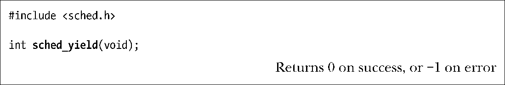

### 35.3.3　释放CPU

实时进程可以通过两种方式自愿释放CPU：通过调用一个阻塞进程的系统调用（如从终端中read()）或调用sched_yield()。

sched_yield()的操作是比较简单的。如果存在与调用进程的优先级相同的其他排队的可运行进程，那么调用进程会被放在队列的队尾，队列中队头的进程将会被调度使用CPU。如果在该优先级队列中不存在可运行的进程，那么sched_yield()不会做任何事情，调用进程会继续使用CPU。

虽然SUSv3允许sched_yield()返回一个错误，但在Linux或很多其他UNIX实现上这个系统调用总会成功。可移植的应用程序应该总是检查这个系统调用是否返回错误。

非实时进程使用sched_yield()的结果是未定义的。

