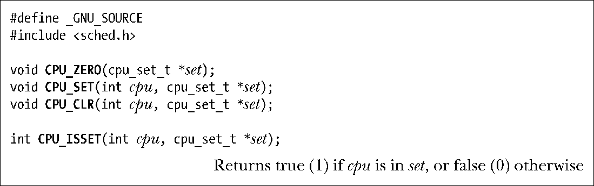
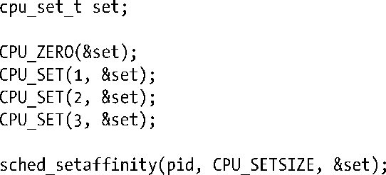

### 35.4　CPU亲和力

当一个进程在一个多处理器系统上被重新调度时无需在上一次执行的CPU上运行。之所以会在另一个 CPU 上运行的原因是原来的CPU处于忙碌状态。

进程切换CPU时对性能会有一定的影响：如果在原来的CPU的高速缓冲器中存在进程的数据，那么为了将进程的一行数据加载进新 CPU 的高速缓冲器中，首先必须使这行数据失效（即在没被修改的情况下丢弃数据，在被修改的情况下将数据写入内存）。（为防止高速缓冲器不一致，多处理器架构在某个时刻只允许数据被存放在一个CPU的高速缓冲器中。）这个使数据失效的过程会消耗时间。由于存在这个性能影响，Linux（2.6）内核尝试了给进程保证软 CPU 亲和力——在条件允许的情况下进程重新被调度到原来的CPU 上运行。

> 高速缓冲器中的一行与虚拟内存管理系统中的一页是类似的。它是CPU高速缓冲器和内存之间传输数据的单位。通常行大小的范围为32～128字节，更多信息请参考[Schimmel, 1994]和[Drepper, 2007]。
> Linux特有的/proc/PID/stat文件中的一个字段显示了进程当前执行或上一次执行时所在的CPU编号。具体请参见proc(5)手册。

有时候需要为进程设置硬CPU亲和力，这样就能显式地将其限制在可用CPU中的一个或一组CPU上运行。之所以需要这样做，原因如下。

+ 可以避免由使高速缓冲器中的数据失效所带来的性能影响。
+ 如果多个线程（或进程）访问同样的数据，那么当将它们限制在同样的CPU上的话可能会带来性能提升，因为它们无需竞争数据并且也不存在由此而产生的高速缓冲器未命中。
+ 对于时间关键的应用程序来讲，可能需要为此应用程序预留一个或更多CPU，而将系统中大多数进程限制在其他CPU上。

> 使用isolcpus内核启动参数能够将一个或更多CPU分离出常规的内核调度算法。将一个进程移到或移出被分离出来的CPU的唯一方式是使用本节介绍的CPU亲和力系统调用。isolcpus启动参数是实现上面列出的最后一种场景的首选方式，具体可参考内核源文件Documentation/ kernel-parameters.txt。
> Linux还提供了一个cpuset内核参数，该参数可用于包含大量CPU的系统以实现如何给进程分配CPU和内存的复杂控制，具体可参考内核源文件Documentation/cpusets.txt。

Linux 2.6提供了一对非标准的系统调用来修改和获取进程的硬CPU亲和力：sched_ setaffinity()和sched_getaffinity()。

> 很多其他UNIX实现提供了控制CPU亲和力的接口，如HP-UX和Solaris提供了pset_bind()系统调用。

sched_setaffinity()系统调用设置了pid指定的进程的CPU亲和力。如果pid为0，那么调用进程的CPU亲和力就会被改变。

赋给进程的CPU亲和力由set指向的cpu_set_t结构来指定。

> 实际上CPU亲和力是一个线程级特性，可以调整线程组中各个进程的CPU亲和力。如果需要修改一个多线程进程中某个特定线程的CPU亲和力的话，可以将pid设定为线程中gettid()调用返回的值。将pid设为0表示调用线程。

虽然cpu_set_t数据类型实现为一个位掩码，但应该将其看成是一个不透明的结构。所有对这个结构的操作都应该使用宏CPU_ZERO()、CPU_SET()、CPU_CLR()和CPU_ISSET()来完成。

下面这些宏操作set指向的CPU集合：

+ CPU_ZERO()将set初始化为空。
+ CPU_SET()将CPU cpu添加到set中。
+ CPU_CLR()从set中删除CPU cpu。
+ CPU_ISSET()在CPU cpu是set的一个成员时返回true。

> GNU C库还提供了其他一些宏来操作CPU集合，具体可参见CPU_SET(3)手册。

CPU集合中的CPU从0开始编号。<sched.h>头文件定义了常量CPU_SETSIZE，它是比cpu_set_t变量能够表示的最大CPU编号还要大的一个数字。CPU_SETSIZE的值为1024。

传递给sched_setaffinity()的len参数应该指定set参数中字节数（即sizeof(cpu_set_t)）。

下面的代码将pid标识出的进程限制在四处理器系统上除第一个CPU之外的任意CPU上运行。

如果set中指定的CPU与系统中的所有CPU都不匹配，那么sched_setaffinity()调用就会返回EINVAL错误。

如果运行调用进程的CPU不包含在set中，那么进程会被迁移到set中的一个CPU上。

非特权进程只有在其有效用户ID与目标进程的真实或有效用户ID匹配时才能够设置目标进程的CPU亲和力。特权（CAP_SYS_NICE）进程可以设置任意进程的CPU亲和力。

sched_getaffinity()系统调用获取pid指定的进程的CPU亲和力掩码。如果pid为0，那么就返回调用进程的CPU亲和力掩码。

返回的 CPU 亲和力掩码位于set指向的 cpu_set_t 结构中，同时应该将len参数设置为结构中包含的字节数，即 sizeof(cpu_set_t)。使用 CPU_ISSET()宏能够确定哪些 CPU 位于set中。

如果目标进程的CPU亲和力掩码并没有被修改过，那么sched_getaffinity()返回包含系统中所有CPU的集合。

sched_getaffinity()执行时不会进行权限检查，非特权进程能够获取系统上所有进程的CPU亲和力掩码。

通过fork()创建的子进程会继承其父进程的CPU亲和力掩码并且在exec()调用之间掩码会得以保留。

sched_setaffinity()和sched_getaffinity()系统调用是Linux特有的。

> 本书源代码中procpri子目录下t_sched_setaffinity.c和t_sched_getaffinity.c程序展示了sched_setaffinity()和sched_getaffinity()的使用。

