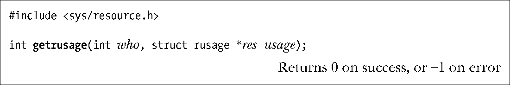
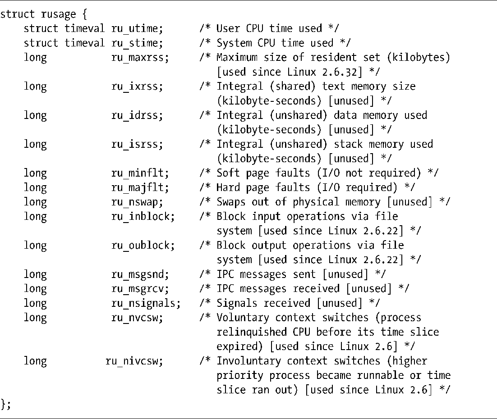

### 36.1　进程资源使用

getrusage()系统调用返回调用进程或其子进程用掉的各类系统资源的统计信息。

who参数指定了需查询资源使用信息的进程，其取值为下列几个值中的一个。

##### RUSAGE_SELF

返回调用进程相关的信息。

##### RUSAGE_CHILDREN

返回调用进程的所有被终止和处于等待状态的子进程相关的信息。

##### RUSAGE_THREAD（自Linux 2.6.26起）

返回调用线程相关的信息。这个值是Linux特有的。

res_usage参数是一个指向rusage结构的指针，其定义如程序清单36-1所示。

程序清单36-1：rusage结构的定义

从程序清单36-1中的注释中可以看出，在Linux上，在调用getrusage()（或wait3()以及wait4()）时，rusage结构中的很多字段都不会被填充，只有最新的内核才会填充这些字段。其中一些字段在Linux中并没有用到，只有UNIX实现用到了这些字段。而Linux系统之所以也提供了这些字段是为了防止以后扩展时需要修改rusage结构而破坏既有的应用程序库。

> 虽然大多数UNIX实现都提供了getrusage()，但SUSv3并没有全面规范这个系统调用（仅规定了ru_utime和ru_stime字段），这样做的部分原因是因为rusage结构中的很多字段的含义是依赖于实现的。

ru_utime和ru_stime字段的类型是timeval结构（参见10.1节），它分别表示一个进程在用户模式和内核模式下消耗的CPU的秒数和毫秒数。（10.7节中介绍的times()系统调用也会返回类似的信息。）

> Linux特有的/proc/PID/stat文件提供了系统中所有进程的某些资源使用信息（CPU时间和页面错误），更多信息可参考proc(5)手册。

getrusage() RUSAGE_CHILDREN操作返回的rusage结构中包含了调用进程的所有子孙进程的资源使用统计信息。如假设三个进程之间的关系为父进程、子进程和孙子进程，那么当子进程在wait()孙子进程时，孙子进程的资源使用值就会被加到子进程的RUSAGE_CHILDREN值上，当父进程执行了一个wait()子进程的操作时，子进程和孙子进程的资源使用信息就会被加到父进程的RUSAGE_CHILDREN值上。而如果子进程没有wait()孙子进程的话，孙子进程的资源使用就不会被记录到父进程的RUSAGE_CHILDREN值中。

在RUSAGE_CHILDREN操作中，ru_maxrss字段返回调用进程的所有子孙进程中最大驻留集大小（不是所有子孙进程之和）。

> SUSv3规定当SIGCHLD被忽略时（这样子进程就不会变成可等待的僵死进程了），子进程的统计信息不应该被加到RUSAGE_CHILDREN的返回值中。但在26.3.3节中曾经指出过在版本号早于2.6.9的内核中，Linux的行为与这个规则不同——当SIGCHLD被忽略时，已经死去的子进程的资源使用值会被加到RUSAGE_CHILDREN的返回值中。

