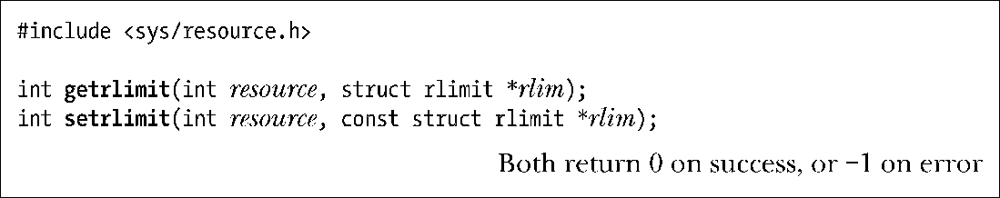
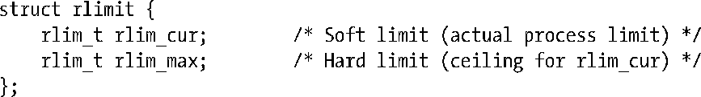
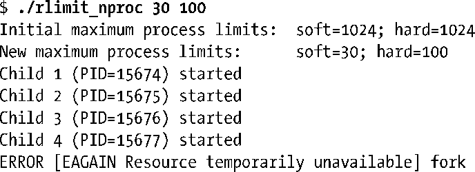
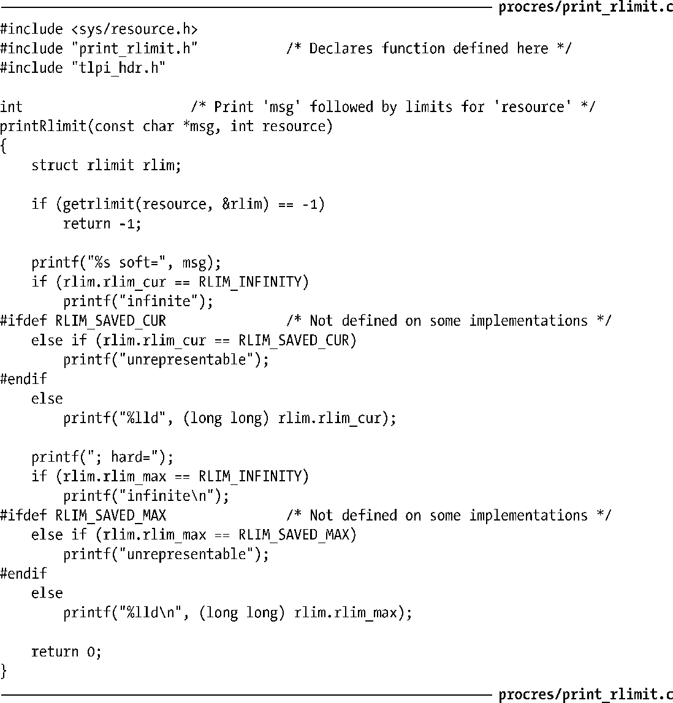
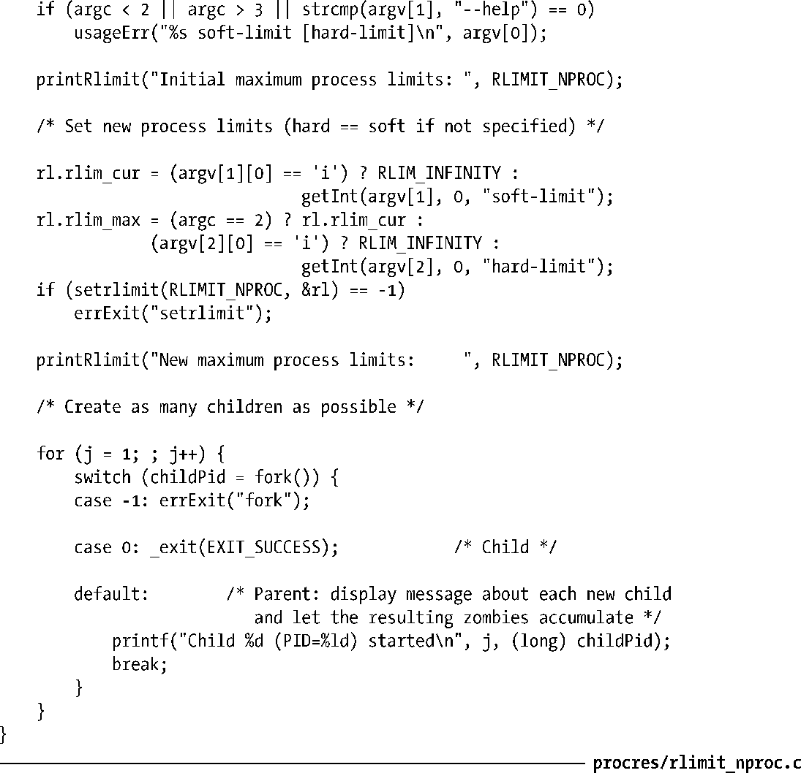

### 36.2　进程资源限制

每个进程都用一组资源限值，它们可以用来限制进程能够消耗的各种系统资源。如在执行任意一个程序之前如果不想让它消耗太多资源，则可以设置该进程的资源限制。使用shell的内置命令ulimit可以设置shell的资源限制（在C shell中是limit）。shell创建用来执行用户命令的进程会继承这些限制。

> 从2.6.24的内核开始，Linux特有的/proc/PID/limits文件可以用来查看任意进程的所有资源限制。这个文件由相应进程的真实用户ID所拥有，并且只有进程ID为用户ID的进程（或特权进程）才能够读取这个文件。

getrlimit()和setrlimit()系统调用允许一个进程读取和修改自己的资源限制。

resource参数标识出了需读取或修改的资源限制。rlim参数用来返回限制值（getrlimit()）或指定新的资源限制值（(setrlimit())，它是一个指向包含两个字段的结构的指针。

这两个字段对应于一种资源的两个关联限制：软限制（rlim_cur）和硬限制（rlim_max）。（rlim_t数据类型是一个整数类型。）软限制规定了进程能够消耗的资源数量。一个进程可以将软限制调整为从0到硬限制之间的值。对于大多数资源来讲，硬限制的唯一作用是为软限制设定了上限。特权（CAP_SYS_RESOURCE）进程能够增大和缩小硬限制（只要其值仍然大于软限制），但非特权进程则只能缩小硬限制（这个行为是不可逆的）。在getrlimit()和setrlimit()调用中，rlim_cur和rlim_max取值为RLIM_INFINITY表示没有限制（不限制资源的使用）。

在大多数情况下，特权进程和非特权进程在使用资源时都会受到限制。通过fork()创建的子进程会继承这些限制并且在exec()调用之间不得到保持。

表36-1列出了getrlimit()和setrlimit()两个函数中resource参数的可取值，详细信息可参见36.3节。

虽然资源限制是一个进程级别的特性，但在某些情况下，不仅需要度量一个进程对相关资源的消耗情况，还需要度量同一个真实用户ID下所有进程对资源的消耗总和情况。限制能创建的进程数目的RLIMIT_NPROC就较好地遵循了这个规则。仅仅将这个限制施加于进程本身所创建的子进程的数量的做法不是非常有效，因为由该进程创建的每个子进程都可以创建自己的子进程，而这些子进程还能够创建更多的子进程，以此类推。因此，这个限制是根据同一真实用户ID下所有的进程数来度量的。注意只有在设置了资源限制的进程中（即进程本身及继承了限制值的子孙进程）才会对资源使用情况进行检查。如果同一真实用户ID下存在一个没有设置限制（即限制值为无限）或设置了一个不同的限制值的进程，那么就会根据它所设置的限制值来检查其创建的子进程的数量。

下面在介绍每类资源的限制值时都会指出此类资源限制值是指同一真实用户ID下所有进程累积能够消耗的资源限制值。如果没有特别指出，那么一个资源限制值就是指进程本身能够消耗的资源限制值。

> 记住，在很多情况下，获取和设置资源限制的shell命令（bash和Korn shell中是ulimit，C shell中是limit）使用的单位与getrlimit()和setrlimit()使用的单位不同。如shell命令在限制各种内存段的大小时通常以千字节为单位。

<b class="my_markdown">表36-1：getrlimit()和setrlimit()中的资源值</b>

| 资 源 | 限 制 | SUSv3 |
| :-----  | :-----  | :-----  | :-----  | :-----  |
| RLIMIT_AS | 进程虚拟内存限制大小（字节数） | ● |
| RLIMIT_CORE | 核心文件大小（字节数） | ● |
| RLIMIT_CPU | CPU时间（秒数） | ● |
| RLIMIT_DATA | 进程数据段（字节数） | ● |
| RLIMIT_FSIZE | 文件大小（字节数） | ● |
| RLIMIT_MEMLOCK | 锁住的内存（字节数） |
| RLIMIT_MSGQUEUE | 为真实用户ID分配的POSIX消息队列的字节数（自Linux 2.6.8起） |
| RLIMIT_NICE | nice值（自Linux 2.6.12起） |
| RLIMIT_NOFILE | 最大的文件描述符数量加1 | ● |
| RLIMIT_NPROC | 真实用户ID下的进程数量 |
| RLIMIT_RSS | 驻留集大小（字节数；没有实现） |
| RLIMIT_RTPRIO | 实时调度策略（自Linux 2.6.12起） |
| RLIMIT_RTTIME | 实时CPU时间（微秒；自Linux 2.6.25起） |
| RLIMIT_SIGPENDING | 真实用户ID信号队列中的信号数（自Linux 2.6.8起） |
| RLIMIT_STACK | 栈段的大小（字节数） | ● |

#### 示例程序

在开始介绍各种资源限制的具体内容之前，首先来看一个使用了资源限制的简单示例。程序清单 36-2 定义了函数printRlimit()，该函数会显示一条消息以及指定资源的软限制和硬限制。

> rlim_t数据类型与off_t通常是一样的，用来处理文件大小资源限制RLIMIT_FSIZE的表示。基于这个原因，在打印rlim_t值时（如在程序清单36-2中），需要像5.10节所说的那样将它们转换成long long并使用%lld printf()修饰符。

程序清单 36-3 调用了 setrlimit()来设置一个用户能够创建的进程数量的软限制和硬限制（RLIMIT_NPROC），同时使用了程序清单 36-2 中的函数 printRlimit()来输出变更之前和之后的资源限制，最后根据资源限制创建了尽可能多的进程。在运行这个程序时，如果将软限制设置为30，硬限制设置为100，那么就能看到下面的输出。

在这个例子中，程序只创建了4个新进程，因为在该用户下已经运行着26个进程了。

程序清单36-2：显示进程资源限制

程序清单36-3：设置RLIMIT_NPROC资源限制

#### 无法表示的限制值

在某些程序设计环境中，rlim_t数据类型可能无法表示某个特定资源限制的所有可取值，这是因为一个系统可能提供了多个程序设计环境，而在这些程序设计环境中rlim_t数据类型的大小是不同的。如当一个off_t为64位的大型文件编译环境被添加到off_t为32位的系统中时就会出现这种情况。（在每种环境中，rlim_t和off_t的大小是一样的。）这就会导致出现这样一种情况，即一个off_t为64位的程序能够创建一个子进程来执行一个rlim_t值较小的程序，这样子进程就会继承父进程的资源限制（如文件大小限制），但该资源限制超过了最大的rlim_t值。

为了帮助可移植应用程序处理可能出现的无法标识资源限制的情况，SUSv3规定了两个常量来标记无法表示的限制值：RLIM_SAVED_CUR和RLIM_SAVED_MAX。如果一个软资源限制无法用rlim_t表示，那么getrlimit()将会在rlim_cur字段返回RLIM_SAVED_CUR。而RLIM_SAVED_MAX的功能类似，即当碰到无法表示的硬限制时在rlim_max字段返回该值。

SUSv3允许实现在rlim_t能够表示资源限制的所有可取值时将RLIM_SAVED_CUR和RLIM_SAVED_MAX定义成与RLIM_INFINITY一样的值。在Linux上，这两个常量值就是这样定义的，这样rlim_t能够表示资源限制的所有可取值，但在像x86-32这样的32位架构上这种做法是不对的。在那些架构上，在一个大文件编译环境中，glibc将rlim_t定义为64位，但内核中表示资源限制的数据类型是unsigned long，它只有32位。当前版本的glibc是这样处理这种情况的：如果一个设置了_FILE_OFFSET_BITS=64编译选项的程序试图将一个资源限制值设置为一个超出32位unsigned long表示范围的值，那么glibc中setrlimit()的包装函数会毫无征兆地将这个值转换成RLIM_INFINITY。换句话说，要求完成的资源限制值的设置并没有如实地被完成。

> 由于在很多 x86-32 发行版中，处理文件的实用程序在编译时通常都设置了_FILE_OFFSET_BITS=64参数，因此当资源限制值超出32位的表示范围时系统不如实地设置资源限制值的做法不仅仅会影响到应用程序开发人员，还会影响到最终的用户。
> 有些人可能会认为glibc setrlimit()包装函数的做法要比在请求的资源限制超出32位unsigned long表示范围时返回一个错误要好，而这个问题的本质是内核的限制，glibc的开发人员在处理这个问题时则采用了前面正文中介绍的方法。

