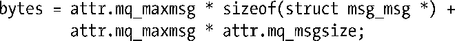

### 36.3　特定资源限制细节

本节将详细介绍Linux上可用的各个资源限制，特别需要注意那些Linux特有的资源限制。

##### RLIMIT_AS

RLIMIT_AS限制规定了进程的虚拟内存（地址空间）的最大字节数，试图（brk()、sbrk()、mmap()、mremap()以及shmat()）超出这个限制会得到ENOMEM错误。在实践中，程序中会超出这个限制的最常见的地方是在调用malloc包中的函数时，因为它们会使用sbrk()和mmap()。当碰到这个限制时，栈增长操作也会失败，进而会出现下面RLIMIT_STACK限制中列出的情况。

##### RLIMIT_CORE

RLIMIT_CORE限制规定了当进程被特定信号（参见22.1节）终止时产生的核心dump文件的最大字节数。当达到这个限制时，核心dump文件就不会再产生了。将这个限制指定为0会阻止核心dump文件的创建，这种做法有时候是比较有用的，因为核心 dump 文件可能会变得非常大，而最终用户通常又不知道如何处理这些文件。另一个禁用核心dump文件的原因是安全性——防止程序占用的内存中的内容输出到磁盘上。如果RLIMIT_FSIZE限制值低于这个限制值，那么核心dump文件的最大大小会被限制为RLIMIT_FSIZE字节。

##### RLIMIT_CPU

RLIMIT_CPU限制规定了进程最多使用的CPU时间（包括系统模式和用户模式）。SUSv3要求当达到软限制值时需要向进程发送一个SIGXCPU信号，但并没有规定其他的细节。（SIGXCPU信号的默认动作是终止一个进程并输出一个核心dump。）此外，也可以为SIGXCPU信号建立一个处理器来完成期望的处理工作，然后将控制返回给主程序。在达到软限制值之后，内核（在Linux上）会在进程每消耗一秒钟的CPU时间后向其发送一个SIGXCPU信号。当进程持续执行直至达到硬CPU限制时，内核会向其发送一个SIGKILL信号，该信号总是会终止进程。

不同的UNIX实现对进程处理完SIGXCPU信号之后继续消耗CPU时间这种情况的处理方式不同。大多数会每隔固定时间间隔向进程发送一个SIGXCPU信号。读者如果想要编写使用这个信号的可移植应用程序，那么应该在首次收到这个信号之后就完成必要的清理工作，然后终止执行。（或者，程序也可以在收到这个信号之后修改资源限制。）

##### RLIMIT_DATA

RLIMIT_DATA限制规定了进程的数据段的最大字节数（在6.3节中介绍的初始化数据、非初始化数据、堆段的总和）。试图（sbrk()和brk()）访问这个限制之外的数据段会得到ENOMEM的错误。与RLIMIT_AS一样，程序中会超出这个限制的最常见的地方是在调用malloc包中的函数时。

##### RLIMIT_FSIZE

RLIMIT_FSIZE限制规定了进程能够创建的文件的最大字节数。如果进程试图扩充一个文件使之超出软限制值，那么内核就会向其发送一个SIGXFSZ信号，并且系统调用（如write()或truncate()）会返回EFBIG错误。SIGXFSZ信号的默认动作是终止进程并产生一个核心dump。此外，也可以捕获这个信号并将控制返回给主程序。不管怎样，后续视图扩充该文件的操作都会得到同样的信号和错误。

##### RLIMIT_MEMLOCK

RLIMIT_MEMLOCK限制（源自BSD，在SUSv3中并没有此限制，只有Linux和BSD系统提供了这个限制）规定了一个进程最多能够将多少字节的虚拟内存锁进物理内存以防止内存被交换出去。这个限制会影响mlock()和mlockall()系统调用以及mmap()和shmctl()系统调用的加锁参数，后面50.2节中将会介绍其中的细节信息。

如果在调用mlockall()时指定了MCL_FUTURE标记，那么RLIMIT_MEMLOCK限制也会导致后续的brk()、sbrk()、mmap()和mremap()调用失败。

##### RLIMIT_MSGQUEUE

RLIMIT_MSGQUEUE限制（Linux特有的，自Linux 2.6.8起）规定了能够为调用进程的真实用户ID的POSIX消息队列分配的最大字节数。当使用mq_open()创建了一个POSIX消息队列后会根据下面的公式将字节数与这个限制值进行比较。

在这个公式中，attr是传给mq_open()的第四个参数mq_attr结构。加数中包含sizeof(struct msg_msg *)确保了用户无法在队列中无止境地加入长度为零的消息。（msg_msg结构是内核内部使用的一个数据类型。）这样做是有必要的，因为虽然长度为零的消息不包含数据，但它们需要消耗一些系统内存以供簿记。

RLIMIT_MSGQUEUE限制只会影响调用进程。这个用户下的其他进程不会受到影响，因为它们也会设置这个限制或继承这个限制。

##### RLIMIT_NICE

RLIMIT_NICE限制（Linux特有的，自Linux 2.6.12起）规定了使用sched_setscheduler()和nice()能够为进程设置的最大nice值。这个最大值是通过公式20 – rlim_cur计算得来的，其中rlim_cur是当前的RLIMIT_NICE软资源限制，更多细节信息可参见35.1节。

##### RLIMIT_NOFILE

RLIMIT_NOFILE限制规定了一个数值，该数值等于一个进程能够分配的最大文件描述符数量加1。试图（如open()、pipe()、socket()、accept()、shm_open()、dup()、dup2()、fcntl(F_DUPFD)和epoll_create()）分配的文件描述符数量超出这个限制时会失败。在大多数情况，失败的错误是EMFILE，但在dup2(fd, newfd)调用中，失败的错误是EBADF，在fcntl(fd, F_DUPFD, newfd)调用中当newfd大于或等于这个限制时，失败的错误是EINVAL。

对RLIMIT_NOFILE限制的变更会通过sysconf(_SC_OPEN_MAX)的返回值反应出来。SUSv3允许但不强制实现在修改RLIMIT_NOFILE限制前后调用sysconf(_SC_OPEN_MAX)返回不同的值，在这一点上其他实现的行为与Linux可能并不相同。

> SUSv3声称如果一个应用程序将进程的软或硬RLIMIT_NOFILE限制设置为一个小于或等于进程当前打开的最大文件描述符数量的值时会出现预期之外的行为。
> 在Linux上可以通过使用readdir()扫描/proc/PID/fd目录下的内容来检查一个进程当前打开的文件描述符，这个目录包含了进程当前打开的每个文件描述符的符号链接。

内核为RLIMIT_NOFILE限制规定了一个最大值。在2.6.25之前的内核中，这个最大值是一个由内核常量NR_OPEN定义的硬编码值，其值为1048576。（提高这个最大值需要重建内核。）从2.6.25的版本开始，这个限制由Linux特有的/proc/sys/fs/nr_open文件定义。这个文件中的默认值是1048576，超级用户可以修改这个值。试图将软或硬RLIMIT_NOFILE限制设置为一个大于最大值的值会产生EPERM错误。

还存在一个系统级别的限制，它规定了系统中所有进程能够打开的文件数量，通过Linux特有的/proc/sys/fs/file-max文件能够获取和修改这个限制。（可以将file-max更加精确地定义为系统中所能打开的文件描述符数量限制，具体可参考5.4节。）只有特权（CAP_SYS_ADMIN）进程才能够超出file-max的限制。在非特权进程中，当系统调用碰到file-max限制时会返回ENFILE错误。

##### RLIMIT_NPROC

RLIMIT_NPROC限制（源自BSD，在SUSv3中并没有此限制，只有Linux和BSD系统提供了这个限制）规定了调用进程的真实用户ID下最多能够创建的进程数量。试图（fork()、vfork()和clone()）超出这个限制会得到EAGAIN错误。

RLIMIT_NPROC限制只影响调用进程。这个用户下的其他进程不会受到影响，除非它们也设置或继承了这个限制。这个限制不适用于特权（CAP_SYS_ADMIN和CAP_SYS_RESOURCE）进程。

> Linux还提供了系统层面的限制来规定所有用户能够创建的进程数量。在Linux 2.4以及之后的版本中，可以使用Linux特有的/proc/sys/kernel/threads-max文件来获取和修改这个限制。
> 准确地说，RLIMIT_NPROC资源限制和threads-max文件实际上限制的是所能创建的线程数量，而不是进程的数量。

不同版本的内核为RLIMIT_NPROC资源限制设置的默认值不同。在Linux 2.2中，该值是根据一个固定的公式计算得来的。在Linux 2.4和之后的版本中，该值是使用一条公式根据可用的物理内存数量计算得来的。

> SUSv3没有规定RLIMIT_NPROC资源限制，但它规定了通过sysconf(_SC_CHILD _MAX)调用来获取（不是修改）一个用户ID最多能够创建的进程数量。Linux也支持这个sysconf()调用，但只有2.6.23前的内核才支持这个调用。这个调用不会返回精确的信息——它总是返回值999。自Linux 2.6.23起（以及glibc 2.4和之后的版本），这个调用会正确地返回限制（通过检查RLIMIT_NPROC资源限制值）。
> 不存在一种统一的方法能够在不同系统中找出某个特定用户ID已经创建的进程数。在Linux中可以通过扫描系统中的所有/proc/PID/status文件并检查Uid条目（它会按顺序列出四个进程用户ID：真实、有效、保留集和文件系统）下的信息来估算一个用户当前拥有的进程，但有一点需要记住，即当完成扫描之后信息可能已经发生了改变。

##### RLIMIT_RSS

RLIMIT_RSS限制（源自BSD，在SUSv3并没有此限制，但该限制是被广泛使用的）规定了进程驻留集中的最大页面数，即当前位于物理内存中的虚拟内存页面总数。Linux也提供了这个限制，但当前并没有起任何作用。

> 在Linux 2.4之前的内核中（早于以及包括2.4.29），RLIMIT_RSS会影响到madvise() MADV_WILLNEED操作的行为（参见50.4节）。如果这个操作因达到RLIMIT_RSS限制而无法执行，那么errno中会存储EIO错误。

##### RLIMIT_RTPRIO

RLIMIT_RTPRIO限制（Linux特有的，自Linux 2.6.12起）规定了使用sched_setscheduler()和sched_setparam()能够为进程设置的最高实时优先级，具体细节请参考35.3.2节。

##### RLIMIT_RTTIME

RLIMIT_RTTIME限制（Linux特有的，自Linux 2.6.25起）规定了一个进程在实时调度策略中不睡眠（即执行一个阻塞系统调用）的情况下最大能消耗的CPU秒数。当达到这个限制时系统的行为与达到RLIMIT_CPU限制时的行为是一样的：如果进程达到了软限制，那么内核会向进程发送一个SIGXCPU信号，之后进程每消耗一秒的CPU时间都会收到一个SIGXCPU信号。在达到硬限制时，内核会向进程发送一个SIGKILL信号。更多细节请参考35.3.2节。

##### RLIMIT_SIGPENDING

RLIMIT_SIGPENDING限制（Linux特有的，自Linux 2.6.8起）规定了调用进程的真实用户ID下信号队列中最多能容纳的信号数量。试图（sigqueue()）超出这个限制会得到EAGAIN错误。

RLIMIT_SIGPENDING只影响调用进程。这个用户下的其他进程不会受到影响，除非它们也设置或继承了这个限制。

在最初的实现中，RLIMIT_SIGPENDING限制的默认值为1024。自内核2.6.12起，这个限制的默认值被改成了与RLIMIT_NPROC的默认值一样的值。

在检查RLIMIT_SIGPENDING限制时统计的队列中的信号包括实时信号和标准信号。（一个进程的标准信号只能进入队列一次。）但这个限制只适用于sigqueue()。即使这个实时用户ID下的进程的信号队列中包含的信号数量已经达到了这个限制，仍然可以使用kill()来将不在进程的信号队列中的各个信号（包括实时信号）的一个实例添加到队列中。

在2.6.12之前的内核中，Linux特有的/proc/PID/status文件中的SigQ字段显示了进程的真实用户ID的信号队列中当前存储的信号数量以及最多存储的信号数量。

##### RLIMIT_STACK

RLIMIT_STACK限制规定了进程栈的最大字节数。试图扩展栈大小以至于超出这个限制会导致内核向该进程发送一个SIGSEGV信号。由于栈空间已经被用光了，因此捕获这个信号的唯一方式是建立另外一个备用的信号栈，具体可参考21.3节。

> 自Linux 2.6.23起，RLIMIT_STACK限制还确定了存储进程的命令行参数和环境变量的最大空间，具体可参考execve(2)手册。

