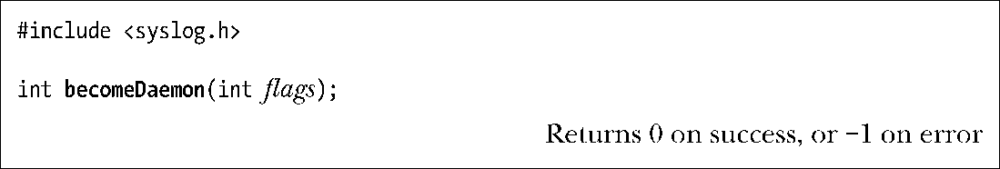
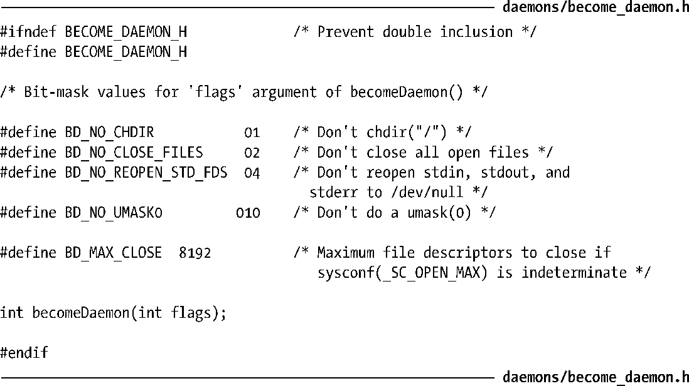
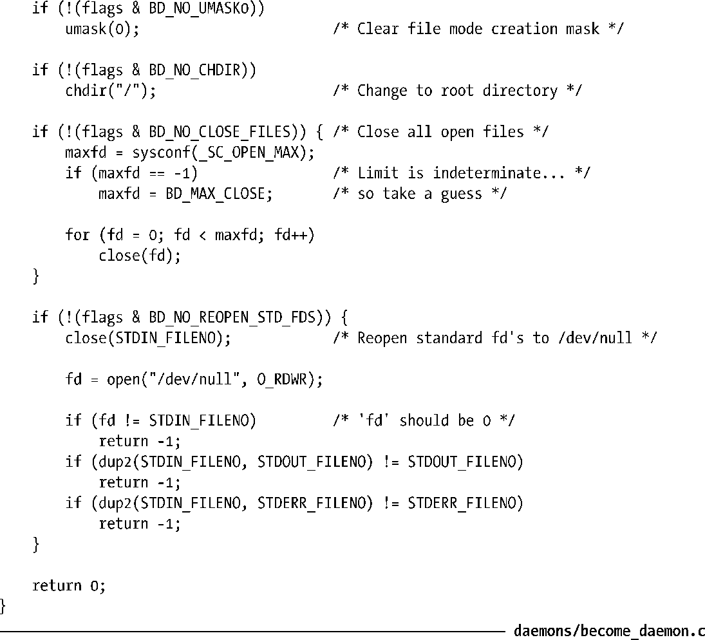
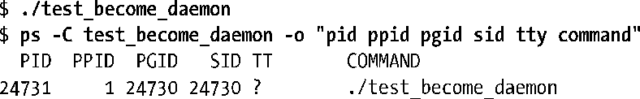

### 37.2　创建一个daemon

要变成daemon，一个程序需要完成下面的步骤。

**1．** 执行一个fork()，之后父进程退出，子进程继续执行。（结果是daemon成为了init进程的子进程。）之所以要做这一步是因为下面两个原因。

+ 假设daemon是从命令行启动的，父进程的终止会被shell发现，shell在发现之后会显示出另一个shell提示符并让子进程继续在后台运行。
+ 子进程被确保不会成为一个进程组首进程，因为它从其父进程那里继承了进程组ID并且拥有了自己的唯一的进程ID，而这个进程ID与继承而来的进程组ID是不同的，这样才能够成功地执行下面一个步骤。

**2．** 子进程调用setsid()（参见34.3节）开启一个新会话并释放它与控制终端之间的所有关联关系。

**3．** 如果daemon从来没有打开过终端设备，那么就无需担心daemon会重新请求一个控制终端了。如果daemon后面可能会打开一个终端设备，那么必须要采取措施来确保这个设备不会成为控制终端。这可以通过下面两种方式实现。

+ 在所有可能应用到一个终端设备上的open()调用中指定O_NOCTTY标记。
+ 或者更简单地说，在setsid()调用之后执行第二个fork()，然后再次让父进程退出并让孙子进程继续执行。这样就确保了子进程不会成为会话组长，因此根据System V中获取终端的规则（Linux也遵循了这个规则），进程永远不会重新请求一个控制终端（参见34.4节）。

> 在遵循BSD规则的实现中，一个进程只能通过一个显式的ioctl() TIOCSCTTY操作来获取一个控制终端，因此第二个fork()调用对控制终端的获取并没有任何影响，但多一个fork()调用不会带来任何坏处。

**4．** 清除进程的umask（参见15.4.6节）以确保当daemon创建文件和目录时拥有所需的权限。

**5．** 修改进程的当前工作目录，通常会改为根目录（/）。这样做是有必要的，因为daemon通常会一直运行直至系统关闭为止。如果daemon的当前工作目录为不包含/的文件系统，那么就无法卸载该文件系统（参见14.8.2节）。或者daemon可以将工作目录改为完成任务时所在的目录或在配置文件中定义的一个目录，只要包含这个目录的文件系统永远不会被卸载即可。如cron会将自身放在/var/spool/cron目录下。

**6．** 关闭daemon从其父进程继承而来的所有打开着的文件描述符。（daemon可能需要保持继承而来的文件描述的打开状态，因此这一步是可选的或者是可变更的。）之所以需要这样做的原因有很多。由于daemon失去了控制终端并且是在后台运行的，因此让daemon保持文件描述符0、1和2的打开状态毫无意义，因为它们指向的就是控制终端。此外，无法卸载长时间运行的daemon打开的文件所在的文件系统。因此，通常的做法是关闭所有无用的打开着的文件描述符，因为文件描述符是一种有限的资源。

> 一些UNIX实现（如Solaris 9和一些最新的BSD发行版）提供了一个名为closefrom(n)（或类似的名称）的函数，它关闭所有大于或等于n的文件描述符。Linux上并不存在这个函数。

**7．** 在关闭了文件描述符0、1和2之后，daemon通常会打开/dev/null并使用dup2()（或类似的函数）使所有这些描述符指向这个设备。之所以要这样做是因为下面两个原因。

+ 它确保了当 daemon 调用了在这些描述符上执行 I/O 的库函数时不会出乎意料地失败。
+ 它防止了daemon后面使用描述符1或2打开一个文件的情况，因为库函数会将这些描述符当做标准输出和标准错误来写入数据（进而破坏了原有的数据）。

> /dev/null是一个虚拟设备，它总会将写入的数据丢弃。当需要删除一个shell命令的标准输出和错误时可以将它们重定向到这个文件。从这个设备中读取数据总是会返回文件结束的错误。

下面是becomeDaemon()函数的实现，它完成了上面描述的步骤以将调用者变成一个daemon。

becomeDaeomon()函数接收一个位掩码参数flags，它允许调用者有选择地执行其中的步骤，具体可参考程序清单37-1中列出的头文件中的注释。

程序清单37-1：become_daemon.c的头文件

程序清单37-2给出了becomeDaemon()函数的实现。

> GNU C库提供了一个非标准的daemon()函数，它将调用者变成一个daemon。glibc daemon()函数与这里的becomeDaemon()函数不同，它并没有定义一个与flags参数等价的参数。

程序清单37-2：创建一个daemon进程

假设编写一个程序调用becomeDaemon(0)，之后睡眠一段时间，那么可以使用ps(1)来查看结果进程的一些特性。

> 由于代码比较简单，因此这里并没有给出daemons/test_become_daemon.c的源代码，本书的源代码包中提供了这个程序的代码。

在ps的输出中，TT标题下的？表示进程没有控制终端。从进程ID与会话ID（SID）不同的事实也可以看出进程不是会话首进程，因此在打开终端设备时不会重新获得控制终端，这就是daemon应该具备的特性。

