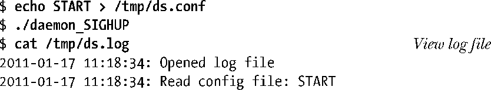
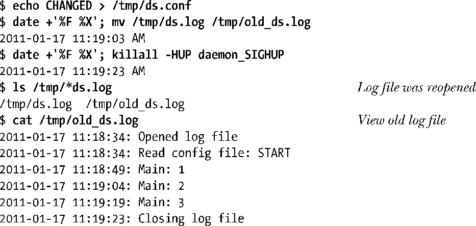
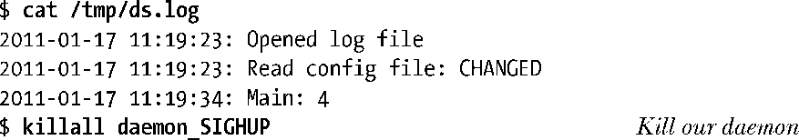
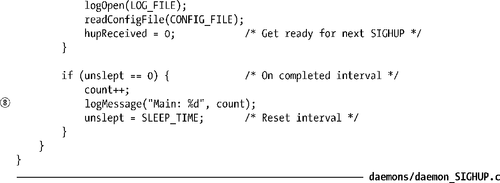

### 37.4　使用SIGHUP重新初始化一个daemon

由于很多daemon需要持续运行，因此在设计daemon程序时需要克服一些障碍。

+ 通常daemon会在启动时从相关的配置文件中读取操作参数，但有些时候需要在不重启daemon的情况下快速修改这些参数。
+ 一些daemon会产生日志文件。如果daemon永远不关闭日志文件的话，那么日志文件就会无限制地增长，最终会阻塞文件系统。（在18.3节中曾经提到过即使删除了一个文件的文件名，只要有进程还打开着这个文件，那么这个文件就会一直存在下去。）这里需要有一种机制来告诉daemon关闭其日志文件并打开一个新文件，这样就能够在需要的时候旋转日志文件了。

解决这两个问题的方案是让daemon为SIGHUP建立一个处理器，并在收到这个信号时采取所需的措施。在34.4节中曾经讲到，当控制进程与控制终端断开连接之后就会生成SIGHUP信号。由于daemon没有控制终端，因此内核永远不会向daemon发送这个信号。这样daemon就可以使用SIGHUP信号来达到目的。

> logrotate程序可以用来自动旋转daemon的日志文件，具体可参考logrotate(8)手册。

程序清单37-3提供了daemon如何使用SIGHUP的一个示例。这个程序为SIGHUP建立了一个处理器②，然后变成daemon ③，接着打开日志文件④，最后读取其配置文件⑤。SIGHUP处理器①只设置了一个全局标记变量hupReceived，主程序会检查这个变量。主程序位于一个循环中，它每隔15秒向日志文件输出一条消息⑧。循环中对sleep()的调用⑥用来模拟真实应用程序中的某些处理工作。在循环中每次sleep()返回之后，程序会检查hupReceived变量是否被设置⑦，如果该变量被设置了，那么程序就会重新打开日志文件和重新读取配置文件以及清除hupReceived标记。

限于篇幅，程序清单37-3中并没有给出logOpen()、logClose()、logMessage()和readConfigFile()函数的实现，但本书的源代码分发包中提供了这些函数的源代码。其中前面三个函数所做的工作从其名称中就能看出，readConfigFile()函数只是简单地从配置文件中读取一行数据并将这行数据输出到日志文件中。

> 一些daemon在收到SIGHUP信号时会使用其他方法来重新初始化自身：它们会关闭所有文件，然后使用exec()重新启动自身。

下面是运行程序清单37-3时可能看到的输出，这里首先创建一个哑配置文件，然后启动这个daemon。

现在修改这个配置文件并在向daemon发送SIGHUP信号之前重命名日志文件。

ls的输出表明新旧日志文件同时存在。当使用cat查看旧的日志文件中的内容时可以看出，即使使用了mv命令来重命名这个文件，daemon仍然会将日志信息记录到那个文件中。这时如果不再需要这个旧日志文件，就可以删除这个旧日志文件了。在查看新日志文件时会发现配置文件被重新读取了。

注意daemon的日志和配置文件通常会像程序清单37-3所做的那样被放置在标准目录中，而不是/tmp目录中。按照惯例，配置文件会被放在/etc或它的一个子目录中，日志文件会被放在/var/log中。Daemon程序通常会提供命令行参数来指定其他存放位置以替换默认的存放位置。

程序清单37-3：使用SIGHUP重新初始化一个daemon

