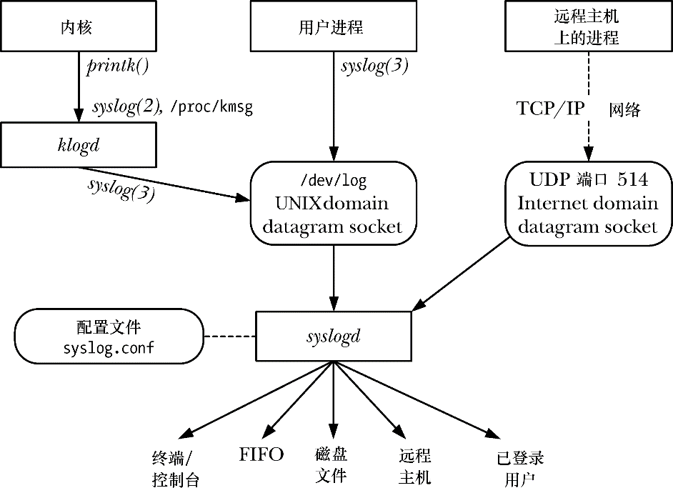

### 37.5.1　概述

syslog工具提供了一个集中式日志工具，系统中的所有应用程序都可以使用这个工具来记录日志消息。图37-1提供了这个工具的一个概览。

<b class="my_markdown">图37-1：系统日志概览</b>

syslog工具有两个主要组件：syslogd daemon和syslog(3)库函数。

System Log daemon syslogd从两个不同的源接收日志消息：一个是UNIX domain socket /dev/log，它保存本地产生的消息；另一个是Internet domain socket（UNP端口514，如果启用的话），它保存通过TCP/IP网络发送的消息。（在其他一些UNIX实现中，syslog socket位于/var/run/log。）

每条由syslogd处理的消息都具备几个特性，其中包括一个facility，它指定了产生消息的程序类型；还有一个是level，它指定了消息的严重程度（优先级）。syslogd daemon会检查每条消息的facility和level，然后根据一个相关配置文件/etc/syslog.conf中的指令将消息传递到几个可能目的地中的一个。可能的目的地包括终端或虚拟控制台、磁盘文件、FIFO、一个或多个（或所有）登录过的用户以及位于另一个系统上的通过TCP/IP网络连接的进程（通常是另一个syslogd daemon）。（将消息发送到另一个系统上的进程有助于通过将多个系统中的日志信息集中到一个位置以降低管理负担。）一条消息可以被发送到多个目的地（或不发送到任何目的地），具备不同的facility和level组合的消息可以被发送到不同的目的地或不同的目的地实例（即不同的控制台、不同的磁盘文件等）。

> 通过TCP/IP网络将syslog消息发送到另一个系统还有助于发现系统非法入侵。非法入侵通常会在系统日志中留下踪迹，但攻击者通常会删除日志记录以掩盖他们的行为。有了远程日志记录之后，攻击者就需要侵入另一个系统才能删除日志记录。

通常，任意进程都可以使用syslog(3)库函数来记录消息。这个函数会使用传入的参数以标准的格式构建一条消息，然后将这条消息写入/dev/log socket以供syslogd读取，本章稍后就会介绍这个函数。

/dev/log中的消息的另一个来源是Kernel Log daemon klogd，它会收集内核日志消息（内核使用printk()函数生成的消息）。这些消息的收集可以通过两个等价的Linux特有的接口中的一个来完成（即/proc/kmsg文件和syslog(2)系统调用），然后使用syslog(3)库函数将它们写入/dev/log。

> 尽管syslog(2)和syslog(3)的名称相同，但它们执行的任务是不同的。glibc提供了一个调用syslog(2)的接口，其名称为klogctl()。除非特别指出，本节中的syslog()指的是syslog(3)。

syslog工具原先出现在4.2BSD中，但现在几乎所有的UNIX实现都提供了这个工具。SUSv3对syslog(3)和相关函数进行了标准化，但并没有规定syslogd的实现和操作以及syslog.conf文件的格式。Linux中syslogd的实现与它原先在BSD的实现的不同之处在于Linux允许对在syslog.conf中指定的消息处理规则进行一些扩展。

