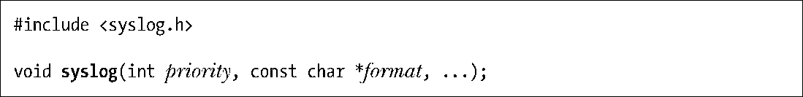
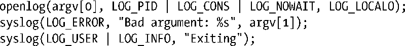
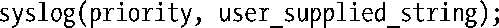
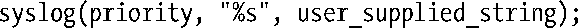
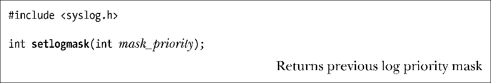
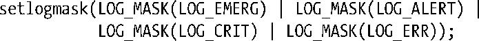

### 37.5.2　syslog API

syslog API由以下三个主要函数构成。

+ openlog()函数为后续的的syslog()调用建立了默认设置。syslog()的调用是可选的，如果省略了这个调用，那么就会使用首次调用syslog()时采用的默认设置来建立到日志记录工具的连接。
+ syslog()函数记录一条日志消息。
+ 当完成日志记录消息之后需要调用closelog()函数拆除与日志之间的连接。

所有这些函数都不会返回一个状态值，这是因为系统日志服务应该总是处于可用状态（系统管理员应该在服务不可用时立即能发现这个问题）。此外，如果在系统记录日志的过程中发生了一个错误，应用程序通常也无法做更多的事情来报告这个错误。

> GNU C库还提供了函数void vsyslog(int priority, const char*format, va_list args)。这个函数所做的工作与syslog()一样，但接收之前由stdarg(3) API处理的一个参数列表。（因此vsyslog()之于syslog()就像vprintf()之于printf()。）SUSv3并没有规定vsyslog()，并且所有的UNIX实现都没有提供这个函数。

#### 建立一个到系统日志的连接

openlog()函数的调用是可选的，它建立一个到系统日志工具的连接并为后续的syslog()调用设置默认设置。

ident参数是一个指向字符串的指针，syslog()输出的每条消息都会包含这个字符串，这个参数的取值通常是程序名。注意openlog()仅仅是复制了这个指针的值。只要应用程序后面会继续调用syslog()，那么就应该确保不会修改所引用的字符串。

> 如果ident的值为NULL，那么与其他一些实现一样，glibc syslog实现会自动将程序名作为ident的值。但SUSv3并没有要求实现这个功能，一些实现也没有提供这个功能。可移植的应用程不应该依赖于这个功能。

传入openlog()的log_options参数是一个位掩码，它是下面几个常量之间的OR值。

##### LOG_CONS

当向系统日志发送消息发生错误时将消息写入到系统控制台（/dev/console）。

##### LOG_NDELAY

立即打开到日志系统的连接（即底层的UNIX domain socket, /dev/log）。在默认情况下（LOG_ODELAY），只有在首次使用syslog()记录消息的时候才会打开连接。O_NDELAY标记对于那些需要精确控制何时为/dev/log分配文件描述符的程序来讲是比较有用的，如调用chroot()的程序就有这样的要求。在调用chroot()之后，/dev/log路径名将不再可见，因此在chroot()之前需要调用一个指定了LOG_NDELAY的openlog()。tftpd daemon（Trivial File Transfer）就因为上述的原因而使用了LOG_NDELAY。

##### LOG_NOWAIT

不要wait()被创建来记录日志消息的子进程。在那些创建子进程来记录日志消息的实现上，当调用者创建并等待子进程时就需要使用LOG_NOWAIT了，这样syslog()就不会试图等待已经被调用者销毁的子进程。在Linux上，LOG_NOWAIT不起任何作用，因为在记录日志消息时不会创建子进程。

##### LOG_ODELAY

这个标记的作用与LOG_NDELAY相反——连接到日志系统的操作会被延迟至记录第一条消息时。这是默认行为，因此无需指定这个标记。

##### LOG_PERROR

将消息写入标准错误和系统日志。通常，daemon进程会关闭标准错误或将其重定向到/dev/null，这样LOG_PERROR就没有用了。

##### LOG_PID

在每条消息中加上调用者的进程ID。在一个创建多个子进程的服务器中使用LOG_PID有助于区分哪个进程记录了某条特定的消息。

SUSv3规定了上面除LOG_PERROR之前的所有常量，但很多其他（不是全部）UNIX实现都定义了LOG_PERROR常量。

传入openlog()的facility参数指定了后续的syslog()调用中使用的默认的facility值。表37-1列出了这个参数的可取值。

<b class="my_markdown">表37-1：openlog()的facility值和syslog()的priority参数</b>

| 值 | 描 述 | SUSv3 |
| :-----  | :-----  | :-----  | :-----  | :-----  |
| LOG_AUTH | 安全和验证消息（如su） | ● |
| LOG_AUTHPRIV | 私有的安全和验证消息 |
| LOG_CRON | 来自cron和at daemons的消息 | ● |
| LOG_DAEMON | 来自其他系统daemon的消息 | ● |
| LOG_FTP | 来自ftp daemon的消息（ftpd） |
| LOG_KERN | 内核消息（用户进程无法生成此类消息） | ● |
| LOG_LOCAL0 | 保留给本地使用（包括LOG_LOCAL1到LOG_LOCAL7） | ● |
| LOG_LPR | 来自行打印机系统的消息（lpr、lpd、lpc） | ● |
| LOG_MAIL | 来自邮件系统的消息 | ● |
| LOG_NEWS | 与Usenet网络新闻相关的消息 | ● |
| LOG_SYSLOG | 来自syslogd daemon的消息 |
| LOG_USER | 用户进程（默认值）生成的消息 | ● |
| LOG_UUCP | 来自UUCP系统的消息 | ● |

表37-1中列出的facility值的大部分都在SUSv3中进行了定义，如表中的SUSv3列所示，但LOG_AUTHPRIV和LOG_FTP只出现在了一些UNIX实现中，LOG_SYSLOG则在大多数实现中都存在。当需要将包含密码或其他敏感信息的日志消息记录到一个与LOG_AUTH指定的位置不同的位置上时，LOG_AUTHPRIV值是比较有用的。

LOG_KERN facility值用于内核消息。用户空间的程序是无法用这个工具记录日志消息的。LOG_KERN常量的值为0。如果在syslog()调用中使用了这个常量，那么0被翻译成了“使用默认的级别”。

#### 记录一条日志消息

要写入一条日志消息可以调用syslog()。

priority参数是facility值和level值的OR值。facility表示记录日志消息的应用程序的类别，其取值为表37-1中列出的值中的一个。如果省略了这个参数，那么facility的默认值为前面一个openlog()调用中指定的facility值，或者当那个调用中也省略了facility值的话为LOG_USER。level表示消息的严重程度，其取值为表37-2中列出的值中的一个。这张表中列出的所有值都在SUSv3进行了定义。

<b class="my_markdown">表37-2：syslog()中priority参数的level值（严重性从最高到最低）</b>

| 值 | 描　　述 |
| :-----  | :-----  | :-----  | :-----  |
| LOG_EMERG | 紧急或令人恐慌的情况（系统不可用了） |
| LOG_ALERT | 需要立即处理的情况（如破坏了系统数据库） |
| LOG_CRIT | 关键情况（如磁盘设备发生错误） |
| LOG_ERR | 常规错误情况 |
| LOG_WARNING | 警告 |
| LOG_NOTICE | 可能需要特殊处理的普通情况 |
| LOG_INFO | 情报性消息 |
| LOG_DEBUG | 调试消息 |

另一个传入syslog()的参数是一个格式字符串以及相应的参数，它们与传入printf()中的参数是一样的，但与printf()不同的是这里的格式字符串不需要包含一个换行字符。此外，格式字符串还可以包含双字符序列%m，在调用的时候这个序列会被与当前的errno值对应的错误字符串（即等价于strerror(errno)）所替换。

下面的代码演示了openlog()和syslog()的用法。

由于在第一个syslog()调用中并没有指定facility，因此将会使用openlog()调用中的默认值（LOG_LOCAL0）。在第二个syslog()调用中显式地指定了LOG_USER标记来覆盖openlog()调用中设置的默认值。

> 在shell中可以使用logger(1)命令来向系统日志中添加条目。这个命令允许指定与日志消息相关的level（priority）和ident（tag），更多细节可参考logger(1)手册。SUSv3规定了logger命令（并没有进行全面定义），大多数UNIX实现都实现了这个命令。

像下面这样使用syslog()写入一些用户提供的字符串是错误的。

上面这段代码存在的问题是应用程序会面临所谓的格式字符串攻击。如果用户提供的字符串中包含格式指示符（如%s），那么结果将是不可预测的，从安全的角度来讲，这种结果可能是具有破坏性的。（这个结论也同样适用于传统的printf()函数。）因此需要将上面的调用重写为下面这样。

#### 关闭日志

当完成日志记录之后可以调用closelog()来释放分配给/dev/log socket的文件描述符。

由于 daemon 通常会持续保持与系统日志之间的连接的打开状态，因此通常会省略对closelog()的调用。

#### 过滤日志消息

setlogmask()函数设置了一个能过滤由syslog()写入的消息的掩码。

所有level不在当前的掩码设置中的消息都会被丢弃。默认的掩码值允许记录所有的严重性级别。

宏LOG_MASK()（在<syslog.h>中定义）会将表37-2中的level值转换成适合传入setlogmask()的位值。如要丢弃除优先级为LOG_ERR以及以上之外的消息时可以使用下面的调用。

SUSv3规定了LOG_MASK()宏。大多数UNIX实现（包括Linux）还提供了标准中未规定的LOG_UPTO()宏。它创建一个能过滤特定级别以及以上的所有消息的位掩码。使用这个宏能够将前面的setlogmask()调用简化成下面这个。

