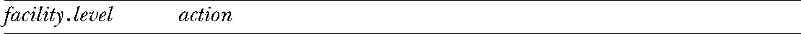
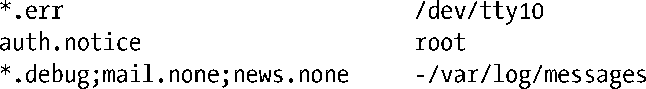

### 37.5.3　/etc/syslog.conf文件

/etc/syslog.conf配置文件控制syslogd daemon的操作。这个文件由规则和注释（以#字符打头）构成。规则的形式如下所示。

facility和level组合在一起被称为选择器，因为它们选择了需应用规则的消息。这个字段是与表37-1和表37-2中的值对应的字符串。action指定了与选择器匹配的消息被发送到何处。选择器和action之间用空白字符隔开，下面是一些示例。

第一条规则表示来自所有工具（*）的level为err（(LOG_ERR）或更高的消息应该被发送到/dev/tty10控制台设备上。第二条规则表示来自验证工具（LOG_AUTH）的level为notice（LOG_NOTICE）或更高的消息应该被发送到root登录的所有控制台和终端。如这个特别的规则允许一个登录的root用户立即看到失败的su尝试。

最后一条规则演示了规则语法中的几个高级特性。一个规则可以包含多个选择器，选择器之间用分号隔开。第一个选择器指定了所有的消息，它使用*通配符表示facility并将level的值指定为debug，这意味着所有级别为debug（最低的级别）以及更高的消息都会被记录下来。（在Linux以及其他一些UNIX实现中，可以将level指定为*，其含义与debug是一样的。但不是所有的syslog实现都支持这个特性。）通常，一个包含多个选择器的规则会匹配与其中任意一个选择器对应的消息，但当将level设置为none时则表示排除所有属于相应的facility的消息。因此这条规则将除来自mail和news工具的消息之外的所有消息发送到/var/log/messages文件中。文件名前面的连接符（-）表示无需每次写入文件时都将文件同步到磁盘（参见13.3节）。这意味着写入操作将变得更快，但如果系统在写入之后崩溃的话可能会丢失一些数据。

每次修改syslog.conf文件之后都需要使用下面的方式让daemon根据这个文件重新初始化自身。

> syslog.conf规则语法的高级特性允许编写比前面介绍的更加强大的规则，更多细节可参考syslog.conf(5)手册。

