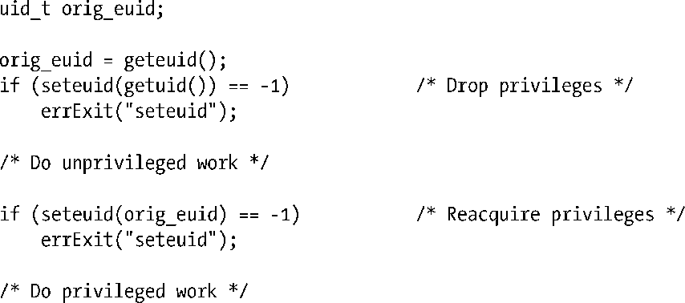
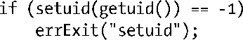
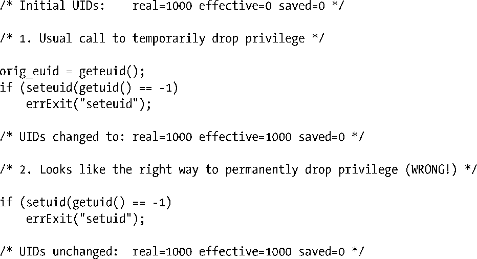
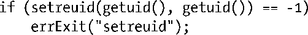

### 38.2　以最小权限操作

set-user-ID（或set-group-ID）程序通常只有在执行特定操作的时候才需要权限，因此在程序（特别是那些拥有超级用户权限的程序）执行其他工作时应该禁用这些权限，同时如果之后永远也不会请求这项权限时就应该永久删除这项权限。换句话说，程序应该总是使用完成当前所执行的任务所需的最小权限来操作，saved 的set-user-ID工具就是为此而设计的（参见9.4节）。

#### 按需拥有权限

在 set-user-ID 程序中可以使用下面的 seteuid()调用序列来临时删除并在之后重新获取权限。

第一个调用使调用进程的有效用户ID变成其真实ID。第二个调用将有效用户ID还原成saved set-user-ID程序中保存的值。

对于set-group-ID程序来讲，saved set-group-ID会保存程序的初始有效组ID，并且setegid()可以用来删除和重新获取权限。第9章对在下面的建议中提到的seteuid()、setegid()、以及类似的系统调用进行了介绍，表9-1对它们进行了总结。

最安全的作法是在程序启动的时候立即删除权限，然后在后面需要的时候临时重新获得这些权限。如果在某个特定的时刻之后永远不会再次请求权限时，那么程序应该删除这些权限，并通过确保saved set-user-ID的变更来保证程序无法再请求这些权限。这样就消除了通过第38.9节中介绍的栈崩溃技术来让程序重新要求权限的可能。

#### 在无需使用权限时永久地删除权限

如果set-user-ID或set-group-ID程序完成了所有需要权限的任务，那么它应该永久地删除这些权限以消除任何由于程序中包含bug或其他意料之外的行为而可能引起的安全风险。永久删除权限是通过将所有进程用户（组）ID重置为真实（组）ID来完成的。

对于一个当前有效用户ID为0的set-user-ID-root程序来讲，可以使用下面的代码来重置所有的用户ID。

当调用进程的当前有效用户ID为非零时，上面的代码不会重置saved set-user-ID：当在一个有效用户ID不为零的程序中发起调用时，setuid()只会修改有效用户ID（参见9.7.1节）。换句话说，在一个set-user-ID-root程序中，下面的调用序列不会永久地删除用户ID 0。

相反，在永久删除权限之前必须要重新获取权限，这可以通过将下面的调用插入到前面的第1步和第2步之间即可。

另一方面，如果一个非root用户拥有了set-user-ID程序，那么由于setuid()不足以修改set-user-ID标识符，因此必须要使用setreuid()或setresuid()来永久地删除特权标识符。例如，可以使用setreuid()来获得预期的结果，如下所示。

上面的代码依赖于Linux实现中的setreuid()特性：如果第一个参数（ruid）不是−1，那么saved set-user-ID也会被设置成（新）有效用户ID。SUSv3并没有规定这个特性，但很多其他实现的行为方式与Linux是一样的。

在set-group-ID程序中永久地删除一个特权组ID同样必须要使用setregid()或setresgid()系统调用，因为当程序的有效用户ID不为零时，setgid()只会修改调用进程的有效组ID。

#### 修改进程身份信息的注意事项

前面几小节介绍了临时和永久删除权限的技术。下面介绍有关使用这些技术时的一些注意事项。

+ 一些修改进程身份信息的系统调用在不同系统上的语义是不同的。此外，此类系统调用中的一些在调用者是特权进程时（有效用户ID为0）与非特权进程时表现出来的语义是不同的。更多细节信息可参考第9章，特别是9.7.4节。由于存在这些差异，[Tsafrir et al., 2008]建议应用程序应该使用系统特有的非标准系统调用来修改进程的身份信息，因为在很多情况下，这些非标准系统调用比与其对应的标准系统调用提供了更加简单和一致的语义。在Linux上，这表示需要使用setresuid()和setresgid()来修改用户和组身份信息。尽管并不是所有的系统都提供了这些系统调用，但使用它们会降低发生错误的可能性。（[Tsafrir et al., 2008]提供了一个函数库，其中的函数会使用各个平台上可用的最佳接口来修改身份信息。）
+ 在Linux上，即使调用者的有效用户ID为0，修改身份信息的系统调用在程序显式地操作其能力时也可能会表现出意料之外的行为。如，如果禁用了CAP_SETUID能力，那么修改进程用户ID将会失败，甚至更糟的是，它会毫无征兆地只修改其中一些需修改的用户ID。
+ 由于存在前面两种可能性，因此强烈建议在实践中（参见[Tsafrir et al., 2008]）不仅需要检查一个修改身份信息的系统调用是否成功，还需要验证修改行为是否如预期的那样。例如如果使用seteuid()临时删除或重新请求一个特权用户ID，那么接着应该使用一个geteuid()调用来验证有效用户ID是否为预期值。类似地，如果永久删除了一个特权用户ID，那么接着应该验证真实用户ID、有效用户ID以及saved set-user-ID已经被成功地修改为非特权用户ID。遗憾的是，虽然存在获取真实和有效ID的标准系统调用，但不存在获取saved set IDs的标准系统调用。Linux和其他一些系统提供了getresuid()和getresgid()来解决这个问题，在其他一些系统上则可能需要使用诸如解析/proc文件中的信息之类的技术来解决这个问题。
+ 一些身份信息的变更只能由有效用户ID为0的进程来完成。因此在修改多个ID时——辅助组ID、组ID和用户ID——先删除特权ID，最后再删除特权有效用户ID。相应地，在提升特权ID时应该先提升特权有效用户ID。

