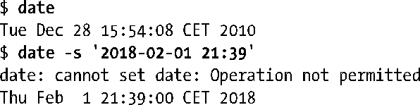
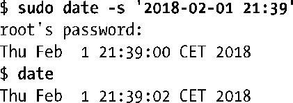
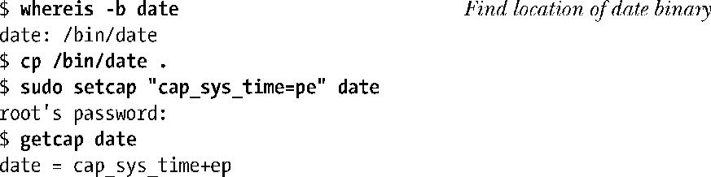
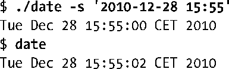

### 39.3.6　在shell中给文件赋予能力和查看文件能力

在39.7节中介绍的libcap包中包含的setcap(8)和getcap(8)命令可以用来操作文件能力集。下面通过一个使用了标准的date(1)程序的简短示例来演示这些命令的用法。（根据39.3.4节中给出的定义，这个程序就是一种能力哑元应用程序。）当在具备权限的情况下运行这个程序时，date(1)可以用来修改系统时间。date程序不是一个set-user-ID-root，因此通常使用权限运行这个程序的唯一方式是变成超级用户。

下面首先显示当前的系统时间，然后尝试以一个非特权用户的身份来修改时间。

从上面可以看出 date 命令没有能够修改系统时间，但它仍然以标准格式显示了传入的参数。

接下来变成超级用户，这样就能够成功地修改系统时间了。

现在复制一份date程序的副本并赋予该副本所需的能力。

上面的setcap命令将CAP_SYS_TIME能力赋给了可执行文件的许可能力集（p）和有效能力集（e）。接着使用了getcap命令来验证能力确实被赋给了文件。（libcap包中的cap_from_text(3)手册描述了setcap和getcap中用来表示能力集的语法。）

date程序的副本的文件能力允许非特权用户使用这个程序来设置系统时间。

