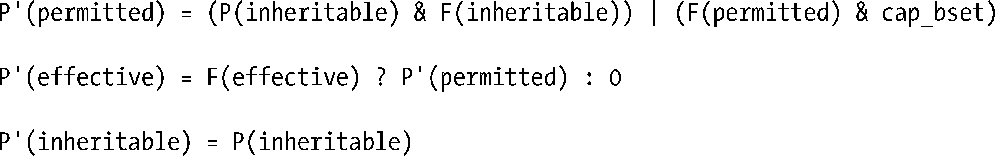

### 39.5　在exec()中转变进程能力

在exec()执行期间，内核会根据进程的当前能力以及被执行的文件的能力集来设置进程的新能力。内核会使用下面的规则来计算进程的新能力。

在上面的规则中，P表示在调用exec()之前进程的能力集的取值，P'表示在调用exec()之后进程的能力集的取值，F表示文件能力集。标识符cap_bset表示能力边界集的取值。注意exec()调用不会改变进程的可继承能力集。

