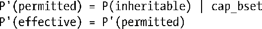

### 39.5.2　保持root语义

在执行一个文件时为了保持root用户的传统语义（即root拥有所有的权限），与该文件相关联的所有能力集都会被忽略。但为了满足在39.5节中给出的算法的要求，在exec()期间文件能力集的定义如下。

+ 如果执行了一个set-user-ID-root程序或调用exec()的进程的真实或有效用户ID为0，那么文件的可继承和许可集被定义为包含所有能力。
+ 如果执行了一个set-user-ID-root程序或调用exec()的进程的有效用户ID为0，那么文件有效位被定义成设置状态。

假设现在正在执行一个set-user-ID-root程序，那么这些文件能力集的概念定义表示在39.5节中给出的进程的新许可和有效能力集的计算被简化成了：

