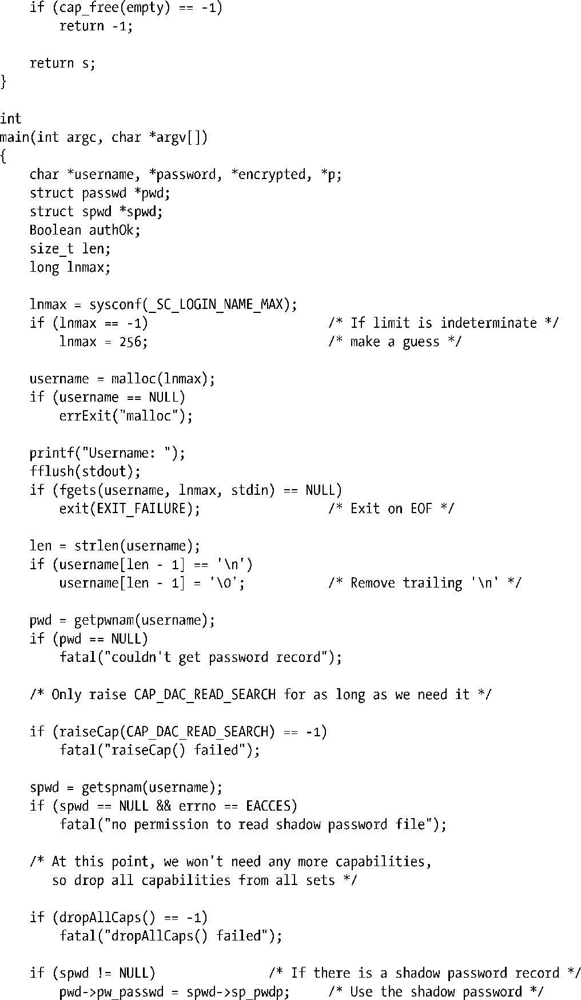
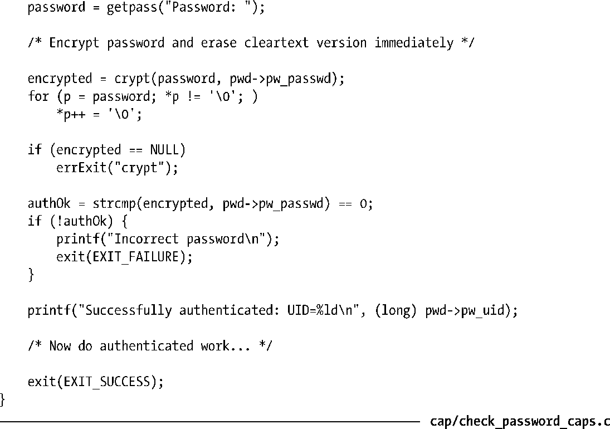

### 39.7　用编程的方式改变进程能力

一个进程可以使用capset()系统调用或稍后介绍的libcap API（首选方法）在其能力集中提升能力或删除能力。修改进程能力需要遵循下列规则。

**1．** 如果进程的有效集中没有CAP_SETPCAP能力，那么新的可继承集必须是既有可继承集合许可集组合的一个子集。

**2．** 新的可继承集必须是既有可继承集合能力边界集组合的一个子集。

**3．** 新许可集必须是既有许可集的一个子集。换句话说，一个进程无法授予自身不属于其许可集中的能力。换一种表述方法就是，在从许可集中删除了一个能力之后就无法再获取这个能力了。

**4．** 新的有效集只能包含位于新许可集中的能力。

#### libcap API

本章到现在还不介绍capset()系统调用以及相应的获取进程能力的capget()系统调用的原型，是因为应该避免使用这两个系统调用。相反，应该使用libcap库中的相关函数。这些函数提供了一个与POSIX 1003.1e标准草案一致的接口以及一些Linux扩展。

限于篇幅，本章不会详细介绍libcap API。总的来说，使用这些函数的程序通常会执行下列步骤。

**1．** 使用cap_get_proc()函数从内核中获取进程的当前能力集的一个副本并将其放置到这个函数在用户空间分配的一个结构中。（或者可以使用cap_init()函数来创建一个全新的空能力集结构。）在libcap API中，cap_t数据类型是用来引用此类结构的一个指针。

**2．** 使用cap_set_flag()函数更新用户空间的结构以便在上一步骤中返回的存储于用户空间中的结构中的许可、有效和可继承集中提升（CAP_SET）和删除（CAP_CLEAR）能力。

**3．** 使用cap_set_proc()函数将用户空间的结构传回内核以修改进程的能力。

**4．** 使用cap_free()函数释放在第一步中由libcap API分配的结构。

> libcap-ng是一个全新改良过的能力库API。在撰写本书的时候，有关libcap-ng的开发工作仍在进行中，详细信息可参考http://freshmeat.net/projects/libcap-ng。

#### 示例程序

程序清单8-2会根据标准的口令数据库来验证用户名和口令。注意程序在读取影像口令文件时需要具备相应的权限，而只有root和shadow组中的成员才能够读取这个文件。给这个程序赋予它所需的权限的传统方式是在root用户下运行这个程序或将程序变成一个set-user-ID-root程序。下面将修改这个程序使之使用能力和libcap API。

为了能够以普通用户的身份读取影像口令文件就需要绕过标准的文件权限检查。从表39-1中列出的能力可以看出相应的能力应该是CAP_DAC_READ_SEARCH。程序清单39-1给出了修改过的口令校验程序。这个程序在正好需要访问影像口令文件之前使用了libcap API来在其有效能力集中提升CAP_DAC_READ_SEARCH，然后在访问文件之后立即删除了这个能力。为了让非特权用户能够使用这个程序，必须要在文件的许可能力集中设置这个能力，如下面的shell会话所示。

程序清单39-1：使用能力来验证用户的程序

