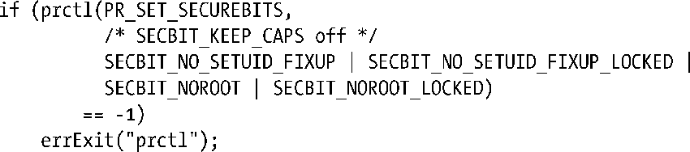

### 39.8　创建仅包含能力的环境

在前面几页中介绍了在能力方面对用户ID为0（root）的进程进行特殊处理的各种方式。

+ 当一个或多个用户ID等于0的进程将其所有的用户ID设置为非0值时，进程的许可和有效能力集会被清除。（参见39.6节）。
+ 当有效用户ID为0的进程将用户ID修改为非0值时会失去其有效能力。当做方向相反的变动时，许可能力集会被复制到有效集中。当进程的文件系统ID在0和非0值之间切换时会对能力子集执行一个类似的步骤。
+ 当真实或有效用户ID为root的进程执行了一个程序或任意进程执行了一个set-user-ID-root程序，那么文件的可继承和许可集会被定义成包含所有能力。如果进程的有效用户ID为0或者它正在执行一个set-user-ID-root程序，那么文件的有效位被定义成1。（参见39.5.2节）在通常情况下（即真实和有效用户ID都是root或正在执行一个set-user-ID-root程序），这表示进程的许可和有效集中包含了所有能力。

在一个完全基于能力的系统中，内核无需对root用户执行这些特殊的处理，因为不存在set-user-ID-root程序并且只会使用文件能力赋给程序执行所需的最小能力。

由于既有应用程序不会使用文件能力基础架构，因此内核必须要维持对用户ID为0的进程的传统处理，但可以要求应用程序在一个完全基于能力的环境中运行，在这样的环境中，不会对root做上述的特殊处理。从2.6.26的内核开始，当在内核中启用了文件能力时，Linux会提供securebits机制，它可以控制一组进程级别的标记，通过这组标记可以分别启用或禁用前面针对root的三种特殊处理中的各种特殊处理。（更准确地讲，securebits标记实际上是一个线程级别的特性。）

securebits机制控制着表39-2中列出的标记，每个标记由一对相关的base标记和相应的locked标记表示。每个base标记控制上面描述的针对root的一种特殊处理。设置相应的locked标记是一个一次性操作，用于防止对相关联的base标记的后续变更——一旦设置之后就无法重置locked标记了。

<b class="my_markdown">表39-2：securebits标记</b>

| 标　　记 | 设置之后的含义 |
| :-----  | :-----  | :-----  | :-----  |
| SECBIT_KEEP_CAPS | 当一个或多个用户ID为0的进程将其所有的用户ID设置为非0值时不要删除许可权限。只有在没有设置SECBIT_NO_SETUID_FIXUP标记的情况下这个标记才会起作用。在exec()中这个标记会被清除 |
| SECBIT_NO_SETUID_FIXUP | 当有效或文件系统用户ID在0和非0之间切换时不要改变能力 |
| SECBIT_NOROOT | 在一个真实或有效用户ID为0的进程调用了exec()或执行了一个set-user-ID-root程序时不要赋予其能力（除非可执行文件拥有文件能力） |
| SECBIT_KEEP_CAPS_LOCKED | 锁住SECBIT_KEEP_CAPS |
| SECBIT_NO_SETUID_FIXUP_LOCKED | 锁住SECBIT_NO_SETUID_FIXUP |
| SECBIT_NOROOT_LOCKED | 锁住SECBIT_NOROOT |

fork()创建子进程会继承securebits标记设置。在调用exec()期间，除SECBIT_KEEP_CAPS之外的所有标记设置都会得到保留，之所以清除SECBIT_KEEP_CAPS标记是为了与下面描述的PR_SET_KEEPCAPS设置保持兼容。

进程可以使用prctl() PR_GET_SECUREBITS操作来获取securebits标记。一个进程如果拥有CAP_SETPCAP能力，那么它就可以使用prctl() PR_SET_SECUREBITS操作修改securebits标记。一个完全基于能力的应用程序能够使用下面的调用不可逆地禁用调用进程及其所有子孙进程对root用户的特殊处理。

在执行完这个调用之后，这个进程及其所有子孙进程获取能力的唯一方式是执行拥有文件能力的程序。

#### SECBIT_KEEP_CAPS和prctl() PR_SET_KEEPCAPS操作

SECBIT_KEEP_CAPS标记能够防止能力在一个或多个用户ID为0的进程将其所有的用户ID值设置为非0值时被删除。粗略地讲，SECBIT_KEEP_CAPS提供了SECBIT_NO_SETUID_FIXUP标记的一半功能。（从表39-2中可以看出，只有在SECBIT_NO_SETUID_FIXUP没有被设置的情况下，SECBIT_KEEP_CAPS才会起作用。）这个标记的存在是为了提供一个实现更古老的prctl() PR_SET_KEEPCAPS操作的securebits标记，它控制着同样的特性。（这两种机制之间的一个差别是进程在使用prctl() PR_SET_KEEPCAPS操作时无需具备CAP_SETPCAP能力。）

> 之前曾经提过在exec()调用期间会保持除SECBIT_KEEP_CAPS之外的所有securebits标记。对SECBIT_KEEP_CAPS位的设置与其他securebits设置相反是为了与通过prctl() PR_SET_KEEPCAPS操作设置的对特性的处理保持一致。

prctl() PR_SET_KEEPCAPS操作由运行于老式的不支持文件能力的内核上的set-user-ID-root程序使用。此类程序可以通过在程序中删除能力并在需要的时候提升能力（参见39.10节）来提高安全性。

即使此类set-user-ID-root程序删除了除所需的权限之外的所有其他权限，它仍然会保留两个重要的权限：访问由root用户拥有的文件的权限以及通过执行程序重新获取能力的权限（参见39.5.2节）。永久删除这些权限的唯一方式是将进程的所有用户ID值设置为非0值，但这样做通常会导致清除许可和有效能力集（参见39.6节中有关用户ID的变动对能力造成的四点影响）。这就产生了矛盾，即在保持一些能力的同时永久地删除用户ID 0。为了允许这样的情况发生，可以使用prctl() PR_SET_KEEPCAPS操作来设置进程特性以防止在所有的用户ID变成非0值时许可能力集被清除。（在这种情况下总是会清除进程的有效能力集，不管是否设置了“keep capabilities”特性。）

