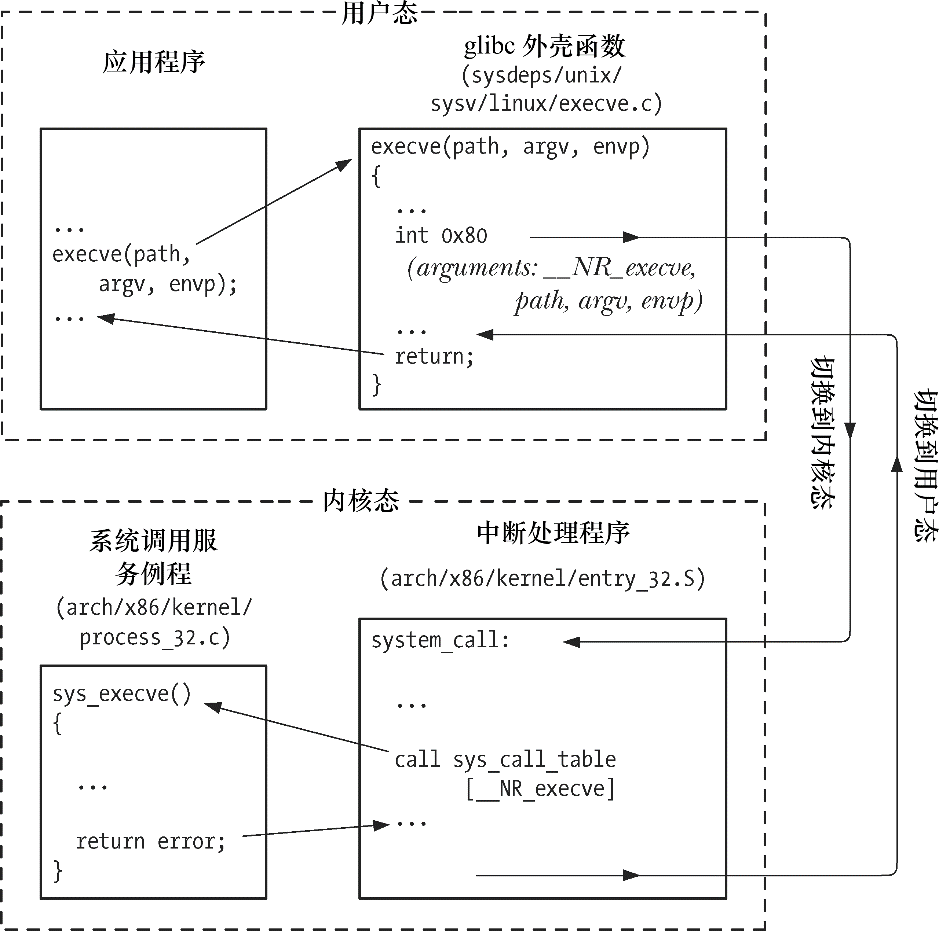

### 3.1　系统调用

系统调用是受控的内核入口，借助于这一机制，进程可以请求内核以自己的名义去执行某些动作。以应用程序编程接口（API）的形式，内核提供有一系列服务供程序访问。这包括创建新进程、执行I/O，以及为进程间通信创建管道等。（手册页syscalls(2)列出了Linux系统调用。）

在深入系统调用的运作方式之前，务必关注以下几点。

+ 系统调用将处理器从用户态切换到核心态，以便CPU访问受到保护的内核内存。
+ 系统调用的组成是固定的，每个系统调用都由一个唯一的数字来标识。（程序通过名称来标识系统调用，对这一编号方案往往一无所知。）
+ 每个系统调用可辅之以一套参数，对用户空间（亦即进程的虚拟地址空间）与内核空间之间（相互）传递的信息加以规范。

从编程角度来看，系统调用与C语言函数的调用很相似。然而，在执行系统调用时，其幕后会历经诸多步骤。为说明这点，下面以一个具体的硬件平台——x86-32为例，按事件发生的顺序对这些步骤加以分析。

**1．** 应用程序通过调用C语言函数库中的外壳（wrapper）函数，来发起系统调用。

**2．** 对系统调用中断处理例程（稍后介绍）来说，外壳函数必须保证所有的系统调用参数可用。通过堆栈，这些参数传入外壳函数，但内核却希望将这些参数置入特定寄存器。因此，外壳函数会将上述参数复制到寄存器。

**3．** 由于所有系统调用进入内核的方式相同，内核需要设法区分每个系统调用。为此，外壳函数会将系统调用编号复制到一个特殊的CPU寄存器（%eax）中。

**4．** 外壳函数执行一条中断机器指令（int 0x80），引发处理器从用户态切换到核心态，并执行系统中断0x80 (十进制数128)的中断矢量所指向的代码。

> 较新的x86-32硬件平台实现了sysenter指令，较之传统的int 0x80中断指令，sysenter指令进入内核的速度更快。2.6内核及glibc 2.3.2以后的版本都支持sysenter指令。

**5．** 为响应中断0x80，内核会调用system_call()例程（位于汇编文件arch/i386/entry.S中）来处理这次中断，具体如下。

a）在内核栈中保存寄存器值（参见6.5节）。

b）审核系统调用编号的有效性。

c）以系统调用编号对存放所有调用服务例程的列表（内核变量sys_call_table）进行索引，发现并调用相应的系统调用服务例程。若系统调用服务例程带有参数，那么将首先检查参数的有效性。例如，会检查地址指向用户空间的内存位置是否有效。随后，该服务例程会执行必要的任务，这可能涉及对特定参数中指定地址处的值进行修改，以及在用户内存和内核内存间传递数据（比如，在I/O操作中）。最后，该服务例程会将结果状态返回给system_call()例程。

d）从内核栈中恢复各寄存器值，并将系统调用返回值置于栈中。

e）返回至外壳函数，同时将处理器切换回用户态。

**6．** 若系统调用服务例程的返回值表明调用有误，外壳函数会使用该值来设置全局变量errno（参见3.4节）。然后，外壳函数会返回到调用程序，并同时返回一个整型值，以表明系统调用是否成功。

> 在Linux上，系统调用服务例程遵循的惯例是调用成功则返回非负值。发生错误时，例程会对相应errno常量取反，返回一负值。C语言函数库的外壳函数随即对其再次取反（负负得正），将结果拷贝至errno，同时以-1作为外壳函数的返回值返回，向调用程序表明有错误发生。
> 上述惯例所依赖的前提条件是系统调用服务例程，若调用成功则不会返回负值。可是，对于少数例程来说，这一前提并不成立。一般情况下，这也不会有问题，因为取反的errno值范围不会与调用成功返回负值的范围有交集。不过，有一种情况，沿用这个惯例确实会出问题：系统调用fcntl()的F_GETOWN 操作，会在63.3节加以描述。

图3-1以系统调用 execve()为例，展示了上文述及事件的发生序列。在 Linux/x86-32上，execve()的系统调用号为 11(__NR_execve)。因此，在 sys_call_table 向量中，条目 11包含了该系统调用的服务例程sys_execve()的地址。（在Linux中，系统调用服务例程的命名通常会采取sys_xyz()的形式，其中，xyz()正是所论及的系统调用。）

<b class="my_markdown">图3-1：系统调用的执行步骤</b>

若是单纯为了掌握本书的后续内容，这里的论述的确有些小题大做。但其要点在于即便对于一个简单的系统调用，仍要完成相当多的工作，因此系统调用的开销虽小，却也不容忽视。

> 可以以getppid()系统调用为例，研判一下发起系统调用的开销——该系统调用只是简单地返回调用进程的父进程ID。在作者的一台运行Linux 2.6.25的x86-32系统上，调用getppid()一千万次大约需要2.2秒钟，每次调用大致需要0.3微秒。相形之下，在同一系统上，调用某个只返回整数的C语言函数一千万次，仅需0.11秒，约为调用getppid()耗费时间的1/20。当然，大多数系统调用的开销都明显高于getppid()。

因此，从C语言编程的角度来看，调用C语言函数库的外壳（wrapper）函数等同于调用相应的系统调用服务例程，在本书后续内容中，“调用系统调用xyz()”这类说法就意味着“调用外壳函数，由外壳函数去调用系统调用xyz()”。

为调试程序，或是研究程序的运作机制，可使用附录A所介绍的strace命令，对程序发起的系统调用进行跟踪。

更多与Linux系统调用机制有关的信息请见[Love, 2010]、[Bovet & Cesati, 2005]以及[Maxwell, 1999]。

