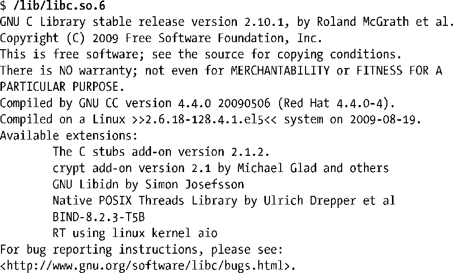

### 确定系统的glibc版本

有时，需要确定系统所安装的glibc版本。在shell中，可以直接运行glibc共享库文件——将其视为可执行文件——来获取glibc版本。这会输出各种文本信息，其中也包括了 glibc的版本号。

在某些Linux发行版中，GNU C语言函数库的路径名并非“/lib/libc.so.6”。确定该库所在位置的方法之一是：针对某个与glibc动态链接的可执行文件（大多数可执行文件都采用这种链接方式），运行ldd（列出动态依赖性）程序。接下来，再检查输出的库依赖性列表，便能发现glibc共享库的位置：

应用程序可通过测试常量和调用库函数这两种方法，来确定系统所安装的glibc版本。从版本2.0开始，glibc定义了两个常量：__GLIBC__和__GLIBC_MINOR__，供程序在编译时（在#ifdef语句中）测试使用。在安装有glibc 2.12版本的系统上，以上两个常量的值分别为2和12。然而，如果程序在A系统上编译，而在B系统（安装了不同版本的glibc）上运行，这两个常量作用就有限了。为应对这种可能，程序可以调用函数gnu_get_libc_version()，来确定运行时的glibc版本。

函数gnu_get_libc_version()返回一个指针，指向诸如“2.12”的字符串。

> 获取glibc版本信息，还有一种方法：使用confstr()函数来获取（glibc特有的）_CS_GNU_LIBC_VERSION配置变量的值。这一调用会返回类似于“glibc 2.12”的字符串。

