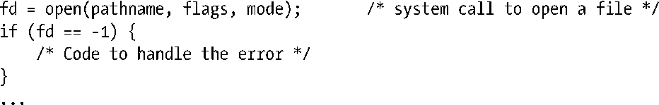
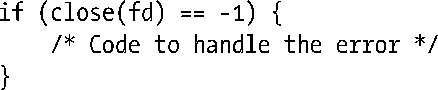
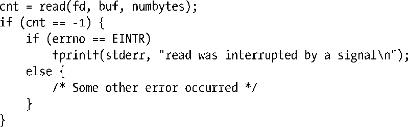
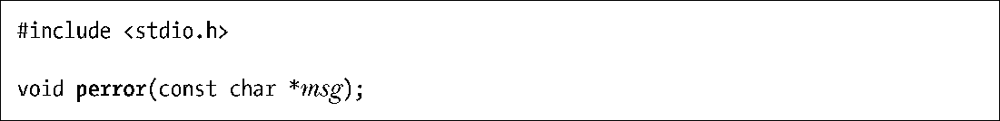
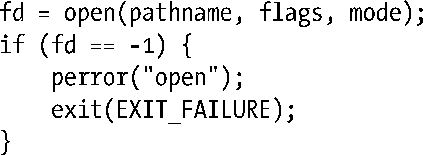
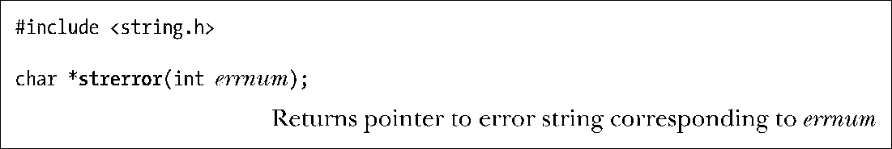

### 处理系统调用错误

每个系统调用的手册页记录有调用可能的返回值，并指出了哪些值表示错误。通常，返回值为-1表示出错。因此，可使用下列代码对系统调用进行检查：

系统调用失败时，会将全局整形变量 errno 设置为一个正值，以标识具体的错误。程序应包含① <errno.h>头文件，该文件提供了对 errno 的声明，以及一组针对各种错误编号而定义的常量。所有这些符号名都以字母E打头。在每个手册页内标题为ERRORS的章节内，都刊载有一份相应系统调用可能返回的errno值列表。以下便是利用errno诊断系统调用错误的一个简单示例：

如果调用系统调用和库函数成功，errno绝不会被重置为0，故此，该变量值不为0，可能是之前调用失败造成的。此外，SUSv3允许在函数调用成功时，将errno设置为非零值（当然，几乎没有函数会这么做）。因此，在进行错误检查时，必须坚持首先检查函数的返回值是否表明调用出错，然后再检查errno确定错误原因。

少数系统调用（比如，getpriority()）在调用成功后，也会返回−1。要判断此类系统调用是否发生错误，应在调用前将errno置为0，并在调用后对其进行检查（上述手法同样适用于某些库函数）。

系统调用失败后，常见的做法之一是根据 errno 值打印错误消息。提供库函数 perror()和strerror()，就是出于这一目的。

函数perror()会打印出其msg参数所指向的字符串，紧跟一条与当前errno值相对应的消息。

以下是对系统调用错误进行处理的一种简单方式：

函数strerror()会针对其errnum参数中所给定的错误号，返回相应的错误字符串。

由strerror()所返回的字符串可以是静态分配的，这意味着后续对strerror()的调用可能会覆盖该字符串。

若无法识别errnum所含的错误编号，则strerror()会返回“Unknown error nnn.”形式的字符串。在某些其他的实现中，在这种情况下，strerror()会返回NULL。

由于perror()和strerror()都属于对语言环境敏感（locale-sensitive）（参见10.4节）的函数，故而错误描述中使用的都是本地语言。

