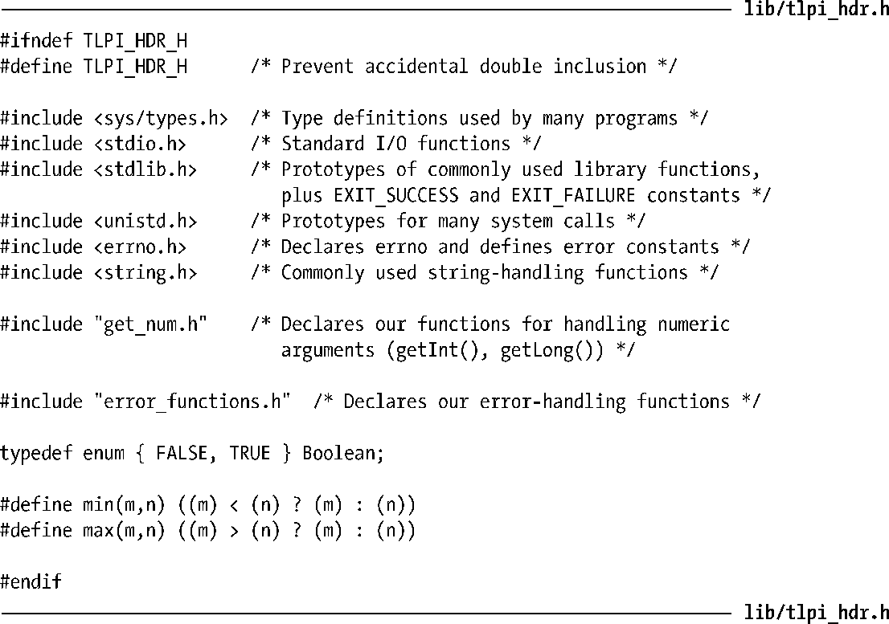
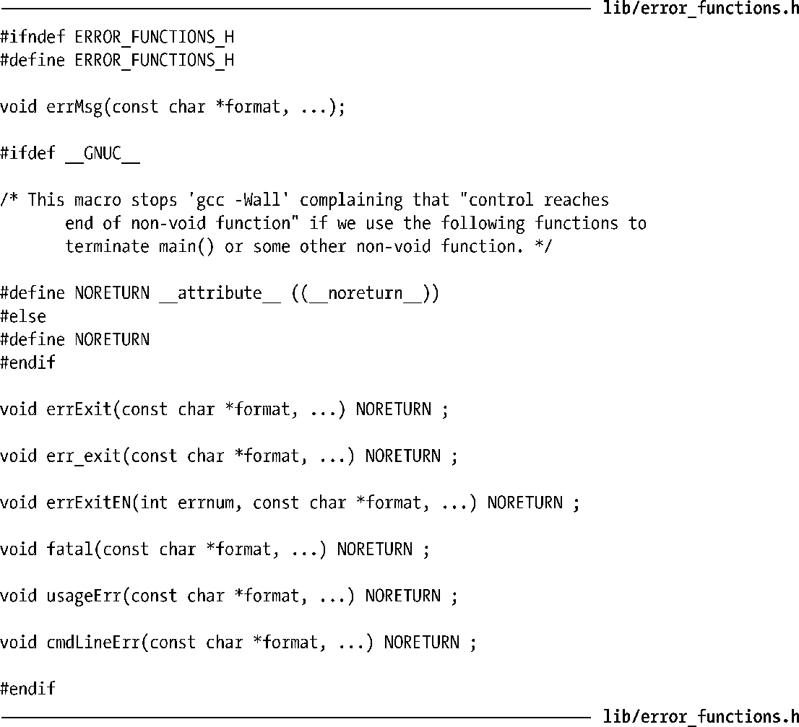
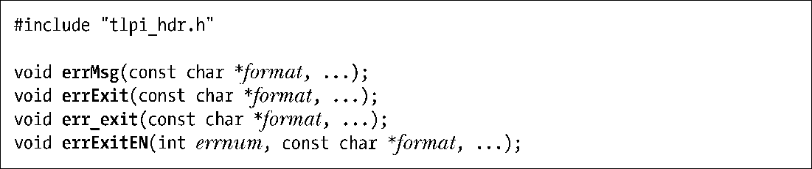
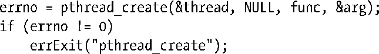
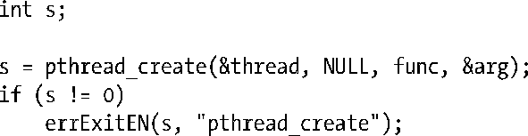
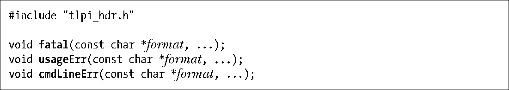
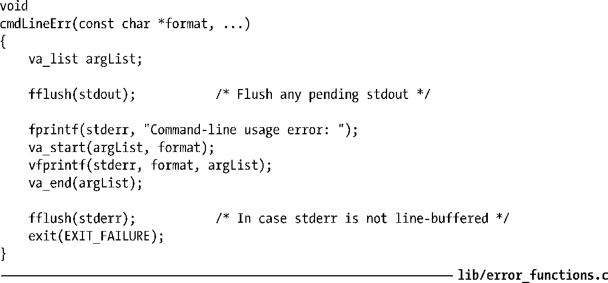
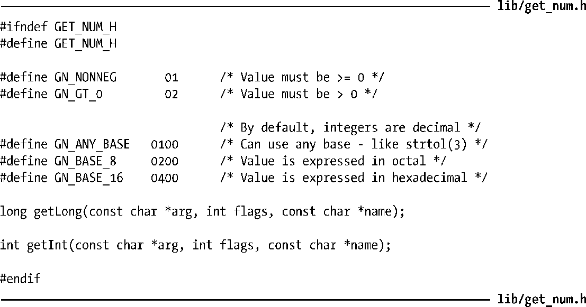
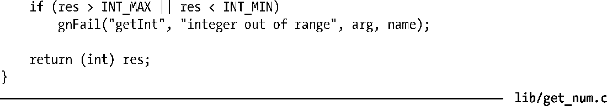

### 3.5.2　常用的函数及头文件

本书的大多数程序示例都包括有一个头文件，内含常用的各种定义。这些示例同样使用了一系列常用函数。本节会对这些头文件及函数进行讨论。

#### 常用的头文件

程序清单3-1所列的头文件几乎为本书所有程序示例所使用。

程序清单3-1：大多数程序示例所使用的头文件

#### 错误诊断函数

为简化本书程序示例中的错误处理，我们编写了错误诊断函数，对其的声明如程序清单3-2所示。

程序清单3-2：常用错误处理函数的声明

本书使用errMsg()、errExit()、err_exit()以及errExitEN()函数，以诊断调用系统调用和库函数时所发生的错误。

函数errMsg()会在标准错误设备上打印消息。除了将一个终止换行符自动追加到输出字符串尾部以外，该函数的参数列表与printf()所用相同。errMsg()函数会打印出与当前errno值相对应的错误文本，其中包括了错误名（比如，EPERM）以及由strerror()返回的错误描述，外加由参数列表指定的格式化输出。

errExit()函数的操作方式与errMsg()相似，只是还会以如下两种方式之一来终止程序。其一，调用exit()退出。其二，若将环境变量EF_DUMPCORE定义为非空字符串，则调用abort()退出，同时生成核心转储（core dump）文件，供调试器调试之用。（本书22.1节会对核心转储文件加以解释。）

函数err_exit()类似于errExit()，但存在两方面的差异。

+ 打印错误消息之前，err_exit()不会刷新标准输出。
+ err_exit()终止进程使用的是_exit()，而非exit()。这一退出方式，略去了对stdio缓冲区的刷新以及对退出处理程序（exit handler）的调用。

本书第 25 章描述了_exit()与exit()之间的区别，还探讨了在fork()创建的子进程中对stdio缓冲区和退出处理程序的处理方式。阅读第25章，会使上述err_exit()操作中的差异细节得以澄清。这里只是想提醒读者，在编写的库函数创建了子进程，且该子进程因发生错误而需要终止时，err_exit()恰好能一显身手。它避免了对子进程继承自父进程（即调用进程）的stdio缓冲区副本进行刷新，且不会调用由父进程所建立的退出处理程序。

在功能上，errExitEN()函数与errExit()大体相同，区别仅仅在于：与errExit()打印与当前errno值相对应的错误文本不同，errExitEN()只会打印与errnum参数中给定的错误号（error number）（这也是该函数后缀名“EN”的由来）相对应的文本。

在本书中调用了POSIX线程API的程序示例中，主要使用errExitEN()来处理错误。与传统的UNIX系统调用返回-1表示错误不同，POSIX线程函数会在其结果中返回一个（POSIX线程函数返回0表示成功）错误号（正数，类型为errno所专用）。

针对POSIX线程函数，可使用如下代码来诊断错误：

然而，这一方法效率不高，因为在线程程序中，errno实际已被定义为宏，展开后是返回可修改左值的一个函数调用。因此，每次使用errno都会引发一次函数调用。使用errExitEN()改写上述代码，功能相同，但更为高效，如下所示：

> 在C语言术语中，左值是一个用来指代存储区域的表达式。左值最为常见的用法是作为一个变量的标识符。某些操作符也会产生左值。例如，若p为指向某块存储区域的指针，则*p便是一个左值。POSIX线程API中，将errno重新定义为一个函数②，该函数会返回一个指向线程专用存储区域的指针（请参阅31.3节）。

诊断其他类型的错误时，本书使用的是fatal()、usageErr()以及cmdLineErr()。

函数fatal()用来诊断一般性错误，其中包括未设置errno的库函数错误。除了将一个终止换行符自动追加到输出字符串尾部以外，fatal()的参数列表与printf()基本相同。该函数会在标准错误上打印格式化输出，然后，像errExit()那样终止程序。

函数usageErr()用来诊断命令行参数使用方面的错误。其参数列表风格与printf()相同，并在标准错误上打印字符串“Usage：”，随之以格式化输出，然后调用exit()终止程序。(本书的一些程序示例自行提供有对usageErr()的扩展版本，命名为usageError()。)

函数cmdLineErr()酷似usageErr()，但其错误诊断是针对于特定程序的命令行参数。

程序清单3-3列出的为本书错误诊断函数的实现。

程序清单3-3：为本书所有程序所使用的错误处理函数

程序清单3-4列出了程序清单3-3所包含的文件enames.c.inc。该文件定义了一个名为“ename”的字符串数组，其内容是与errno的各种可能值相对应的符号名称。本书所采用的错误处理函数会使用该数组，去打印与某个特定错误号相对应的符号名。之所以做如此变通，是为了应对以下两种实际情况：一方面，strerror()不会标识出与错误消息相对应的符号常量；而另一方面，手册页在描述错误时，使用的是符号名称。打印出符号名便于读者在手册页中查找错误原因。

> 由于errno值随Linux硬件架构的不同而有所变化，因此ename.c.inc文件的内容与特定的硬件架构相关。程序清单3-4所示的ename.c.inc文件版本专用于Linux 2.6/x86-32系统。构建该文件的脚本lib/Build_ename.sh，包含于为本书发布的源码当中。可以使用该脚本，针对特定的硬件平台及内核版本，来构建ename.c.inc文件。

请注意，数组ename中的某些字符串为空。它们与未使用的错误值相对应。此外，其中的一些字符串包含了两个错误名称，之间以斜杠分隔，是对应两个符号错误名具有相同数值的情况。

> 从ename.c.inc文件中，可以看出错误EAGAIN和EWOULDBLOCK具有相同数值。SUSv3明确允许这一做法，而且在大多数其他UNIX实现（并非全部）上，这些常量值均相同。系统调用返回此类错误的情况是：本应阻塞（亦即在完成调用前被强制等待），而调用者要求系统调用返回错误。EAGAIN源于System V，是由实施I/O操作、信号操作、消息队列操作以及文件锁定操作（fcntl()）的系统调用所返回的错误。EWOULDBLOCK则发源于BSD，由文件锁定（flock()）以及与套接字相关的系统调用返回。
> 在SUSv3中，仅在与套接字相关的各种接口规范中提及EWOULDBLOCK。对此类接口来说，SUSv3允许非阻塞调用要么返回EAGAIN，要么返回EWOULDBLOCK。对于所有其他的非阻塞调用，SUSv3只明确定义了EAGAIN错误。

程序清单3-4：Linux错误名（x86-32版）

#### 解析数值型命令行参数的函数

程序清单3-5中的头文件提供了两个函数声明，在本书中频繁用于解析整形命令行参数：getInt()和getLong()。较之于atoi()、atol()以及strtol()，它们的主要优点在于针对数值型参数提供了一些基本的有效性检查。

函数getInt()和getLong()分别将arg指向的字符串转换为int或long。如果arg未包含一个有效的整数字符串（即仅包含数字以及字符“+”和“-”），那么这两个函数会打印一条错误消息，并终止程序。

若参数name非空，则所含内容应为一字符串，用于标识arg对应于命令行中相应参数的名称。在上述两函数中，无论打印任何错误消息，该字符串都是消息中的一部分。

可通过flags参数对getInt()和getLong()函数的操作施加一些控制。默认情况下，两个函数会处理包含有符号十进制整数的字符串。若将定义于程序清单 3-5 中的一个或多个GN_*系列常量与flags相或，则既可以选择其他的转换进制，也能将数值范围限制为非负或正整数。

> 虽然flags参数允许程序强制执行正文所述的范围检查，但在某些情况下，即便这么做看起来很合理，程序示例也无需做类似检测。例如，程序清单 47-1 中就并未对参数init-value进行检查。这意味着，用户可将一个负数作为初始值赋给某个信号量，这会引发随后的semctl()系统调用返回错误（ERANGE），因为信号量不能为负值。在此类情况下省略对范围的检查，不但能够让读者体验对系统调用及库函数的正确使用，还能观察到输入无效参数时所发生的情形。通常，现实世界中的应用程序会对自身命令行参数施以更为严格的检查。

程序清单3-6给出了函数getInt()和getLong()的实现。

程序清单3-5：get_num.c的头文件

程序清单3-6：解析数值型命令行参数的函数

