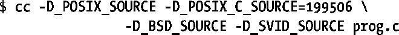

### 3.6.1　特性测试宏

系统调用和库函数API的行为受各种标准（参见1.3节）的制约。这些标准中的一部分是由Open Group（SUS）这样的标准机构来制定的，而另一部分则是由具有重要历史意义的两个UNIX实现BSD和System V Release 4（以及相关的System V接口定义）来定义。

编写可移植性应用程序时，有时会希望各个头文件只显露遵循特定标准的定义（常量、函数原型等）。要达到这一目的，在编译程序时需要定义下列一个或多个特性测试宏。方式之一是在程序源码包含③任何头文件之前，定义如下宏：

此外，还可以使用C编译器的-D选项：

> 术语“特性测试宏”似乎易于让人产生误解，但只要从UNIX实现的角度看来，读者便会发现这一称谓其实颇有道理。通过测试（使用#if）应用程序为宏所定义的值，实现可以决定应该让哪些（由头文件提供的）特性可见。

以下特性测试宏由相关标准定义而成，因而在支持这些标准的所有系统上，对这些宏的使用均是可移植的：

##### _POSIX_SOURCE

一经定义（任何值），头文件会显露符合POSIX.1-1990和ISO C（1990）标准的定义。该宏已被_POSIX_C_SOURCE取代。

##### _POSIX_C_SOURCE

若定义为1，效果与_POSIX_SOURCE相同。若将其值定义为大于等于199309，头文件还会显露遵从POSIX.1b（实时）标准的定义。若将其值定义为大于等于199506，便会开启对POSIX.1c（线程）定义的支持。若将其值定义为200112，则开启对POSIX.1-2001基本规范（排除了XSI扩展）定义的支持。（2.3.3版本之前，glibc头文件对值为200112的_POSIX_C_SOURCE不做解释。）若将其值定义为200809，便会开启对POSIX.1-2008基本规范定义的支持。（2.10版本之前，glibc头文件对值为200809的_POSIX_C_SOURCE不做解释。）

##### _XOPEN_SOURCE

一经定义（任何值），头文件会显露对POSIX.1、POSIX.2和X/Open(XPG4)标准的定义。若将其值定义为大于等于500，还会开启对SUSv2 (UNIX 98和XPG5)扩展的支持。若将其值设置为大于等于600，则又开启了对SUSv3 XSI (UNIX 03)扩展和C99扩展的支持。（2.2版本之前，glibc头文件对值为600的_XOPEN_SOURCE不做解释。）若将其值设置为大于等于700，便会开启对SUSv4 XSI扩展的支持（2.10版本之前，glibc头文件对值为700的_XOPEN_SOURCE不做解释）。之所以选择500、600和700作为取值，是因为SUSv2、SUSv3和SUSv4分别是X/Open规范的第5号、第6号和第7号。

以下列出为glibc专用的特性测试宏：

##### _BSD_SOURCE

一经定义（任何值），开启对BSD定义的支持。此外，只要定义了该宏，便以值199506定义了_POSIX_C_SOURCE。极少数的情况下，当标准之间发生冲突时，显式设置该宏会导致系统向BSD定义倾斜。

##### _SVID_SOURCE

一经定义（任何值），头文件会显露符合System V接口规范（SVID）的定义。

##### _GNU_SOURCE

一经定义（任何值），头文件除了会显露符合前述所有标准的定义（通过设置前述所有宏来提供）外，还会开启对各种GNU扩展定义的支持。

在不带任何特殊选项调用GNU C编译器时，即默认定义了_POSIX_SOURCE、_POSIX_C_SOURCE=200809（glibc版本为2.5-2.9时，其值为200112；glibc版本低于2.4时，其值为199506）、_BSD_SOURCE以及_SVID_SOURCE。

在对个别宏进行了定义，或以其标准模式之一去调用编译器时（比如, cc –ansi 或 cc – std=c99），只会按需提供定义。不过，有一个例外：若未对_POSIX_C_SOURCE另行定义，且未以标准模式之一去调用编译器，则_POSIX_C_SOURCE的值会被定义为200809（glibc版本为2.4-2.9时，其值为200112；glibc版本低于2.4时，其值为199506）。

定义多个宏有叠加效应，故而缺省情况下所提供的宏设置，也可使用如下cc命令来明确选择：

<features.h>头文件和feature_test_macros(7)手册页，针对赋给每个特性测试宏的值，提供了更多精确信息。

#### _POSIX_C_SOURCE、_XOPEN_SOURCE以及POSIX.1/SUS

在POSIX.1-2001/SUSv3中，仅对_POSIX_C_SOURCE和_XOPEN_SOURCE特性测试宏进行了明确定义，应用程序要符合该标准，应分别将上述两宏的值定义为 200112 和 600。将_POSIX_C_SOURCE值定义为200112，即表示应用程序符合POSIX.1-2001基本规范（即符合除XSI扩展规范以外的POSIX规范）。将_XOPEN_SOURCE值定义为600，即表示应用程序符合SUSv3规范（即符合XSI规范基本规范加XSI扩展规范）。上述声明同样适用于 POSIX.1-2008/SUSv4，只是需要将上述两个特性测试宏的值分别定义为200809和700。

SUSv3 明文规定将_XOPEN_SOURCE 设置为 600 所提供的特性，就包含了将POSIX_C_SOURCE设置为200112时所激活的所有特性。因此，为符合SUSv3（即XSI规范），应用程序只需要定义_XOPEN_SOURC。SUSv4做出了类似规定，将_XOPEN_SOURCE设置为700所提供的特性，包含了_POSIX_C_SOURCE值被设置为200809时所激活的所有特性。

#### 函数原型及源码示例中的特性测试宏

手册页则描述了欲使某个特定常量定义或函数声明在头文件中可见，应该定义哪些特性测试宏。为本书编写的所有源码示例，编译时采用缺省的GNU C语言编译器选项或如下选项：

对于在本书中出现的函数，为了能在以上述两种方式编译的程序中编译通过，在其原型处均注明了使用这些函数所必须定义的任何特性测试宏。手册页中，对于启用每一函数声明所需定义的特性测试宏，则有更为精确的描述。

