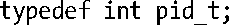
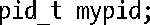
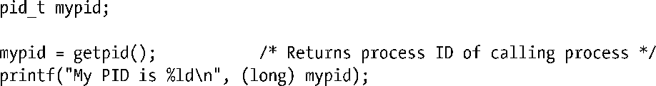

### 3.6.2　系统数据类型

不同实现的数据类型，例如：进程ID、用户ID以及文件偏移量，表示时均采用标准C语言类型。尽管也有可能使用C语言的基本类型，诸如int和long，来声明存储此类信息的变量，但这一做法降低了不同UNIX系统间相互移植的难度，分析如下。

+ 随着UNIX实现的不同（例如，long型可能在系统A上长度为4字节，在系统B上为8字节），有时甚至是同一实现中编译环境的不同，这些基本类型的大小各不相同。更有甚者，不同实现可能会使用不同类型来表示相同信息。例如，进程ID在系统A上为int型，而在系统B上为long型。
+ 即便是针对同一款UNIX实现，用以表征信息的类型在不同版本之间也会有所不同。Linux上较为知名的例子是用户ID和组ID。在Linux 2.2及其之前，这些值以16位表示。在2.4及其之后，则以32位表示。

为避免此类可移植性问题，SUSv3规范了各种标准系统数据类型，并要求各个实现适当加以定义和使用。每种类型的定义均使用C语言的typedef特性。例如，pid_t数据类型用以表示进程ID，在Linux/x86-32上，其类型定义如下：

标准系统数据类型中的大多数，其命名均以_t结尾。其中的许多都声明于头文件<sys/types.h>中，余下的少量则定义于其他头文件中。

应用程序应采用这些类型定义来声明其使用的变量，才能保证可移植性。例如，如下声明将允许应用程序在任何符合SUSv3标准的系统上正确表示进程ID。

表3-1列出将在书中碰到的部分系统数据类型。对于表中的某些特定类型，SUSv3要求以“运算类型（arithmetic type）”来加以实现。这意味着，实现所选择的底层类型，要么为整数类型，要么为浮点（实数或复数）型。

<b class="my_markdown">表3-1：系统数据类型选录</b>

| 数据类型 | SUSv3类型需求 | 描　　述 |
| :-----  | :-----  | :-----  | :-----  | :-----  |
| blkcnt_t | 有符号整型 | 文件块数量（15.1节） |
| blksize_t | 有符号整型 | 文件块大小（15.1节） |
| cc_t | 无符号整型 | 终端特殊字符（62.4节） |
| clock_t | 整型或浮点型实数 | 以时钟周期计量的系统时间（10.7节） |
| clockid_t | 运算类型之一 | 针对POSIX.1b时钟和定时器函数的时钟标识符 |
| comp_t | SUSv3未作规范 | 经由压缩处理的时钟周期（28.1节） |
| dev_t | 运算类型之一 | 设备号，包含主、次设备号（15.1节） |
| DIR | 无类型要求 | 目录流（18.8节） |
| fd_set | 结构类型 | select()（63.2.1节）中的文件描述符集合 |
| fsblkcnt_t | 无符号整型 | 文件系统块数量（14.11节） |
| fsfilcnt_t | 无符号整型 | 文件数量（14.11节） |
| gid_t | 整型 | 数值型组标识符（8.3节） |
| id_t | 整型 | 用以存放标识符的通用类型，其大小至少可放置pid_t、uid_t和gid_t类型 |
| in_addr_t | 32位无符号整型 | IPv4地址（59.4节） |
| in_port_t | 16位无符号整型 | IP端口号（59.4节） |
| ino_t | 无符号整型 | 文件i-node号（15.1节） |
| key_t | 运算类型之一 | System V IPC键（45.2节） |
| mode_t | 整型 | 文件权限及类型（15.1节） |
| mqd_t | 无类型要求，但不能为数组类型 | POSIX消息队列描述符 |
| msglen_t | 无符号整型 | System V消息队列所允许的字节数（46.4节） |
| msgqnum_t | 无符号整型 | System V消息队列中的消息数量（46.4节） |
| nfds_t | 无符号整型 | poll()（63.2.2节）中的文件描述符数量 |
| nlink_t | 整型 | 文件的（硬）连接数量（15.1节） |
| off_t | 有符号整型 | 文件偏移量或大小（4.7节及15.1节） |
| pid_t | 有符号整型 | 进程ID、进程组ID或会话ID（6.3节、34.2节、34.3节） |
| ptrdiff_t | 有符号整型 | 两指针差值，为有符号整型 |
| rlim_t | 无符号整型 | 资源限制（36.2节） |
| sa_family_t | 无符号整型 | 套接字地址族（56.4节） |
| shmatt_t | 无符号整型 | 与System V共享内存段相连的进程数量 |
| sig_atomic_t | 整型 | 可进行原子访问的数据类型（21.1.3节） |
| siginfo_t | 结构类型 | 信号起源的相关信息（21.4节） |
| sigset_t | 整形或结构类型 | 信号集合（20.9节） |
| size_t | 无符号整型 | 对象大小（以字节数计） |
| socklen_t | 至少32位的整型 | 套接字地址结构大小（以字节数计）（56.3节） |
| speed_t | 无符号整型 | 终端线速度（62.7节） |
| ssize_t | 有符号整型 | 字节数或（为负时）标识错误 |
| stack_t | 结构类型 | 对备选信号栈的描述（21.3节） |
| suseconds_t | 有符号整型，范围为[−1,1000000] | 微秒级的时间间隔（10.1节） |
| tcflag_t | 无符号整型 | 终端模式标志位的位掩码（62.2节） |
| time_t | 整型或浮点型实数 | 自所谓纪元（Epoch）（10.1节）始，以秒计的日历时间 |
| timer_t | 运算类型之一 | POSIX.1b间隔定时器函数（23.6节）的定时器标识符 |
| uid_t | 整型 | 数值型用户标识符（8.1节） |

在后续章节中论及表 3-1 的数据类型时，常会作如下表述：某类型“为一整数类型（由SUSv3所规定）”。这是指SUSv3要求以整型来定义该类型，但不要求使用某一特定的原生（native）数据类型（例如：short、int或long）。（通常，针对Linux中的每种系统数据类型，书中不会言明实际会使用哪种原生数据类型加以表示，因为编写可移植应用程序时无需关注这点。）

#### 打印系统数据类型值

当需要打印表3-1所列数值型系统数据类型（例如：pid_t和uid_t）的值时，调用printf()应留意不要引入对表现形式的依赖。这一依赖是由于C语言的（升级型）自动类型转换造成的。该转换会将short型转换为int型，而对于int型和long型则置之不问。这就意味着传入printf()的要么为int型，要么为long型。然而，因为printf()在运行时无从判定其参数类型，调用者必须明确其格式限定符为%d还是%ld。问题在于在printf()中仅就一种限定符进行编码会导致对实现的依赖。常见的应对策略是强制转换相应值为long型后，再使用%ld的限定符，如下所示：

上述技术有个例外。因为在一些编译环境中数据类型off_t大小与long long相当，所以会将off_t强制转换为该类型并使用%lld的限定符，如5.10节所述。

> C99标准为printf定义了名为z的长度修饰符，以表明紧随其后的整型转换是与size_t或ssize_t类型相对应的。因而，要对付这些类型，就可以用%zd来取代%ld外加类型转换的方法了。尽管glibc支持该限定符，但其并未获得所有UNIX实现的支持，故而本书也避免采用这一做法。
> C99标准还定义有名为j的长度修饰符，并规定其相应参数的类型为intmax_t（或uintmax_t），该类型之大，足以用其表示任何类型的整数。最终，使用intmax_t强制转换外加%jd限定符的方案应取代long强制转换外加%ld限定符的方案，成为打印数值型系统数据类型的首选，因为前者可以处理long long型值和诸如int128_t之类的任一可扩展整数类型。然而，出于相同的原因（未获得所有UNIX实现的支持），本书没有采用这一技术。

