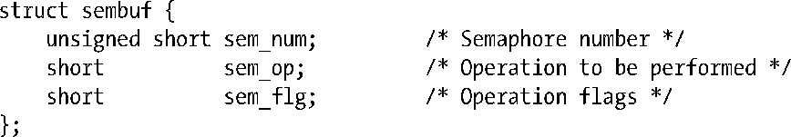
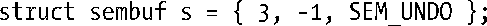
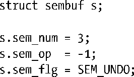
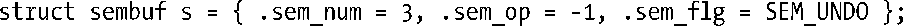
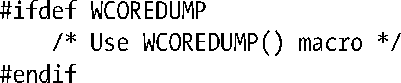

### 3.6.3　其他的可移植性问题

本节所讨论的，是进行系统编程时可能会遇到的一些其他可移植性问题。

#### 初始化操作和使用结构

每种UNIX实现，都明确定义了一系列标准结构，用于各种系统调用及库函数。现试举一例，请考虑用来表示信号量操作（通过semop()系统调用去执行）的结构sembuf：

尽管SUSv3定义了诸如sembuf之类的结构，但意识到如下两点尤为重要。

+ 总体而言，未对此类结构内部的字段顺序作出规范。
+ 一些情况下，此类结构内会包含额外的、与实现相关的字段。

因此，以如下方式对数据结构进行初始化，其代码是无法移植的：

这段初始化程序尽管在Linux上运行没有问题，但在其他一些实现上，由于对sembuf结构的定义中顺序会有所不同，故而将无法工作。要在初始化时消除此类移植问题，必须明确采用如下赋值语句：

如果采用的是C99语言标准，可以利用该语言针对结构初始化的新语法，写出等价代码：

若需要将标准结构的内容转储到文件时，标准结构的成员顺序也要加以考虑。此时要消除可移植性问题，简单地将结构以二进制形式写入是无济于事的。相反，必须将结构内字段以特定顺序逐一加以记录（可能是以文本形式）。

#### 使用未见诸于所有实现的宏

有时，未必所有的UNIX实现都对一个宏做了定义。例如，WCOREDUMP()宏（用于检测子进程是否生成了核心转储文件）的使用非常广泛，但SUSv3却并未对其进行规范。因此，在某些UNIX实现上，该宏并不存在。要妥善处理此类潜在的可移植性问题，可以使用C语言的预编译指令#ifdef，如下所示：

#### 不同实现间所需头文件的变化

有些情况下，包含各种系统调用和库函数原型的头文件，在不同UNIX实现之间会有所不同。本书仅展示Linux的需求，并注明其与SUSv3间的各种变化。

本书论及部分函数时，会引入特定头文件，伴之以“/*出于可移植型考虑*/”形式的注解。这表明Linux和SUSv3都不需要此头文件，但由于某些其他（尤其是老一些的）实现可能需要，在可移植程序中应将其纳入。

> POSIX.1-1990曾规定，编程时如需使用其所规范的许多函数，在包含与该函数相关的任何其他头文件之前，必须包含头文件<sys/types.h>。可是，这一要求不久就成了多此一举。绝大多数现代UNIX实现中的应用程序，在使用这些函数时都无需包含此头文件。SUSv1因而删除了这一要求。然而，在编写可移植程序时，将以其为首的头文件包括在内，仍不失为明智之举。（不过，本书的程序示例中省去这一头文件，因为在Linux平台下此举实属多余，而程序代码也因此少了一行。）

