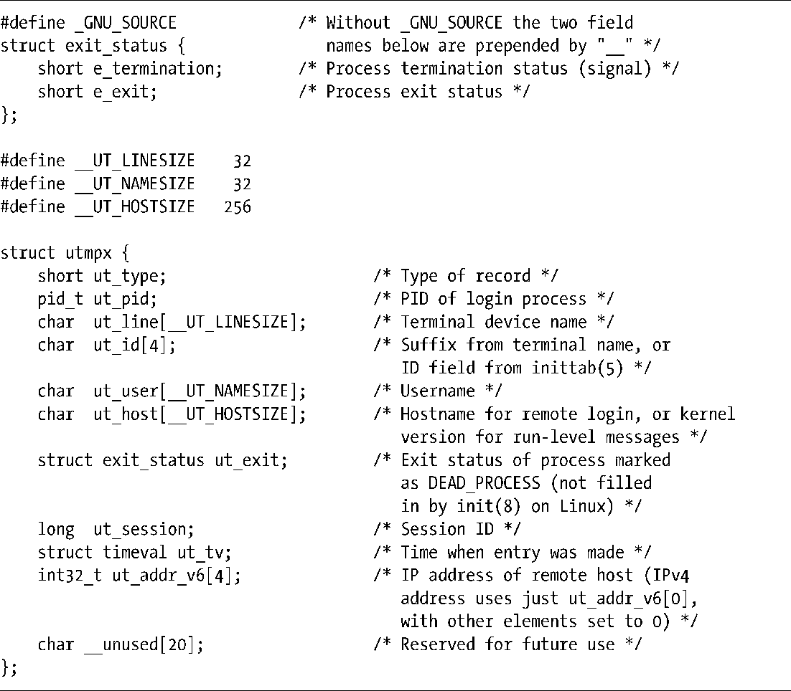

### 40.3　utmpx结构

utmp和wtmp文件包含utmpx记录。utmpx结构式在<utmpx.h>中定义的，如程序清单40-1所示。

> SUSv3规范中的utmpx结构不包含ut_host、ut_exit、ut_session以及ut_addr_v6字段。在其他大多数实现中都存在ut_host和ut_exit字段；一些实现上还定义了ut_session字段；ut_addr_v6是Linux特有的字段。SUSv3规定了ut_line和ut_user字段，但并没有规定它们的长度。
> 在utmpx结构中ut_addr_v6字段的数据类型是int32_t，它是一个32位的整数。

程序清单40-1：utmpx结构的定义

utmpx结构中的所有字符串字段都以null结尾，除非值完全填满了相应的数组。

对于登录进程来讲，存储在ut_line和ut_id字段中的信息是从终端设备的名称中得出的。ut_line字段包含了终端设备的完整的文件名。ut_id字段包含了文件名的后缀——跟在tty、pts或pty后面的字符串（后两个分别表示System-V和BSD风格的伪终端）。因此，对于/dev/tty2终端来讲，ut_line的值为tty2，ut_id的值为2。

在窗口环境中，一些终端模拟器使用ut_session字段来为终端窗口记录会话ID（有关会话ID的介绍请参考34.3节）。

ut_type字段是一个整数，它定义了写入文件的记录类型，其取值为下面一组常量中的一个（括号中给出了相应的数值）。

##### EMPTY (0)

这个记录不包含有效的记账信息。

##### RUN_LVL (1)

这个记录表明在系统启动或关闭时系统运行级别发生了变化。（有关运行级别的信息可以在init(8)手册中找到。）要在<utmpx.h>中取得这个常量的定义就必须要定义_GNU_SOURCE特性测试宏。

##### BOOT_TIME (2)

这个记录包含ut_tv字段中的系统启动时间。写入RUN_LVL和BOOT_TIME字段的进程通常是init。这些记录会同时被写入utmp和wtmp文件。

##### NEW_TIME (3)

这个记录包含系统时钟变更之后的新时间，记录在ut_tv字段中。

##### OLD_TIME (4)

这个记录包含系统时钟变更之前的旧时间，记录在ut_tv字段中。当系统时钟发生变更时，NTP daemon（或类似的进程）会将类型为OLD_TIME 和 NEW_TIME的记录写入到utmp和wtmp文件中。

##### INIT_PROCESS (5)

记录由init进程孵化的进程，如getty进程，细节信息请参考inittab(5)手册。

##### LOGIN_PROCESS (6)

记录用户登录会话组长进程，如login(1)进程。

##### USER_PROCESS (7)

记录用户进程，通常是登录会话，用户名会出现在ut_user字段中。登录会话可能是由login(1)启动，或者也可能是由像ftp和ssh之类的提供远程登录工具的应用程序启动。

##### DEAD_PROCESS (8)

这个记录标识出已经退出的进程。

这里之所以给出了这些常量的数值是因为很多应用程序都要求这些常量的数值顺序与上面列出的顺序一致。如在agetty程序的源代码中可以发现下面这样的检查。

类型为INIT_PROCESS通常对应于getty(8)调用（或类似的程序，如agetty(8)和mingetty(8)）。在系统启动的时候，init进程会为每个命令行和虚拟控制台创建一个子进程，每个子进程会执行getty程序。getty程序会打开终端，提示用户输入用户名，然后执行login(1)。当成功验证用户以及执行了其他一些动作之后，login会创建一个子进程来执行用户登录shell。这种登录会话的完整声明周期由写入wtmp文件的四个记录来表示，其顺序如下所示。

+ 一个INIT_PROCESS记录，由init写入。
+ 一个LOGIN_PROCES记录，由getty写入。
+ 一个USER_PROCESS记录，由login写入。
+ 一个DEAD_PROCESS记录，当init进程检测到login子进程死亡之后（发生在用户登出时）写入。

更多有关在用户登录期间getty和login的操作的细节可以在[Stevens & Rago, 2005]的第9章中找到。

> 一些版本的init会在更新wtmp文件之前孵化出getty进程，这样init和getty会在更新wtmp文件时形成竞争，从而导致INIT_PROCESS和LOGIN_PROCESS记录的写入顺序与正文中描述的顺序相反。

