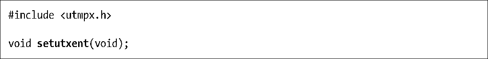
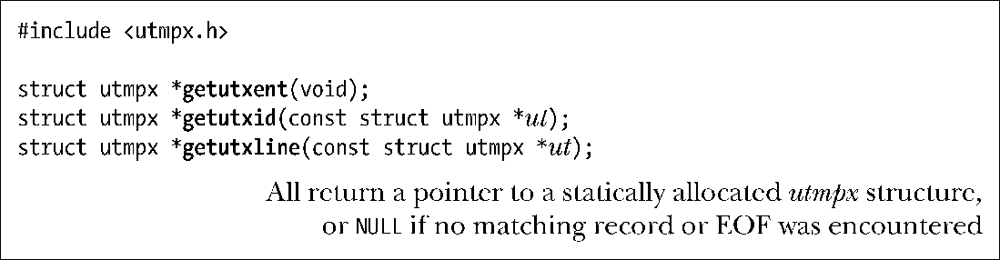
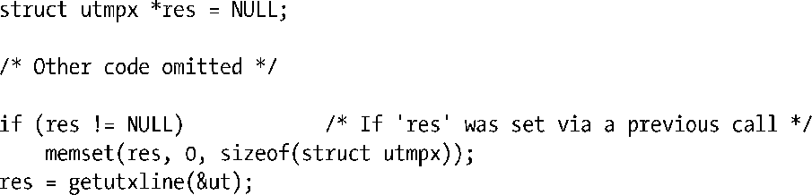
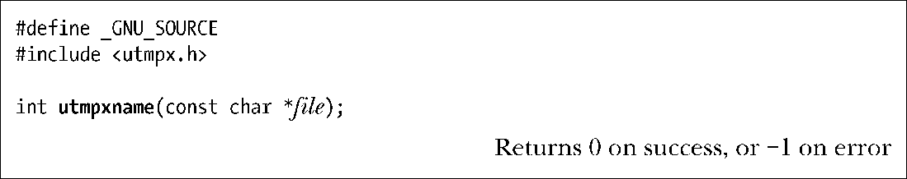
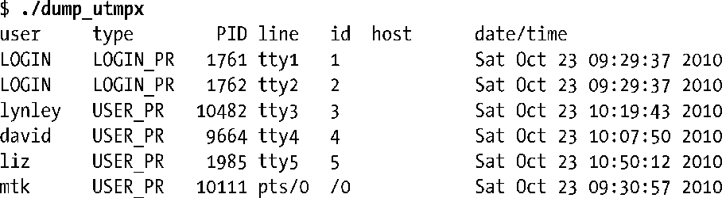
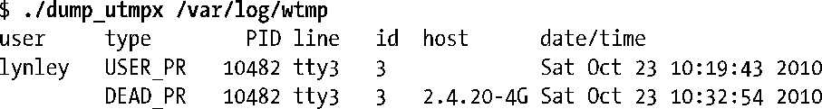
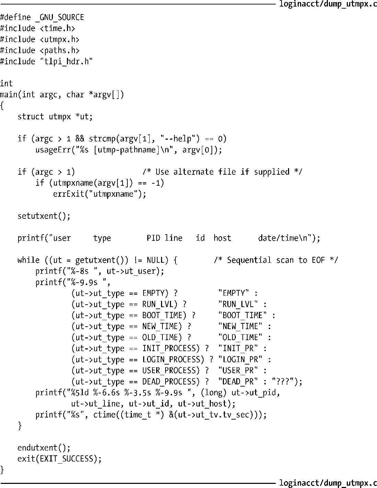

### 40.4　从utmp和wtmp文件中检索信息

本节介绍的函数能从包含utmpx格式记录的文件中获取读取信息。在默认情况下，这些函数使用标准的utmp文件，但使用utmpxname()函数（稍后介绍）能够改变读取的文件。

这些函数都使用了当前位置（current location）的概念，它们会从文件中的当前位置来读取记录，每个函数都会更新这个位置。

setutxent()函数会将utmp文件的当前位置设置到文件的起始位置。

通常，在使用任意getutx*()函数（稍后介绍）之前应该调用setutxent()，这样就能避免因程序中已经调用到的第三方函数在之前用过这些函数而产生的混淆。根据所执行的任务的不同，在程序后面合适的地方可能需要调用setutxent()。

当utmp文件没有被打开时，setutxent()函数和getutx*()函数会打开这个文件。当用完这个文件之后可以使用endutxent()函数来关闭这个文件。

getutxent()、getutxid()和getutxline()函数从utmp文件中读取一个记录并返回一个指向utmpx结构（静态分配）的指针。

getutxent()函数顺序读取utmp文件中的下一个记录。getutxid()和getutxline()函数会从当前文件位置开始搜索与ut参数指向的utmpx结构中指定的标准匹配的一个记录。

getutxid()函数根据ut参数中ut_type和ut_id字段的值在utmp文件中搜索一个记录。

+ 如果ut_type字段是RUN_LVL、BOOT_TIME、NEW_TIME或OLD_TIME，那么getutxid()会找出下一个ut_type字段与指定的值匹配的记录。（这种类型的记录与用户登录不相关。）这样就能够搜索与修改系统时间和运行级别相关的记录了。
+ 如果ut_type字段的取值是剩余的有效值中的一个（INIT_PROCESS、LOGIN_PROCESS、USER_PROCESS或DEAD_PROCESS），那么getutxent()会找出下一个ut_type字段与这些值中的任意一个匹配并且ut_id字段与ut参数中指定的值匹配的记录。这样就能够扫描文件来找出对应于某个特定终端的记录了。

getutxline()函数会向前搜索ut_type字段为LOGIN_PROCESS或USER_PROCESS并且ut_line字段与ut参数指定的值匹配的记录。这对于找出与用户登录相关的记录是非常有用的。

当搜索失败时（即达到文件尾时还没有找到匹配的记录），getutxid()和getutxline()都返回NULL。

在一些UNIX实现上，getutxline()和getutxid()将用于返回utmpx结构的静态区域看成是某种高速缓冲存储（cache）。如果它们确定上一个getutx*()调用放置在高速缓冲存储中的记录与ut指定的标准匹配，那么就不会执行文件读取操作，而是简单地再次返回同样的记录（SUSv3允许这个行为）。因此为避免当在循环中调用getutxline()和getutxid()时重复返回同一个记录，必须要使用下面的代码清除这个静态数据结构。

glibc实现不会进行这样的缓存，但从可移植性的角度出发，在编写程序时永远不要使用这种技术。

> 由于getutx*()函数返回的是一个指向静态分配的结构的指针，因此它们是不可重入的。GNU C库提供了传统的utmp函数的可重入版本（getutent_r()、getutid_r()以及getutline_r()），但并没有为utmpx函数提供可重入版本。（SUSv3并没有规定可重入版本。）

在默认情况下，所有getutx*()函数都使用标准的utmp文件。如果需要使用另一个文件，如wtmp文件，那么必须要首先调用utmpxname()并指定目标路径名。

utmpxname()函数仅仅将传入的路径名复制一份，它不会打开文件，但会关闭之前由其他调用打开的所有文件。这表示就算指定了一个无效的路径名，utmpxname()也不会返回错误。相反，当后面调用某个getutx*()函数发现无法打开文件时会返回一个错误（即NULL，errno被设为ENOENT）。

> 虽然SUSv3并没有对此进行规定，但大多数UNIX实现提供了utmpxname()或类似的utmpname()函数。

#### 示例程序

程序清单40-2中的程序使用了本节中介绍的一些函数来输出一个utmpx格式文件的内容。下面的shell会话日志给出了使用这个程序输出/var/run/utmp（当没有调用utmpxname()时这些函数会默认使用该文件）的内容时得到的结果。

限于篇幅，这里将程序的很多输出都省去了。上面tty1到tty5是表示虚拟控制台上的登录（/dev/tty[1-6]）。输出中的最后一行表示伪终端上的xterm会话。

从下面输出/var/log/wtmp文件时所产生的结果可以看出当一个用户登录和登出时会向wtmp文件写入两个记录。（程序的其他不相关的所有输出都被省去了。）在顺序搜索wtmp文件（使用getutxline()）时可以使用ut_line来匹配这些记录。

程序清单40-2：显示一个utmpx格式文件的内容

