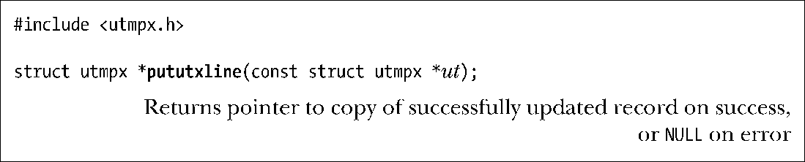
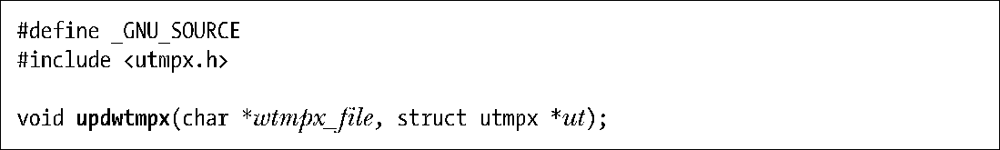
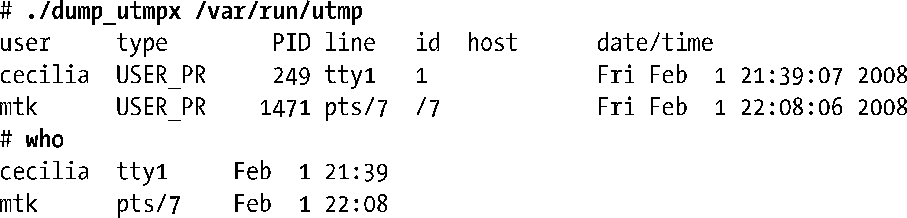
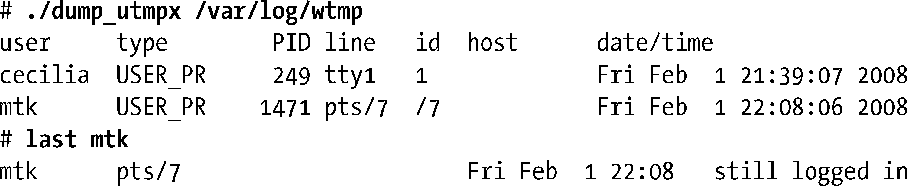
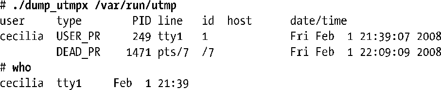
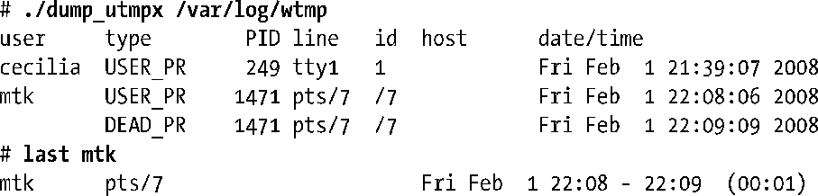
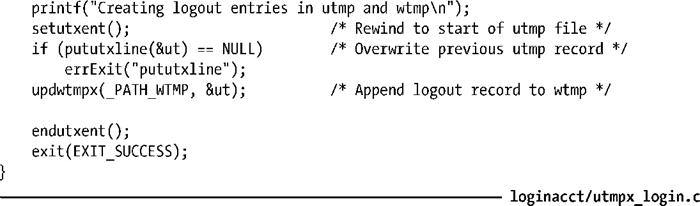

### 40.6　为登录会话更新utmp和wtmp文件

在编写一个创建登录会话的应用程序（如像login或sshd那样）时应该要按照下面的步骤更新utmp和wtmp文件。

+ 在登录的时候应该向utmp文件写入一条记录表明这个用户登录进系统了。应用程序必须要检查在utmp文件中是否存在这个终端的记录。如果已经存在了一个记录，那么它将重写这个记录，否则就在文件后面附加一个新记录。通常调用pututxline()（稍后介绍）就足以确保正确执行这些步骤了（具体示例可参见程序清单40-3）。输出的utmpx记录至少需要填充ut_type、ut_user、ut_tv、ut_pid、ut_id以及ut_line字段。ut_type字段应该被设置成USER_PROCESS。ut_id字段应该包含用户登录的设备名（即终端或伪终端）的后缀，ut_line字段应该包含登录设备的名称中去除了开头的/dev/的字符串。（运行程序清单40-2中的程序时产生的输出会显示这两个字段的内容。）一个包含完全一样的信息的记录会被附加到wtmp文件中。

> utmp文件中的记录以终端名（ut_line和ut_id字段）作为唯一键。

+ 在登出的时候应该删除之前写入utmp文件的记录，这是通过创建一个记录并将ut_type设置为DEAD_PROCESS、同时将ut_id和ut_line设置为登录时写入的记录中相应字段的值并将ut_user字段的值置零来完成的。这个记录会覆盖之前的记录，同时这个记录的一个副本会被附加到wtmp文件中。

> 如果在登出时没有成功清理utmp中的相关记录，可能因为程序崩溃，那么在下一次重启的时候，init会自动清理这些记录并将记录的ut_type设置为DEAD_PROCESS以及将记录中其他字段置零。

通常utmp和wtmp文件是受保护的，只有特权用户可以更新这些文件。getlogin()的精确程度依赖于utmp文件的完整性。正因为这个原因以及其他一些原因，在utmp和wtmp文件的权限设置中应该永远都不允许非特权用户写这两个文件。

哪些程序会产生一个登录会话呢？正如读者所想的那样，通过login、telnet以及ssh登录会记录在登录记账文件中。大多数ftp实现也会创建登录记账记录。但系统上每个打开的终端窗口或调用su时会创建登录记账记录吗？这个问题的答案因UNIX实现的不同而不同。

> 在一些终端模拟程序（如xterm）中，可以使用命令行选项以及其他一些机制来确定程序是否更新登录记账文件。

pututxline()函数会将ut指向的utmpx结构写入到/var/run/utmp文件中（或者如果之前调用了utmpxname()的话将是另一个文件）。

在写入记录之前，pututxline()首先会使用getutxid()向前搜索一个可被重写的记录。如果找到了这样的记录，那么会重写该记录，否则就会在文件尾附加一个新记录。在很多情况下，应用程序在调用pututxline()之前会调用其中一个getutx*()函数，因为这个函数会将当前文件位置设定到正确的记录——即与getutxid()系列函数中ut指向的utmpx结构中的标准匹配的记录。如果pututxline()能够确定已经重置过了当前文件位置，那么就不会调用getutxid()。

> 如果pututxline()在内部调用了getutxid()，那么这个调用不会改变getutx*()函数用来返回utmpx结构的静态区域。SUSv3要求实现遵循这种行为。

在更新wtmp文件时仅仅是简单地打开文件并在文件尾附加一个记录。由于这是一个标准操作，因此glibc将其封装进了updwtmpx()函数。

updwtmpx()函数将ut指向的utmpx记录附加到wtmpx_file指定的文件尾。

SUSv3没有规定updwtmpx()，这个函数只出现了一些UNIX实现中，而其他实现则提供了相关函数——login(3)、logout(3)以及logwtmp(3)——这些函数位于glibc中并且手册也对这些函数进行了描述。如果不存在这样的函数，那么就需要自己编写实现相同功能的函数了。（这些函数的实现并不复杂。）

#### 示例程序

程序清单40-3使用了这一节中介绍的函数来更新utmp和wtmp文件。这个程序先执行记录由命令行指定的用户的登录操作所需的对utmp和wtmp文件的更新，然后睡眠的几秒钟之后再登出用户。通常，此类操作会与用户的登录会话的创建和终止相关联。这个程序使用了ttyname()来获取与文件描述符相关联的终端设备的名称，ttyname()将在第62.10节中予以介绍。

下面的shell会话日志演示了程序清单40-3中的程序的操作。假设程序已经拥有了更新登录记账文件的权限，然后使用这个程序来为用户mtk创建一个记录。

在utmpx_login程序睡眠的过程中输入Control-Z以挂起该程序并将其放到后台。接着使用程序清单40-2中的程序来查看utmp文件中的内容。

上面使用了who(1)命令来表明who的输出源自utmp文件。

接着使用程序来查看wtmp文件中的内容。

上面使用了last(1)命令来表明last的输出源自wtmp文件。（限于篇幅，这里给出的shell会话日志中dump_utmpx和last命令输出已经删除了与本节讨论主题无关的内容。）

接着使用fg命令将utmpx_login程序恢复到前台。程序随后就会将登出记录写入utmp和wtmp文件。

接着再次查看utmp文件中的内容，从中可以看出utmp中的记录被重写了。

输出中的最后一行表明who忽略了DEAD_PROCESS记录。

在查看wtmp文件之后可以看出wtmp记录已经被附加进去了。

上面输出中的最后一行表明last匹配了wtmp文件中的登录和登出记录，从而能看出整个登录会话的开始时间和结束时间。

程序清单40-3：更新utmp和wtmp文件

