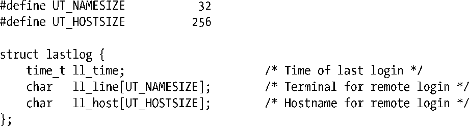
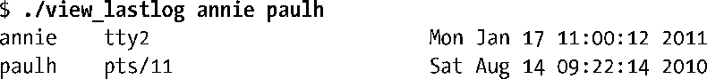
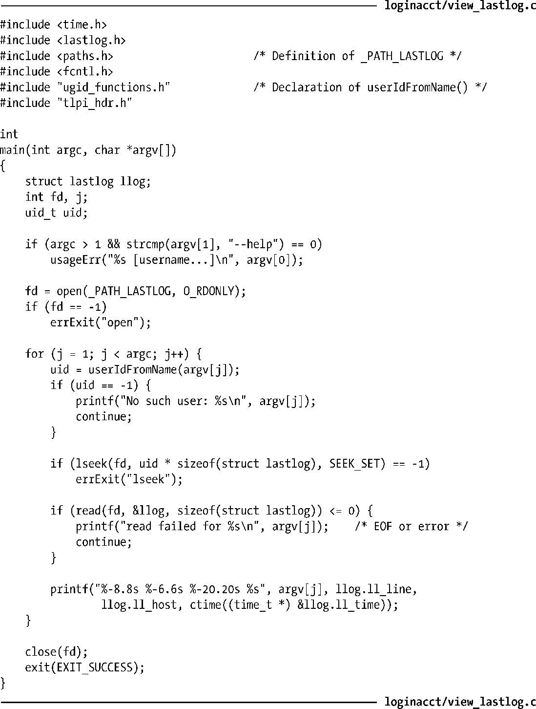

### 40.7　lastlog文件

lastlog文件记录着每个用户最近一次登录到系统的时间。（它与wtmp文件不同，wtmp文件记录着所有用户的登录和登出行为。）login程序通过lastlog文件能够通知用户（在新登录会话开始的时候）他们上次登录的时间。提供登录服务的应用程序除了要更新utmp和wtmp文件之外还应该更新lastlog文件。

与utmp和wtmp文件一样，不同系统实现中lastlog文件的存放位置和格式可能会存在差异。（一些UNIX实现并没有提供这个文件。）在Linux上，这个文件位于/var/log/lastlog，<paths.h>文件中定义的常量_PATH_LASTLOG指向了这个位置。与utmp和wtmp文件一样，lastlog文件通常也是受保护的，这样所有用户都能读取这个文件但只有特权进程才能够更新这个文件。

lastlog文件中的记录的格式如下所示（在<lastlog.h>中定义）。

注意这些记录中并没有包含用户名或用户ID。lastlog文件中的记录是用用户ID作为索引的，因此要找出用户ID为1000的lastlog记录就需要到文件的相应位置处（1000 * sizeof(struct lastlog)）查找。程序清单40-4对此进行了演示，通过这个程序读者能够查看在命令行中列出的用户的lastlog记录，其功能与lastlog(1)命令的功能类似。下面是运行这个程序时产生的输出。

更新lastlog文件时会打开文件，寻找到正确的位置，然后执行一个写入操作。

> 由于lastlog文件是以用户ID为索引的，因此无法区分拥有同样的用户ID的不同用户名的登录行为。（在8.1节中层指出过多个登录名拥有同样的用户ID是可能的，虽然这种情况并不常见。）

程序清单40-4：显示lastlog文件中的信息

