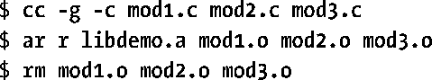
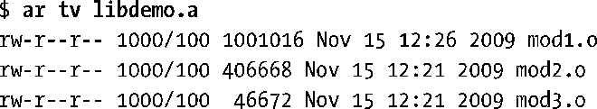
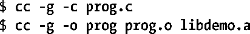
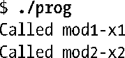

### 41.2　静态库

在开始讨论共享库之前首先对静态库作一个简短的介绍，这样读者就能够弄清楚共享库与静态库之间的差别以及共享库所具备的优势了。

静态库也被称为归档文件，它是UNIX系统提供的第一种库。静态库能带来下列好处。

+ 可以将一组经常被用到的目标文件组织进单个库文件，这样就可以使用它来构建多个可执行程序并且在构建各个应用程序的时候无需重新编译原来的源代码文件。
+ 链接命令变得更加简单了。在链接命令行中只需要指定静态库的名称即可，而无需一个个地列出目标文件了。链接器知道如何搜素静态库并将可执行程序需要的对象抽取出来。

#### 创建和维护静态库

从结果上来看，静态库实际上就是一个保存所有被添加到其中的目标文件的副本的文件。这个归档文件还记录着每个目标文件的各种特性，包括文件权限、数字用户和组ID以及最后修改时间。根据惯例，静态库的名称的形式为libname.a。

使用ar(1)命令能够创建和维护静态库，其通用形式如下所示。

options参数由一系列的字母构成，其中一个是操作代码，其他是能够影响操作的执行的修饰符。下面是一些常用的操作代码。

+ r（替换）：将一个目标文件插入到归档文件中并取代同名的目标文件。这个创建和更新归档文件的标准方法，使用下面的命令可以构建一个归档文件。
+ 

从上面可以看出，在构建完库之后可以根据需要删除原始的目标文件，因为已经不再需要它们了。

+ t（目录表）：显示归档中的目录表。在默认情况下只会列出归档文件中目标文件的名称。添加v（verbose）修饰符之后可以看到记录在归档文件中的各个目标文件的其他所有特性，如下面的例子所示。
+ 

从左至右每个目标文件的特性为被添加到归档文件中时的权限、用户ID和组ID、大小以及上次修改的日志和时间。

+ d（删除）：从归档文件中删除一个模块，如下面的例子所示。
+ 

#### 使用静态库

将程序与静态库链接起来存在两种方式。第一种是在链接命令中指定静态库的名称，如下所示。

或者将静态库放在链接器搜索的其中一个标准目录中（如/usr/lib），然后使用-l选项指定库名（即库的文件名去除了lib前缀和.a后缀）。

如果库不位于链接器搜索的目录中，那么可以只用-L选项指定链接器应该搜索这个额外的目录。

虽然一个静态库可以包含很多目标模块，但链接器只会包含那些程序需要的模块。

在链接完程序之后可以按照通常的方式运行这个程序。

