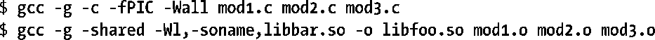
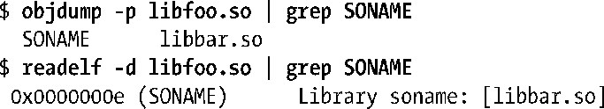
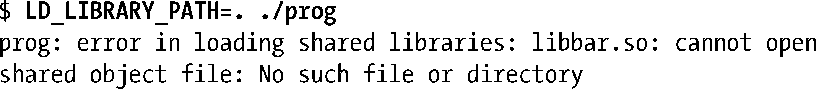
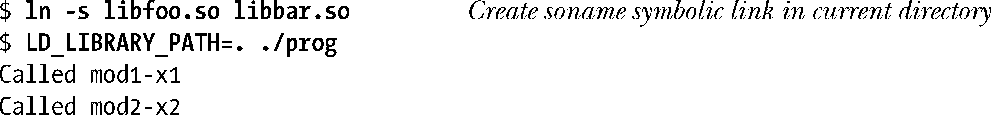
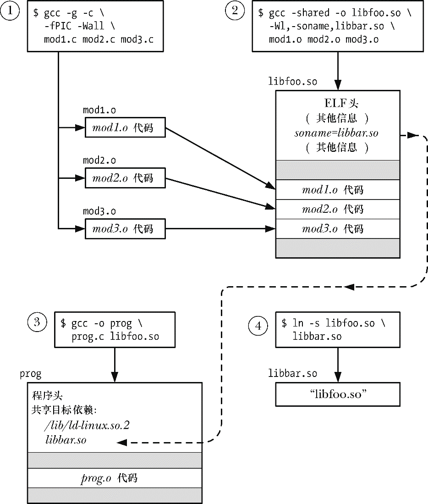
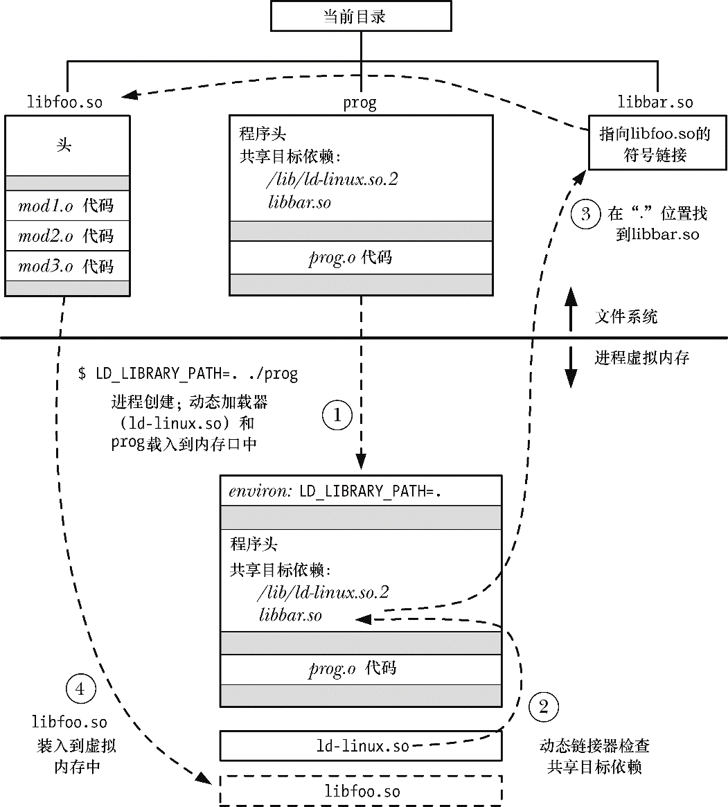

### 41.4.4　共享库soname

到目前为止介绍的所有例子中，嵌入到可执行文件以及动态链接器在运行时搜索的名称是共享库文件的实际名称，这被称为库的真实名称（real name）。但可以——实际上经常这样做——使用别名来创建共享库，这种别名称为soname（ELF中的DT_SONAME标签）。

如果共享库拥有一个soname，那么在静态链接阶段会将soname嵌入到可执行文件中，而不会使用真实名称，同时后面的动态链接器在运行时也会使用这个soname来搜索库。引入soname的目的是为了提供一层间接，使得可执行程序能够在运行时使用与链接时使用的库不同的（但兼容的）共享库。

在41.6节中将会介绍共享库的真实名称和soname的命名规则。下面通过一个简化的例子来说明这些原则。

使用soname的第一步是在创建共享库时指定soname。

–Wl、–soname以及libbar.so选项是传给链接器的指令以将共享库libfoo.so的soname设置为libbar.so。

如果要确定一个既有共享库的soname，那么可以使用下面两个命令中的任意一个。

在使用soname创建了一个共享库之后就可以照常创建可执行文件了。

但这次链接器检查到库libfoo.so包含了soname libbar.so，于是将这个soname嵌入到了可执行文件中。

现在当运行这个程序时就会看到下面的输出。

这里的问题是动态链接器无法找到名为libbar.so共享库。当使用soname时还需要做一件事情：必须要创建一个符号链接将soname指向库的真实名称，并且必须要将这个符号链接放在动态链接器搜索的其中一个目录中。因此可以像下面这样运行这个程序。

图41-1给出了在使用一个内嵌的soname，将程序与共享库链接起来，以及创建运行程序所需的soname符号链接时所涉及到的编译和链接事项。

<b class="my_markdown">图41-1：创建一个共享库并将一个程序与该共享库链接起来</b>

图41-2给出了当图41-1中创建的程序被加载进内存以备执行时发生的事情。

<b class="my_markdown">图41-2：加载共享库的程序的执行</b>

> 要找出一个进程当前使用的共享库则可以列出相应的Linux特有的/proc/PID/maps文件中的内容（参见48.5节）。

