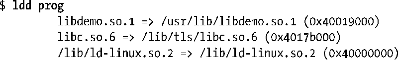
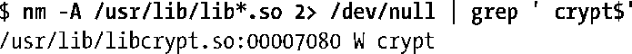

### 41.5　使用共享库的有用工具

本节将简要介绍对分析共享库、可执行文件以及编译过的目标文件（.o）有用的一组工具。

#### ldd命令

ldd(1)（列出动态依赖）命令显示了一个程序运行所需的共享库，如下所示。

ldd命令会解析出每个库引用（使用的搜索方式与动态链接器一样）并以下面的形式显示结果。

对于大多数ELF可执行文件来讲，ldd至少会列出与ld-linux.so.2、动态链接器以及标准C库libc.so.6相关的条目。

> 在一些架构上，C库的名称是不同的。如在IA-64和Alpha上，这个库的名称是libc.so.6.1。

#### objdump和readelf命令

objdump命令能够用来获取各类信息——包括反汇编的二进制机器码——从一个可执行文件、编译过的目标以及共享库中。它还能够用来显示这些文件中各个ELF节的头部信息，当这样使用objdump时它就类似于readelf，readelf能显示类似的信息，但显示格式不同。本章结尾处将会列出更多有关objdump和readelf的信息源。

#### nm命令

nm命令会列出目标库或可执行程序中定义的一组符号。这个命令的一种用途是找出哪些库定义了一个符号。如要找出哪个库定义了crypt()函数则可以像下面这样做。

nm的–A选项指定了在显示符号的每一行的开头处应该列出库的名称。这样做是有必要的，因为在默认情况下，nm只列出库名一次，然后在后面会列出库中包含的所有符号，这对于像上面那样进行某种过滤的例子来讲是没有用处的。此外，这里还丢弃了标准错误输出以便隐藏与nm命令无法识别文件格式有关的错误消息。从上面的输出中可以看出，crypt()被定义在了libcrypt库中。

