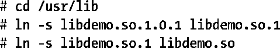
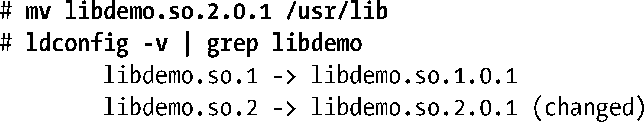
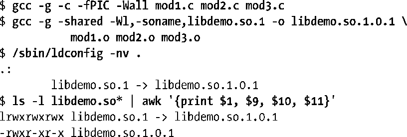

### 41.7　安装共享库

在本章到目前为止介绍的例子中都是将共享库创建在用户私有的目录中，然后使用LD_LIBRARY_PATH环境变量来确保动态链接器会搜到该目录。特权用户和非特权用户都可以使用这种技术，但在生产应用程序中不应该采用这种技术。一般来讲，共享库及其关联的符号链接会被安装在其中一个标准库目录中，标准库目录包括：

+ /usr/lib，它是大多数标准库安装的目录。
+ /lib，应该将系统启动时用到的库安装在这个目录中（因为在系统启动时可能还没有挂载/usr/lib）。
+ /usr/local/lib，应该将非标准或实验性的库安装在这个目录中（对于/usr/lib是一个由多个系统共享的网络挂载但需要只在本机安装一个库的情况则可以将库放在这个目录中）。
+ 其中一个在/etc/ld.so.conf（稍后介绍）中列出的目录。

在大多数情况下，将文件复制到这些目录中需要具备超级用户的权限。

安装完之后就必须要创建soname和链接器名称的符号链接了，通常它们是作为相对符号链接与库文件位于同一个目录中。因此要将本章的演示库安装在/usr/lib（只允许root进行更新）中则可以使用下面的命令。

shell会话中的最后两行创建了soname和链接器名称的符号链接。

#### ldconfig

ldconfig(8)解决了共享库的两个潜在问题。

+ 共享库可以位于各种目录中，如果动态链接器需要通过搜索所有这些目录来找出一个库并加载这个库，那么整个过程将非常慢。
+ 当安装了新版本的库或者删除了旧版本的库，那么soname符号链接就不是最新的。

ldconfig程序通过执行两个任务来解决这些问题。

**1．** 它搜索一组标准的目录并创建或更新一个缓存文件/etc/ld.so.cache使之包含在所有这些目录中的主要库版本（每个库的主要版本的最新的次要版本）列表。动态链接器在运行时解析库名称时会轮流使用这个缓存文件。为了构建这个缓存，ldconfig会搜索在/etc/ld.so.conf中指定的目录，然后搜索/lib 和 /usr/lib。/etc/ld.so.conf文件由一个目录路径名（应该是绝对路径名）列表构成，其中路径名之间用换行、空格、制表符、逗号或冒号分隔。在一些发行版中，/usr/local/lib目录也位于这个列表中。（如果不在这个列表中，那么就需要手工将其添加到列表中。）

> 命令ldconfig –p会显示/etc/ld.so.cache的当前内容。

**2．** 它检查每个库的各个主要版本的最新次要版本（即具有最大的次要版本号的版本）以找出嵌入的soname，然后在同一目录中为每个soname创建（或更新）相对符号链接。

为了能够正确执行这些动作，ldconfig要求库的名称要根据前面介绍的规范来命名（即库的真实名称包含主要和次要标识符，它们随着库的版本的更新而恰当的增长）。

在默认情况下，ldconfig会执行上面两个动作，但可以使用命令行选项来指定它执行其中一个动作：-N选项会防止缓存的重建，-X选项会阻止soname符号链接的创建。此外，-v (verbose)选项会使得ldconfig输出描述其所执行的动作的信息。

每当安装了一个新的库，更新或删除了一个既有库，以及/etc/ld.so.conf中的目录列表被修改之后，都应该运行ldconfig。

下面是一个使用ldconfig的例子。假设需要安装一个库的两个不同的主要版本，那么需要做下面的事情。

上面对ldconfig的输出进行了过滤，这样读者就只会看到与名为libdemo的库相关的信息了。

接着列出在/usr/lib目录中名为libdemo的文件来验证soname符号链接的设置。

还需要为链接器名称创建符号链接，如下面的命令所示。

如果安装了库的一个新的2.x次要版本，那么由于链接器名称指向了最新的soname，因此ldconfig还能取得保持链接器名称最新的效果，如下面的例子所示。

如果创建和使用的是一个私有库（即没有安装在上述标准目录中的库），那么可以通过使用-n选项让ldconfig创建soname符号链接。这个选项指定了ldconfig只处理在命令行中列出的目录中的库，而无需更新缓存文件。下面的例子使用了ldconfig来处理当前工作目录中的库。

在上面的例子中，当运行ldconfig时指定了完全路径名，因为使用的是一个非特权账号，其PATH环境变量不包含/sbin目录。

