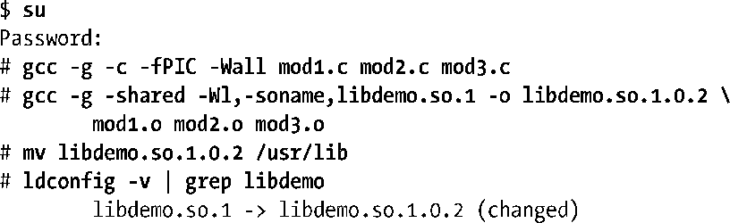
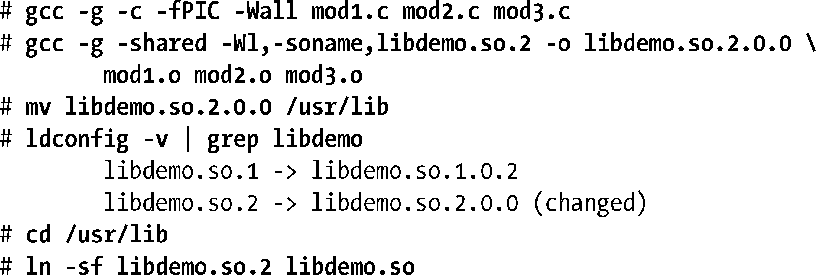

### 41.9　升级共享库

共享库的优点之一是当一个运行着的程序正在使用共享库的一个既有版本时也能够安装库的新主要版本或次要版本。在安装的过程中需要做的事情包括创建新的库版本、将其安装在恰当的目录中以及根据需要更新soname和链接器名称符号链接（或通常让ldconfig来完成这部分工作）。如要创建共享库/usr/lib/libdemo.1.0.1的一个新次要版本，那么需要完成：

假设已经正确地配置了链接器名称（即指向库的soname），那么就无需修改链接器名称了。

已经运行着的程序会继续使用共享库的上一个次要版本，只有当它们终止或重启之后才会使用共享库的新次要版本。

如果后面需要创建共享库的一个新主要版本（2.0.0），那么就需要完成：

从上面的输出可以看出，ldconfig自动为新主要版本创建了一个soname符号链接，但从最后一条命令可以看出，必须要手工更新链接器名称的符号链接。

