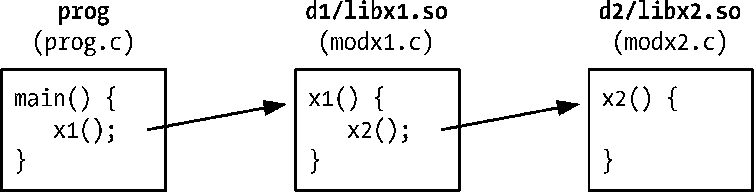
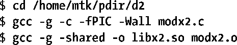
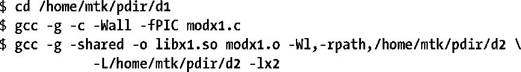
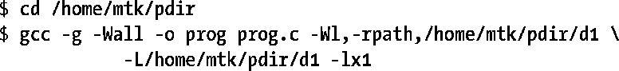
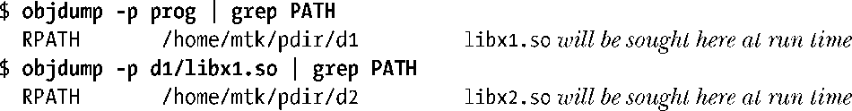
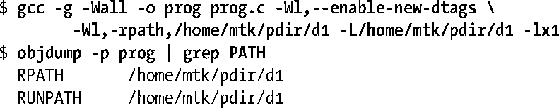

### 41.10　在目标文件中指定库搜索目录

到目前为止本章已经介绍了两种通知动态链接器共享库的位置的方式：使用LD_LIBRARY_PATH环境变量和将共享库安装到其中一个标准库目录中（/lib、/usr/lib或在/etc/ld.so.conf中列出的其中一个目录）。

还存在第三种方式：在静态编辑阶段可以在可执行文件中插入一个在运行时搜索共享库的目录列表。这种方式对于库位于一个固定的但不属于动态链接器搜索的标准位置的位置中时是非常有用的。要实现这种方式需要在创建可执行文件时使用-rpath链接器选项。

上面的命令将字符串/home/mtk/pdir复制到了可执行文件prog的运行时库路径（rpath）列表中，因此当运行这个程序时，动态链接器在解析共享库引用时还会搜索这个目录。

如果有必要的话，可以多次指定–rpath选项；所有这些列出的目录会被连接成一个放到可执行文件中的有序rpath列表。或者，在一个rpath选项中可以指定多个由分号分割开来的目录列表。在运行时，动态链接器会按照在–rpath选项中指定的目录顺序来搜索目录。

> -rpath选项的一个替代方案是LD_RUN_PATH环境变量。可以将一个由分号分隔开来的目录的字符串赋给该变量，当构建可执行文件时可以将这个变量作为rpath列表来使用。只有当构建可执行文件时不指定-rpath选项时才会使用LD_RUN_PATH变量。

#### 在构建共享库时使用–rpath链接器选项

在构建共享库时–rpath选项也是有用的。假设有一个依赖于另一个共享库libx2.so的共享库libx1.so，如图41-4所示。另外再假设这些库分别位于非标准目录d1和d2中。下面介绍构建这些库以及使用它们的程序所需完成的步骤。

<b class="my_markdown">图41-4：依赖于另一个共享库的共享库</b>

首先在pdir/d2目录中构建libx2.so。（为了使这个例子简单一点，这里省略了库的版本号和soname。）

接着在pdir/d1目录中构建libx1.so。由于libx1.so依赖于libx2.so，并且libx2.so位于一个非标准目录中，因此在指定libx2.so的运行时位置时需要使用–rpath链接器选项。这个选项的取值与库的链接时位置（由-L选项指定）可以不同，尽管在这个例子中这两个位置是相同的。

最后在pdir目录中构建主程序。由于主程序使用了libx1.so并且这个库位于一个非标准目录中，因此还需要使用–rpath链接器选项。

注意在链接主程序时无需指定libx2.so。由于链接器能够分析libx1.so中的rpath列表，因此它能够找到libx2.so，同时在静态链接阶段解析出所有的符号。

使用下面的命令能够检查prog和libx1.so以便查看它们的rpath列表的内容。

> 还可以通过查找readelf – –dynamic（或等价的readelf –d）命令的输出来查看rpath列表。

使用ldd命令能够列出prog的完整的动态依赖列表。

#### ELF DT_RPATH和DT_RUNPATH条目

在第一版ELF规范中，只有一种rpath列表能够被嵌入到可执行文件或共享库中，它对应于ELF文件中的DT_RPATH标签。后续的ELF规范舍弃了DT_RPATH，同时引入了一种新标签DT_RUNPATH来表示rpath列表。这两种rpath列表之间的差别在于当动态链接器在运行时搜索共享库时它们相对于LD_LIBRARY_PATH环境变量的优先级：DT_RPATH的优先级更高，而DT_RUNPATH的优先级则更低（参见41.11节）。

在默认情况下，链接器会将rpath列表创建为DT_RPATH标签。为了让链接器将rpath列表创建为DT_RUNPATH条目必须要额外使用– –enable–new–dtags(启用新动态标签)链接器选项。如果使用这个选项重建程序并且使用objdump查看获得的可执行文件，那么将会看到下面这样的输出。

从上面可以看出，可执行文件包含了DT_RPATH和DT_RUNPATH标签。链接器采用这种方式复写了rpath列表是为了让不理解DT_RUNPATH标签的老式动态链接器能够正常工作。（glibc 2.2增加了对DT_RUNPATH的支持）。理解DT_RUNPATH标签的链接器会忽略DT_RPATH标签（参见41.11节）。

#### 在rpath中使用$ORIGIN

假设需要发布一个应用程序，这个应用程序使用了自身的共享库，但同时不希望强制要求用户将这些库安装在其中一个标准目录中，相反，需要允许用户将应用程序解压到任意异目录中，然后能够立即运行这个应用程序。这里存在的问题是应用程序无法确定存放共享库的位置，除非要求用户设置LD_LIBRARY_PATH或者要求用户运行某种能够标识出所需的目录的安装脚本，但这两种方法都不是令人满意的方法。

为解决这个问题，在构建链接器的时候增加了对rpath规范中特殊字符串$ORIGIN（或等价的${ORIGIN}）的支持。动态链接器将这个字符串解释成“包含应用程序的目录”。这意味着可以使用下面的命令来构建应用程序。

上面的命令假设在运行时应用程序的共享库位于包含应用程序的可执行文件的目录的子目录lib中。这样就能向用户提供一个简单的包含应用程序及相关的库的安装包，同时允许用户将这个包安装在任意位置并运行这个应用程序了（即所谓的“turn-key应用程序”）。

