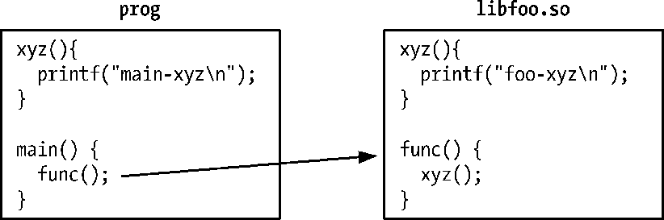
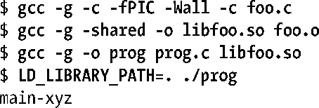
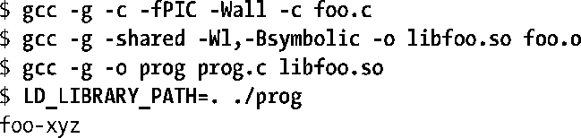

### 41.12　运行时符号解析

假设在多个地方定义了一个全局符号（即函数或变量），如在一个可执行文件和一个共享库中或在多个共享库中。那么如何解析指向这个符号的引用呢？

假设现在有一个主程序和一个共享库，它们两个都定义了一个全局函数xyz()，并且共享库中的另一个函数调用了xyz()，如图41-5所示。

<b class="my_markdown">图41-5：解析全局符号引用</b>

在构建共享库和可执行程序并运行这个程序之后能够看到下面的输出。

从上面输出的最后一行可以看出，主程序中的xyz()定义覆盖（优先）了共享库中的定义。

尽管这种处理方式在一开始看起来有些令人惊讶，但这样做是有历史原因的。第一个共享库实现在设计时的目标是使符号解析的默认语义与那些和同一库等价的静态库进行链接的应用程序中的符号解析的语义完成一致。这意味着下面的语义是正确的。

+ 主程序中全局符号的定义覆盖库中相应的定义。
+ 如果一个全局符号在多个库中进行了定义，那么对该符号的引用会被绑定到在扫描库时找到的第一个定义，其中扫描顺序是按照这些库在静态链接命令行中列出时从左至右的顺序。

虽然这些语义使得从静态库到共享库的转变变得相对简单了，但这种做法会导致一些问题。其中最大的问题是这些语义在使用共享库实现一个自包含的子系统时会与共享库模型产生矛盾。在默认情况下，共享库无法确保一个指向其自身的某个全局符号的引用会真正被绑定到该符号在库中的定义上，从而导致当该共享库被集成到一个更大的系统中时共享库的属性可能会发生改变。这会导致应用程序出现令人意料之外的行为，同时也使得分治调试的执行变得更加困难（即尝试使用更少或不同的共享库来重现问题）。

在上面的例子中，如果想要确保在共享库中对xyz()的调用确实调用了库中定义的相应函数，那么在构建共享库的时候就需要使用–Bsymbolic链接器选项。

–Bsymbolic链接器选项指定了共享库中对全局符号的引用应该优先被绑定到库中的相应定义上（如果存在的话）。（注意不管是否使用了这个选项，在主程序中调用xyz()总是会调用主程序中定义的xyz()。）

